# 
Project Report

    <strong>Universidad Peruana de Ciencias Aplicadas</strong> 
     
    <strong>Ingeniería de Software - 2026-10</strong> 
    <strong>Desarrollo de Soluciones IOT - 17755</strong> 
    <strong>Profesor: Marco Antonio Leon Baca</strong> 
     <strong>Informe del Trabajo Final</strong>

    <strong>Startup: </strong> 
    <strong>Producto: </strong>

    <h3 align="center">Team Members:</h3>
    <table align="center">
        <tr>
            <th style="text-align:center;">Member</th>
            <th style="text-align:center;">Code</th>
        </tr>
        <tr>
            <td>Giancarlo Santiago Castañeda Guimas</td>
            <td>U202310601</td>
        </tr>
        <tr>
            <td>Luciana Carolina Choquehuanca Nuñez</td>
            <td>U202319431</td>
        </tr>
        <tr>
            <td>Carlos Matthew Gonzales Valverde</td>
            <td>U202314130</td>
        </tr>
        <tr>
            <td>María Patricia Hernández Uchuya</td>
            <td>U202311258</td>
        </tr>
        <tr>
            <td>Ronald Joel Peralta Chipa</td>
            <td>U202224619</td>
        </tr>
    </table>

    <strong>Abril, 2026</strong>

 

# Registro de versiones del Informe

<table align="center">
    <tr>
        <th>Versión</th>
        <th>Fecha</th>
        <th>Autor</th>
        <th>Descripción de modificaciones</th>
    </tr>
    <tr>
        <td>0</td>
        <td>11/04/2026</td>
        <td>María Hernández</td>
        <td>Creación del reporte</td>
    </tr>
</table>

 

# Project Report Collaboration Insights
Link del repositorio del reporte: 

 

# Contenido
- [Student Outcome](#student-outcome)
- [Capítulo I: Introducción](#capítulo-i-introducción)
    - [1.1. Startup Profile](#11-startup-profile)
        - [1.1.1. Descripción de la Startup](#111-descripción-de-la-startup)
        - [1.1.2. Perfiles de integrantes del equipo](#112-perfiles-de-integrantes-del-equipo)
    - [1.2. Solution Profile](#12-solution-profile)
        - [1.2.1 Antecedentes y problemática](#121-antecedentes-y-problemática)
        - [1.2.2 Lean UX Process](#122-lean-ux-process)
            - [1.2.2.1. Lean UX Problem Statements](#1221-lean-ux-problem-statements)
            - [1.2.2.2. Lean UX Assumptions](#1222-lean-ux-assumptions)
            - [1.2.2.3. Lean UX Hypothesis Statements](#1223-lean-ux-hypothesis-statements)
            - [1.2.2.4. Lean UX Canvas](#1224-lean-ux-canvas)
    - [1.3. Segmentos objetivo](#13-segmentos-objetivo)
- [Capítulo II: Requirements Elicitation & Analysis](#capítulo-ii-requirements-elicitation--analysis)
    - [2.1. Competidores](#21-competidores)
        - [2.1.1. Análisis competitivo](#211-análisis-competitivo)
        - [2.1.2. Estrategias y tácticas frente a competidores](#212-estrategias-y-tácticas-frente-a-competidores)
    - [2.2. Entrevistas](#22-entrevistas)
        - [2.2.1. Diseño de entrevistas](#221-diseño-de-entrevistas)
        - [2.2.2. Registro de entrevistas](#222-registro-de-entrevistas)
        - [2.2.3. Análisis de entrevistas](#223-análisis-de-entrevistas)
    - [2.3. Needfinding](#23-needfinding)
        - [2.3.1. User Personas](#231-user-personas)
        - [2.3.2. User Task Matrix](#232-user-task-matrix)
        - [2.3.3. User Journey Mapping](#233-user-journey-mapping)
        - [2.3.4. Empathy Mapping](#234-empathy-mapping)
    - [2.4. Big Picture EventStorming](#24-big-picture-eventstorming)
    - [2.5. Ubiquitous Language](#25-ubiquitous-language)
- [Capítulo III: Requirements Specification](#capítulo-iii-requirements-specification)
    - [3.1. User Stories](#31-user-stories)
    - [3.2. Impact Mapping](#32-impact-mapping)
    - [3.3. Product Backlog](#33-product-backlog)
- [Capítulo IV: Solution Software Design](#capítulo-iv-solution-software-design)
    - [4.1. Strategic-Level Domain-Driven Design](#41-strategic-level-domain-driven-design)
        - [4.1.1. Design-Level EventStorming](#411-design-level-eventstorming)
            - [4.1.1.1 Candidate Context Discovery](#4111-candidate-context-discovery)
            - [4.1.1.2 Domain Message Flows Modeling](#4112-domain-message-flows-modeling)
            - [4.1.1.3 Bounded Context Canvases](#4113-bounded-context-canvases)
        - [4.1.2. Context Mapping](#412-context-mapping)
        - [4.1.3. Software Architecture](#413-software-architecture)
            - [4.1.3.1. Software Architecture System Landscape Diagram](#4131-software-architecture-system-landscape-diagram)
            - [4.1.3.2. Software Architecture Context Level Diagrams](#4132-software-architecture-context-level-diagrams)
            - [4.1.3.3. Software Architecture Container Level Diagrams](#4133-software-architecture-container-level-diagrams)
            - [4.1.3.4. Software Architecture Deployment Diagrams](#4134-software-architecture-deployment-diagrams)
    - [4.2. Tactical-Level Domain-Driven Design](#42-tactical-level-domain-driven-design)
        - [4.2.X. Bounded Context: <Bounded Context Name>](#42x-bounded-context-bounded-context-name)
            - [4.2.X.1. Domain Layer](#42x1-domain-layer)
            - [4.2.X.2. Interface Layer](#42x2-interface-layer)
            - [4.2.X.3. Application Layer](#42x3-application-layer)
            - [4.2.X.4. Infrastructure Layer](#42x4-infrastructure-layer)
            - [4.2.X.5. Bounded Context Software Architecture Component Level Diagrams](#42x5-bounded-context-software-architecture-component-level-diagrams)
            - [4.2.X.6. Bounded Context Software Architecture Code Level Diagrams](#42x6-bounded-context-software-architecture-code-level-diagrams)
                - [4.2.X.6.1. Bounded Context Domain Layer Class Diagrams](#42x61-bounded-context-domain-layer-class-diagrams)
                - [4.2.X.6.2. Bounded Context Database Design Diagram](#42x62-bounded-context-database-design-diagram)
- [Capítulo V: Solution UI/UX Design](#capítulo-v-solution-uiux-design)
    - [5.1. Style Guidelines](#51-style-guidelines)
        - [5.1.1. General Style Guidelines](#511-general-style-guidelines)
        - [5.1.2. Web, Mobile and IoT Style Guidelines](#512-web-mobile-and-iot-style-guidelines)
    - [5.2. Information Architecture](#52-information-architecture)
        - [5.2.1. Organization Systems](#521-organization-systems)
        - [5.2.2. Labeling Systems](#522-labeling-systems)
        - [5.2.3. SEO Tags and Meta Tags](#523-seo-tags-and-meta-tags)
        - [5.2.4. Searching Systems](#524-searching-systems)
        - [5.2.5. Navigation Systems](#525-navigation-systems)
    - [5.3. Landing Page UI Design](#53-landing-page-ui-design)
        - [5.3.1. Landing Page Wireframe](#531-landing-page-wireframe)
        - [5.3.2. Landing Page Mock-up](#532-landing-page-mock-up)
    - [5.4. Applications UX/UI Design](#54-applications-uxui-design)
        - [5.4.1. Applications Wireframes](#541-applications-wireframes)
        - [5.4.2. Applications Wireflow Diagrams](#542-applications-wireflow-diagrams)
        - [5.4.3. Applications Mock-ups](#543-applications-mock-ups)
        - [5.4.4. Applications User Flow Diagrams](#544-applications-user-flow-diagrams)
    - [5.5. Applications Prototyping](#55-applications-prototyping)
    - [5.6. IoT Device Design](#56-iot-device-design)
- [Capítulo VI: Product Implementation, Validation & Deployment](#capítulo-vi-product-implementation-validation--deployment)
    - [6.1. Software Configuration Management](#61-software-configuration-management)
        - [6.1.1. Software Development Environment Configuration](#611-software-development-environment-configuration)
        - [6.1.2. Source Code Management](#612-source-code-management)
        - [6.1.3. Source Code Style Guide & Conventions](#613-source-code-style-guide--conventions)
        - [6.1.4. Software Deployment Configuration](#614-software-deployment-configuration)
    - [6.2. Landing Page, Services & Applications Implementation](#62-landing-page-services--applications-implementation)
        - [6.2.X. Sprint n](#62x-sprint-n)
            - [6.2.X.1. Sprint Planning n](#62x1-sprint-planning-n)
            - [6.2.X.2. Aspect Leaders and Collaborators](#62x2-aspect-leaders-and-collaborators)
            - [6.2.X.3. Sprint Backlog n](#62x3-sprint-backlog-n)
            - [6.2.X.4. Development Evidence for Sprint Review](#62x4-development-evidence-for-sprint-review)
            - [6.2.X.5. Testing Suite Evidence for Sprint Review](#62x5-testing-suite-evidence-for-sprint-review)
            - [6.2.X.6. Execution Evidence for Sprint Review](#62x6-execution-evidence-for-sprint-review)
            - [6.2.X.7. Services Documentation Evidence for Sprint Review](#62x7-services-documentation-evidence-for-sprint-review)
            - [6.2.X.8. Software Deployment Evidence for Sprint Review](#62x8-software-deployment-evidence-for-sprint-review)
            - [6.2.X.9. Team Collaboration Insights during Sprint](#62x9-team-collaboration-insights-during-sprint)
    - [6.3. Validation Interviews](#63-validation-interviews)
        - [6.3.1. Diseño de Entrevistas](#631-diseño-de-entrevistas)
        - [6.3.2. Registro de Entrevistas](#632-registro-de-entrevistas)
        - [6.3.3. Evaluaciones según heurísticas](#633-evaluaciones-según-heurísticas)
    - [6.4. Video About-the-Product](#64-video-about-the-product)
- [Conclusiones](#conclusiones)
- [Bibliografía](#bibliografía)
- [Anexos](#anexos)

 

# Student Outcome

 

# Capítulo I: Introducción

## 1.1. Startup Profile
### 1.1.1. Descripción de la Startup
### 1.1.2. Perfiles de integrantes del equipo

<table align="center" border="1" cellspacing="0" cellpadding="8" style="width: 90%; border-collapse: collapse;">
  <tr>
    <td style="width: 150px; text-align: center;">
      </img>
    </td>
    <td>
      
<strong>Giancarlo Santiago Castañeda Guimas - U202310601</strong>

      

        ...
      

    </td>
  </tr>
</table>

<table align="center" border="1" cellspacing="0" cellpadding="8" style="width: 90%; border-collapse: collapse;">
  <tr>
    <td style="width: 150px; text-align: center;">
      </img>
    </td>
    <td>
      
<strong>Luciana Carolina Choquehuanca Nuñez - U202319431</strong>

      

        ...
      

    </td>
  </tr>
</table>

<table align="center" border="1" cellspacing="0" cellpadding="8" style="width: 90%; border-collapse: collapse;">
  <tr>
    <td style="width: 150px; text-align: center;">
      </img>
    </td>
    <td>
      
<strong>Carlos Matthew Gonzales Valverde - U202314130</strong>

      

        ...
      

    </td>
  </tr>
</table>

<table align="center" border="1" cellspacing="0" cellpadding="8" style="width: 90%; border-collapse: collapse;">
  <tr>
    <td style="width: 150px; text-align: center;">
      </img>
    </td>
    <td>
      
<strong>María Patricia Hernández Uchuya - U202311258</strong>

      

        Estudio la carrera de Ingeniería de Software, tengo 20 años y actualmente me encuentro cursando el septimo ciclo de dicha carrera. Me considero una persona con responsabilidad, optimismo y honestidad, cualidades que considero fundamentales para una colaboración efectiva en equipo y un buen desarrollo en este proyecto.
      

    </td>
  </tr>
</table>

<table align="center" border="1" cellspacing="0" cellpadding="8" style="width: 90%; border-collapse: collapse;">
  <tr>
    <td style="width: 150px; text-align: center;">
      </img>
    </td>
    <td>
      
<strong>Ronald Joel Peralta Chipa - U202224619</strong>

      

         ...
      

    </td>
  </tr>
</table>

## 1.2. Solution Profile
### 1.2.1 Antecedentes y problemática
### 1.2.2 Lean UX Process
#### 1.2.2.1. Lean UX Problem Statements
#### 1.2.2.2. Lean UX Assumptions
#### 1.2.2.3. Lean UX Hypothesis Statements
#### 1.2.2.4. Lean UX Canvas

## 1.3. Segmentos objetivo

 

# Capítulo II: Requirements Elicitation & Analysis

## 2.1. Competidores
### 2.1.1. Análisis competitivo
### 2.1.2. Estrategias y tácticas frente a competidores

## 2.2. Entrevistas
### 2.2.1. Diseño de entrevistas
### 2.2.2. Registro de entrevistas
### 2.2.3. Análisis de entrevistas

## 2.3. Needfinding
### 2.3.1. User Personas
### 2.3.2. User Task Matrix
### 2.3.3. User Journey Mapping
### 2.3.4. Empathy Mapping

## 2.4. Big Picture EventStorming
## 2.5. Ubiquitous Language

 

# Capítulo III: Requirements Specification

## 3.1. User Stories
## 3.2. Impact Mapping
## 3.3. Product Backlog

 

# Capítulo IV: Solution Software Design

## 4.1. Strategic-Level Domain-Driven Design
### 4.1.1. Design-Level EventStorming

### **Introducción**

El equipo realizó una sesión de EventStorming con el objetivo de identificar una primera aproximación de alto nivel al dominio de **BluePatitas**, mapeando los principales eventos que suceden dentro del negocio y su integración con los dispositivos físicos de hardware. Esta dinámica permitió alinear la visión de los integrantes, reconocer el flujo natural de operaciones del refugio (desde la gestión clínica hasta la automatización del entorno físico) y establecer una base sólida para las siguientes fases de modelado arquitectónico.

La sesión se llevó a cabo a través de Discord como herramienta de comunicación, mientras que para la construcción colaborativa de los diagramas se utilizó Miro. El tiempo total invertido fue de aproximadamente 2 horas, tiempo suficiente para consolidar los eventos clave del software y la telemetría IoT sin extender el proceso innecesariamente.

### **Identificadores**

Para mantener el estándar de la arquitectura orientada a eventos (DDD), se utilizaron las siguientes convenciones visuales:

-   **Post-it Naranja:** Evento de Dominio (Hito o cambio de estado relevante que ya ocurrió en el sistema, redactado en tiempo pasado).
    
-   **Post-it Azul:** Comando (Acción, intención o decisión que desencadena un evento).
    
-   **Post-it Amarillo:** Actor (Usuario humano que ejecuta el comando).
    
-   **Post-it Morado / Lila:** Sistema o Hardware Externo (Dispositivos IoT, motores de reglas o APIs de terceros que interactúan de forma autónoma en el flujo).

### **Contextos Identificados**

### **IAM**

### **Animals**

### **Feeding**

### **Veterinary**

### **Monitoring**

### **Elementos**
Al tener ya nuestros segmentos objetivos definidos pudimos sacar facilmente a los actores principales de nuestra aplicación

Identificamos los eventos que contara nuestra aplicación y pensar como serian aplicando una breve simulación mental, como resultado obtuvimos los siguientes eventos

Finalmente identificamos los comandos con los cuales se puedan acceder a estos eventos en nuestra aplicación 

#### 4.1.1.1 Candidate Context Discovery

Tras la sesión de EventStorming y el análisis de las capacidades del sistema IoT, el equipo ha identificado cinco Bounded Contexts candidatos para la arquitectura de BluePatitas. Estos contextos agrupan de forma lógica los eventos, comandos y reglas de negocio, permitiendo una estructura desacoplada donde el software puede interactuar eficientemente con los dispositivos de hardware.

A continuación, se presenta la tabla de clasificación estratégica de los contextos identificados, detallando su rol en el dominio, la complejidad (tanto de negocio como técnica) y su prioridad para la implementación desde los valores que el sistema debe entregar al usuario final o al negocio.

| Bounded Context | Descripción | Domain Role | Complexity (Business / Technical) | Priority |
| :--- | :--- | :--- | :--- | :--- |
| **Monitoring** | Centraliza la telemetría de cámaras y sensores en tiempo real para gestionar la seguridad perimetral y el control ambiental automático de las zonas. | Core Domain | High / High | High |
| **Feeding** | Gestiona la automatización física de los dispensadores, traduciendo dietas médicas en raciones precisas y cronogramas de alimentación. | Core Domain | High / High | High |
| **Veterinary** | Administra el ciclo de vida clínico, incluyendo historiales médicos, citas y las prescripciones nutricionales que rigen al módulo de Feeding. | Supporting Subdomain | Medium / Medium | Medium |
| **Animals** | Actúa como catálogo maestro de perfiles y gestiona la vinculación lógica de dispositivos (GPS, cámaras) a cada animal o área del refugio. | Gateway Subdomain | Low / Medium | Medium |
| **IAM** | Provee capacidades transversales de seguridad, gestionando la identidad, autenticación y autorización basada en roles (Admin/Veterinario). | Generic Subdomain | Low / Low | Low |

#### 4.1.1.2 Domain Message Flows Modeling

En esta etapa, el equipo aplicó la técnica de Domain Storytelling con el fin de visualizar cómo los bounded contexts previamente identificados colaboran para resolver los principales casos de uso del negocio. El objetivo fue detallar las interacciones entre usuarios y sistema, evidenciando cómo los mensajes fluyen entre los distintos contextos para completar los procesos clave.

- Caso 1: Ingreso de Animal y Apertura Automática de Historial Clínico
  

- Caso 2: Control y gestión del ambiente en caso de alertas

- Caso 3: Detección Perimetral y Alerta Temprana de Escape

#### 4.1.1.3 Bounded Context Canvases

El Bounded Context Canvas es una herramienta visual utilizada en talleres de Diseño Dirigido por el Dominio (DDD) para definir y documentar explícitamente los límites y las relaciones de diferentes Contextos Delimitados dentro de un sistema más grande. Ayuda a los equipos a lograr una comprensión compartida de el nombre y el propósito de cada contexto delimitado, las entidades y agregados que que posee el contexto y las politicas de negocio que poseen.

### **IAM**

### **Animals**

### **Feeding**

### **Veterinary**

### **Monitoring**

### 4.1.2. Context Mapping

El Context Mapping en DDD permite representar de forma explícita cómo interactúan los bounded contexts entre sí y con sistemas externos. Este mapa facilita identificar dependencias, direcciones de influencia (upstream/downstream) y niveles de acoplamiento entre los diferentes componentes del sistema.

En el proyecto se definieron los siguientes bounded contexts: IAM, Animals, Monitoring, Feeding y Veterinary. A partir del análisis del dominio, se evaluaron distintas alternativas de organización para garantizar una arquitectura desacoplada, clara y alineada a las capacidades del negocio.

## Evaluación de alternativas

Inicialmente se consideró agrupar las funcionalidades de monitoreo, alimentación y seguimiento veterinario en un único bounded context. Sin embargo, esta opción fue descartada debido a la alta complejidad que generaba al concentrar múltiples responsabilidades en un solo módulo.

Otra alternativa evaluada fue separar el sistema según los dispositivos IoT (cámara, sensores, GPS y dispensador). Esta opción también fue descartada, ya que organizaba el sistema en base a elementos técnicos en lugar de capacidades del negocio, dificultando la evolución del dominio.

Finalmente, se optó por separar los bounded contexts según responsabilidades claras: gestión de identidad, información del animal, monitoreo, alimentación y seguimiento veterinario. Esta estructura permite mantener independencia entre contextos y reducir el acoplamiento.

## Context Map Patterns

### Open Host Service (OHS)

Un contexto upstream expone sus capacidades mediante un contrato claro y estable, permitiendo que múltiples contextos downstream consuman sus servicios sin conocer su implementación interna.

En este proyecto, el bounded context IAM actúa como proveedor de servicios de autenticación y autorización. Los demás contextos consumen estos servicios para gestionar el acceso de usuarios al sistema.

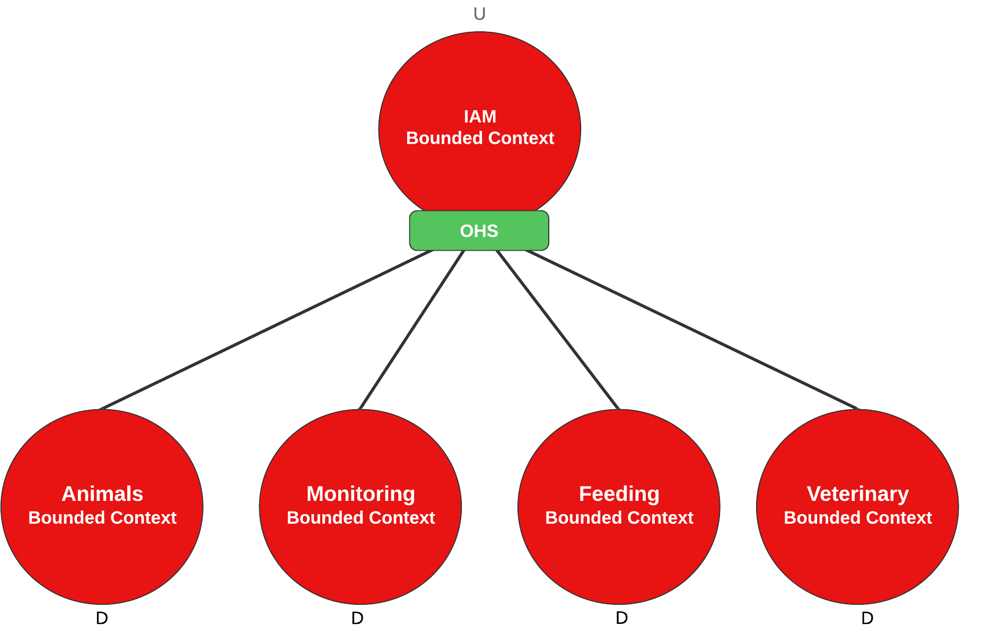

### Customer/Supplier (C/S) – Animals

El bounded context Animals actúa como proveedor de información base de los animales, como su identificación y estado. Otros contextos dependen de esta información para operar.

Relaciones:
- Monitoring (D) → Animals (U)  
- Feeding (D) → Animals (U)  
- Veterinary (D) → Animals (U)  

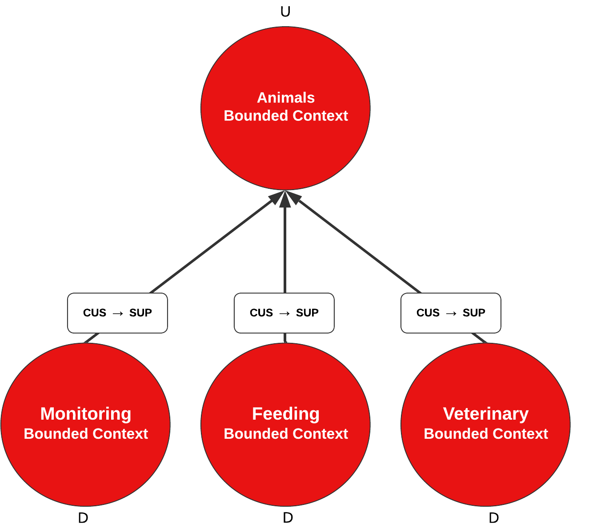

### Customer/Supplier (C/S) – Monitoring y Veterinary

El bounded context Monitoring genera eventos y alertas sobre el comportamiento o estado del animal. Veterinary utiliza esta información para evaluar situaciones de riesgo y tomar decisiones.

Relación:
- Veterinary (D) → Monitoring (U)  

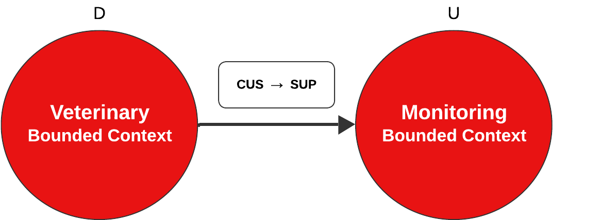

### Customer/Supplier (C/S) – Feeding y Veterinary

El bounded context Veterinary genera recomendaciones relacionadas con la alimentación según el estado de salud del animal. Feeding utiliza esta información para ajustar los planes de alimentación.

Relación:
- Feeding (D) → Veterinary (U)  

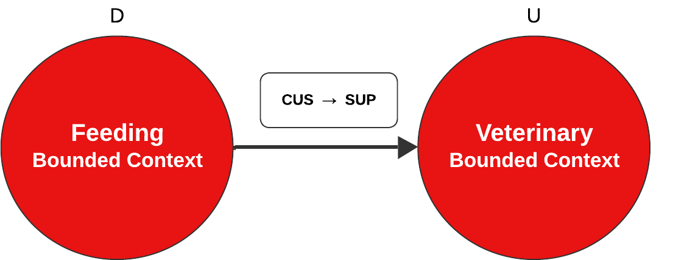

### Anti-Corruption Layer (ACL)

El patrón Anti-Corruption Layer se utiliza para integrar sistemas externos sin afectar el modelo interno del dominio.

En este proyecto, el bounded context Monitoring se integra con servicios externos como geolocalización (GPS). Para evitar acoplamiento directo, se utiliza una capa de traducción que adapta la información externa al modelo del sistema.

Relación:
- GPS External System (U) → ACL → Monitoring (D)  

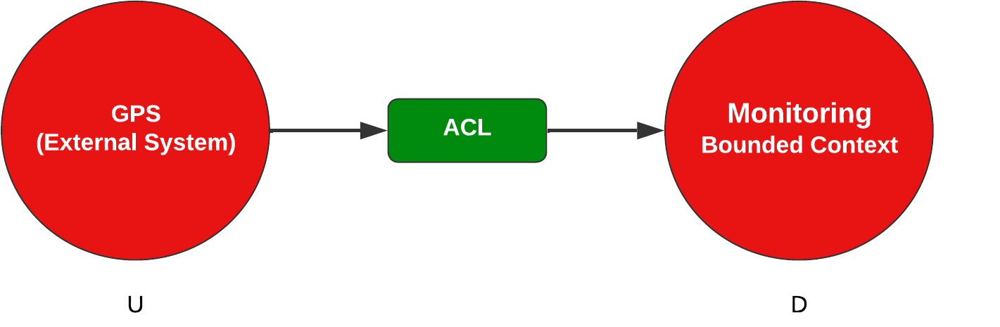

La arquitectura final seleccionada organiza los bounded contexts en función de capacidades de negocio claramente definidas, evitando la centralización excesiva y la fragmentación técnica.

El uso de patrones como Open Host Service, Customer/Supplier y Anti-Corruption Layer permite reducir el acoplamiento, facilitar la integración con sistemas externos y asegurar que cada contexto pueda evolucionar de manera independiente.

Este enfoque garantiza una arquitectura escalable, mantenible y alineada con los principios de Domain-Driven Design.

### 4.1.3. Software Architecture

#### 4.1.3.1. Software Architecture System Landscape Diagram
El System Landscape Diagram presenta una vista general del ecosistema en el que se ubica BluePatitas. En este diagrama se identifican los usuarios principales, el sistema BluePatitas y los sistemas externos con los que interactúa, como los dispositivos IoT, el servicio de notificaciones push y el servicio de mapas. Su propósito es mostrar, de forma resumida, cómo la solución se relaciona con su entorno general.
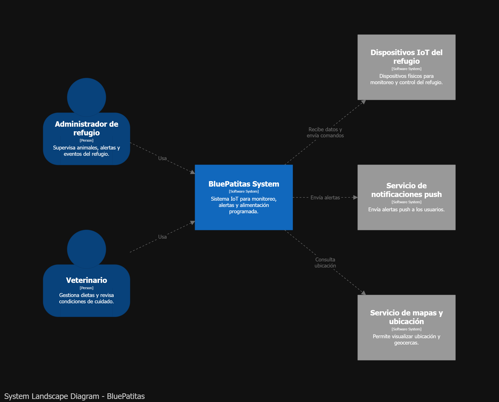

#### 4.1.3.2. Software Architecture Context Level Diagrams
El Context Diagram muestra a BluePatitas System como el sistema central de la solución. En esta vista se detallan sus relaciones directas con los actores principales, que son los administradores de refugios y veterinarios, así como con los dispositivos IoT y servicios externos necesarios para el monitoreo, las alertas y la ubicación. Este diagrama permite comprender qué funciones cumple el sistema dentro del contexto del refugio.
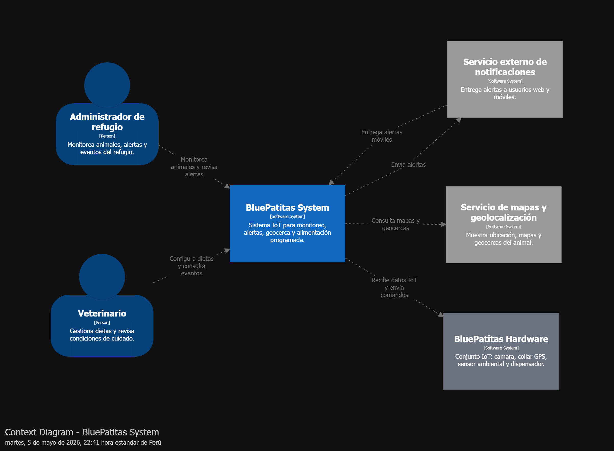

#### 4.1.3.3. Software Architecture Container Level Diagrams
El Container Diagram descompone internamente el sistema BluePatitas en sus principales componentes de software. En esta vista se representan la aplicación web, la aplicación móvil, el API Gateway, el Backend API, la base de datos, el IoT Edge Gateway, la base de datos local del Edge y las aplicaciones embebidas que interactúan con los dispositivos IoT. Su finalidad es mostrar cómo se organiza técnicamente la solución y cómo fluye la información entre sus componentes.
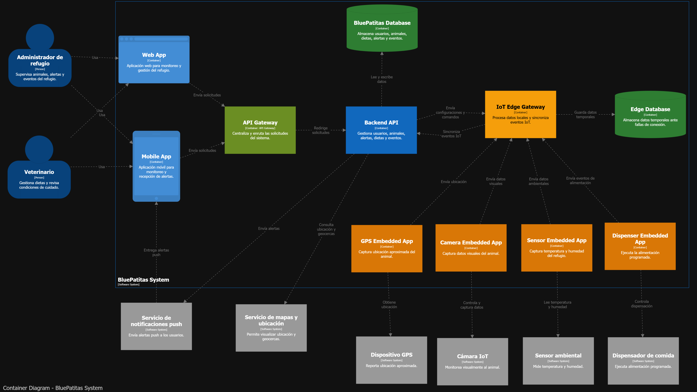

#### 4.1.3.4. Software Architecture Deployment Diagrams
El Deployment Diagram ilustra la infraestructura física y lógica donde se ejecutan los componentes de software en un entorno de producción. Se estructuran tres nodos principales: el dispositivo del usuario final, el Refugio Físico (Edge Layer) donde opera la red local de dispositivos IoT, y el Cloud Provider que aloja los servicios escalables de backend y bases de datos gestionadas. Su finalidad es detallar la topología de red, el uso de contenedores Docker y la conectividad necesaria para integrar los sensores físicos con la lógica en la nube

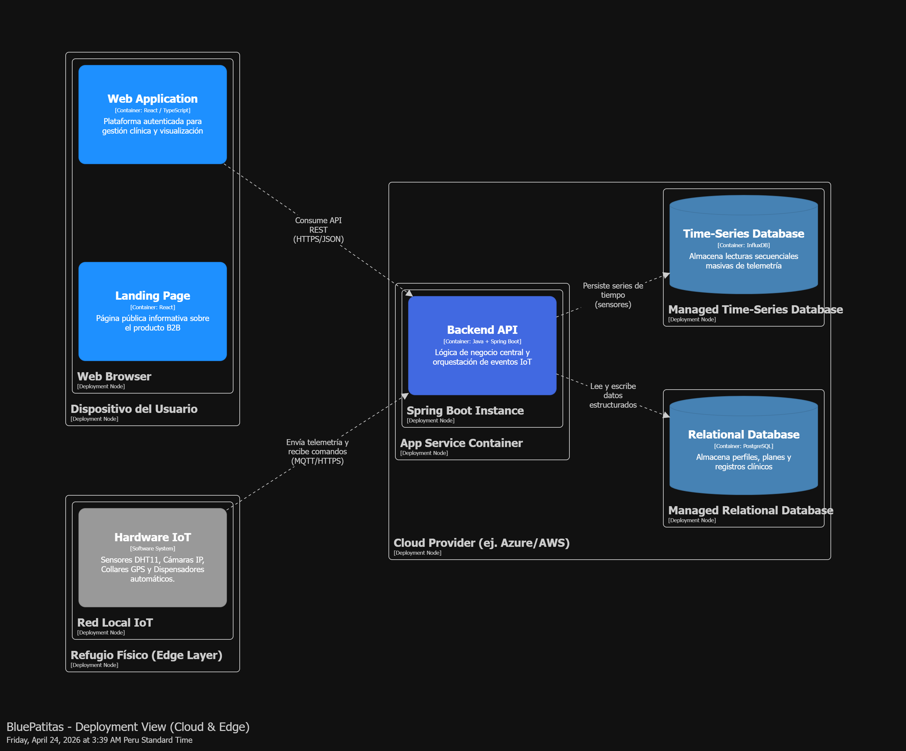

## 4.2. Tactical-Level Domain-Driven Design
En esta sección veremos cómo se organiza la implementación del sistema siguiendo los principios de Domain-Driven Design a nivel táctico, dividiendo la solución en capas como Domain, Application, Interface e Infrastructure, para separar responsabilidades y mantener una arquitectura clara, mantenible y alineada con la lógica del negocio.

### 4.2.1. Bounded Context: IAM (Identity and Access Management)

#### 4.2.1.1. Domain Layer

#### Entity: UserAccount

**Descripción:**  
Representa la cuenta de acceso y autorización del usuario.

##### Attributes

| Nombre        | Tipo de dato | Visibilidad | Descripción                                      |
|--------------|-------------|------------|--------------------------------------------------|
| id           | UUID        | Private    | Identificador único de la cuenta                |
| email        | String      | Private    | Correo electrónico de acceso                    |
| passwordHash | String      | Private    | Credencial de acceso encriptada                 |
| roleId       | UUID        | Private    | Identificador del rol asignado                  |
| isActive     | Boolean     | Private    | Estado actual de la cuenta                      |

##### Methods

| Nombre               | Tipo de retorno | Descripción                                      |
|---------------------|----------------|--------------------------------------------------|
| authenticate(String)| Boolean        | Valida las credenciales de la cuenta            |
| assignRole(UUID)    | Void           | Actualiza el rol asignado al usuario            |
| revokeAccess()      | Void           | Deshabilita el acceso de la cuenta al sistema   |

---

#### Entity: Role

**Descripción:**  
Representa un conjunto de permisos dentro del sistema.

##### Attributes

| Nombre      | Tipo de dato | Visibilidad | Descripción                                      |
|------------|-------------|------------|--------------------------------------------------|
| id         | UUID        | Private    | Identificador único del rol                     |
| name       | String      | Private    | Nombre identificador del rol                    |
| permissions| List        | Private    | Lista de permisos autorizados para el rol       |

##### Methods

| Nombre                   | Tipo de retorno | Descripción                                      |
|--------------------------|----------------|--------------------------------------------------|
| addPermission(String)    | Void           | Asigna un nuevo permiso al rol                  |
| removePermission(String) | Void           | Revoca un permiso existente del rol             |
| hasPermission(String)    | Boolean        | Evalúa si el rol posee un permiso específico    |

---

#### 4.2.1.1. Interface Layer

#### Controller: AuthController

| Ruta                   | Método | Descripción                                           |
|------------------------|--------|-------------------------------------------------------|
| /api/iam/auth/login    | POST   | Inicia sesión y genera las credenciales de acceso     |
| /api/iam/auth/logout   | POST   | Invalida la sesión actual del usuario                 |

---

#### Controller: RoleController

| Ruta                                   | Método | Descripción                                               |
|----------------------------------------|--------|-----------------------------------------------------------|
| /api/iam/roles                         | GET    | Obtiene el catálogo de roles disponibles                  |
| /api/iam/roles/{id}/permissions        | PUT    | Actualiza los permisos de un rol específico               |
| /api/iam/users/{id}/role               | PUT    | Asigna un nuevo rol a una cuenta de usuario               |

---

### 4.2.1.3. Application Layer

#### Service: AuthService

| Nombre                                           | Descripción                                               |
|--------------------------------------------------|-----------------------------------------------------------|
| authenticateUser(AuthenticateUserQuery)          | Procesa la validación de credenciales y acceso            |
| disableUserAccount(DisableAccountCommand)        | Gestiona la inhabilitación de una cuenta                  |

---

#### Service: RoleService

| Nombre                                           | Descripción                                               |
|--------------------------------------------------|-----------------------------------------------------------|
| assignRoleToUser(AssignUserRoleCommand)          | Ejecuta la asignación de roles a cuentas                  |
| updateRolePermissions(UpdatePermissionsCommand)  | Gestiona la modificación de permisos de los roles         |

---

### 4.2.1.4. Infrastructure Layer

| Nombre                          | Categoría                    | Implementa             | Descripción                                          |
|---------------------------------|------------------------------|------------------------|------------------------------------------------------|
| RelationalUserAccountRepository | Repository Implementation     | UserAccountRepository  | Persistencia de los datos de las cuentas             |
| RelationalRoleRepository        | Repository Implementation     | RoleRepository         | Persistencia de los roles y la lista de permisos     |

#### 4.2.1.5. Bounded Context Software Architecture Component Level Diagrams

En esta sección se presenta el diagrama de componentes del Bounded Context IAM (Identity and Access Management). Este diagrama sigue el enfoque del C4 Model y muestra la organización interna del contexto, sus componentes principales, las responsabilidades de cada capa y sus relaciones con las aplicaciones cliente, la API REST y la persistencia de datos.

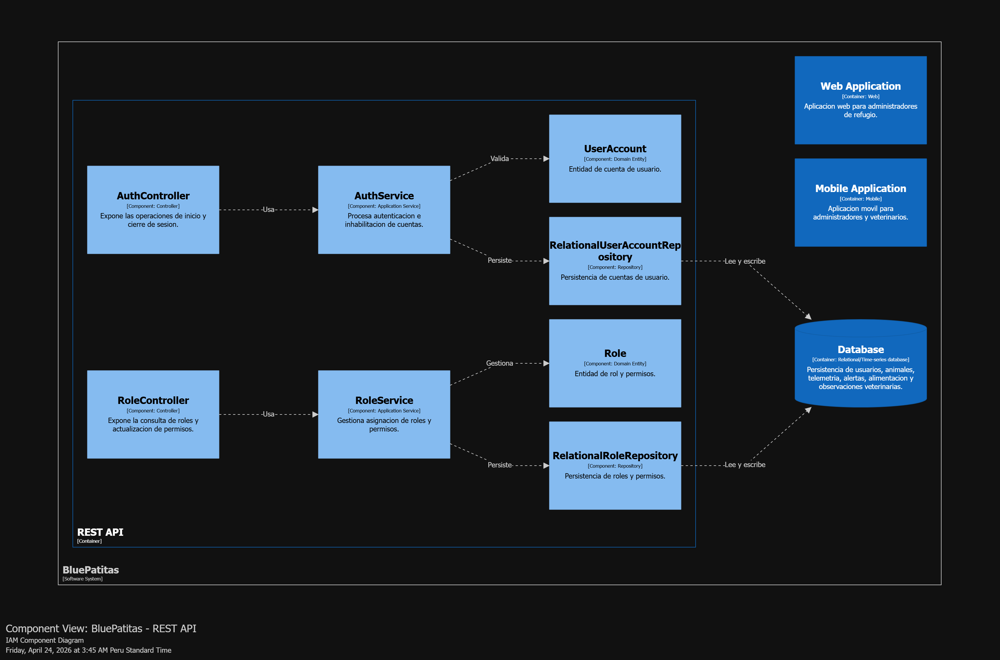

El Bounded Context IAM está compuesto por los siguientes componentes principales:

1. **Interface Layer**
   - `AuthController`: expone las solicitudes de inicio y cierre de sesión de los usuarios del sistema.
   - `RoleController`: permite consultar roles, actualizar permisos y asignar roles a cuentas de usuario.

2. **Application Layer**
   - `AuthService`: procesa la validación de credenciales, la autenticación y la inhabilitación de cuentas.
   - `RoleService`: gestiona la asignación de roles y la modificación de permisos asociados.

3. **Domain Layer**
   - `UserAccount`: representa la cuenta de acceso del usuario y concentra las reglas vinculadas con credenciales, estado y rol asignado.
   - `Role`: representa el conjunto de permisos que determina las acciones autorizadas para cada perfil de usuario.

4. **Infrastructure Layer**
   - `RelationalUserAccountRepository`: persiste los datos de las cuentas de usuario.
   - `RelationalRoleRepository`: persiste los roles y permisos disponibles en el sistema.

Este contexto se comunica con la Web Application y la Mobile Application mediante la REST API para autenticar usuarios y validar sus permisos. Además, proporciona capacidades transversales de seguridad para los demás bounded contexts, especialmente para operaciones ejecutadas por administradores de refugios y veterinarios.

#### 4.2.1.6. Bounded Context Software Architecture Code Level Diagrams
Aquí se muestra el diagrama correspondiente, organizado dentro del bounded context de Analíticas. El modelo incorpora tablas que representan entidades persistentes, las cuales pueden ser mapeadas a clases de dominio dentro de una arquitectura orientada a objetos.

##### 4.2.1.6.1. Bounded Context Domain Layer Class Diagram (IAM)
Este diagrama representa la lógica pura de negocio, utilizando los patrones tácticos de DDD como Aggregate Roots y Entities.

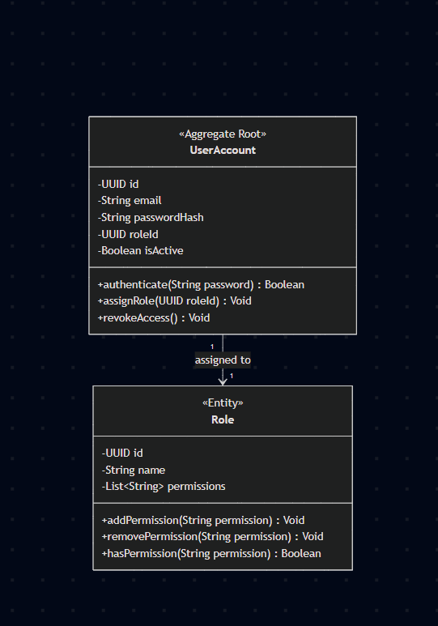

##### 4.2.1.6.2. Bounded Context Database Design Diagram
Este diagrama muestra cómo se estructura la persistencia de datos en una base de datos relacional, definiendo llaves primarias (PK), foráneas (FK) y tipos de datos.

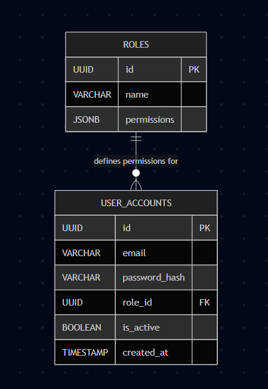

## 4.2.2. Bounded Context: Animals

### 4.2.2.1. Domain Layer

#### Entity: Animal

**Descripción:**  
Representa la identidad, estado biológico y ubicación asignada de un animal.

##### Attributes

| Nombre              | Tipo de dato | Visibilidad | Descripción                                                        |
|--------------------|-------------|------------|--------------------------------------------------------------------|
| id                 | UUID        | Private    | Identificador único del animal                                    |
| name               | String      | Private    | Nombre de identificación                                          |
| speciesDetails     | SpeciesInfo | Private    | Datos base (especie, raza, edad aproximada)                       |
| healthCondition    | String      | Private    | Estado general de salud actual                                    |
| assignedPerimeterId| UUID        | Private    | Identificador de la zona o perímetro seguro asignado              |

##### Methods

| Nombre                          | Tipo de retorno | Descripción                                                        |
|---------------------------------|----------------|--------------------------------------------------------------------|
| updateBaseProfile(SpeciesInfo)  | Void           | Actualiza los datos base e identidad del animal                   |
| registerHealthCondition(String) | Void           | Modifica el estado general de salud (ej. en tratamiento, sano)    |
| relocateToPerimeter(UUID)       | Void           | Asigna o reubica al animal en un nuevo perímetro delimitado       |

---

### 4.2.2.2. Interface Layer

#### Controller: AnimalProfileController

| Ruta                              | Método | Descripción                                                        |
|----------------------------------|--------|--------------------------------------------------------------------|
| /api/animals                     | POST   | Registra la identidad y datos base de un nuevo animal             |
| /api/animals/{id}                | GET    | Obtiene el perfil completo y estado del animal                    |
| /api/animals/{id}/health         | PUT    | Actualiza el estado general de salud                              |
| /api/animals/{id}/perimeter      | PUT    | Asigna una nueva zona o perímetro al animal                       |

---

### 4.2.2.3. Application Layer

#### Service: AnimalManagementService

| Nombre                                              | Descripción                                                        |
|-----------------------------------------------------|--------------------------------------------------------------------|
| registerNewAnimal(RegisterAnimalCommand)            | Procesa la creación de la identidad y datos base                  |
| updateAnimalHealth(UpdateHealthCommand)             | Gestiona la actualización del estado general del animal           |
| assignAnimalPerimeter(AssignPerimeterCommand)       | Ejecuta la asignación del animal a una zona específica            |

---

### 4.2.2.4. Infrastructure Layer

| Nombre                      | Categoría                    | Implementa        | Descripción                                                        |
|-----------------------------|------------------------------|-------------------|--------------------------------------------------------------------|
| RelationalAnimalRepository | Repository Implementation     | AnimalRepository  | Persistencia de la identidad, estado y asignación de zona         |

#### 4.2.2.5. Bounded Context Software Architecture Component Level Diagrams

En esta sección se presenta el diagrama de componentes del Bounded Context Animals. Este diagrama sigue el enfoque del C4 Model y muestra la organización interna del contexto, sus componentes principales, las responsabilidades de cada capa y sus relaciones con otros contextos que utilizan la identidad y ubicación asignada de cada animal.

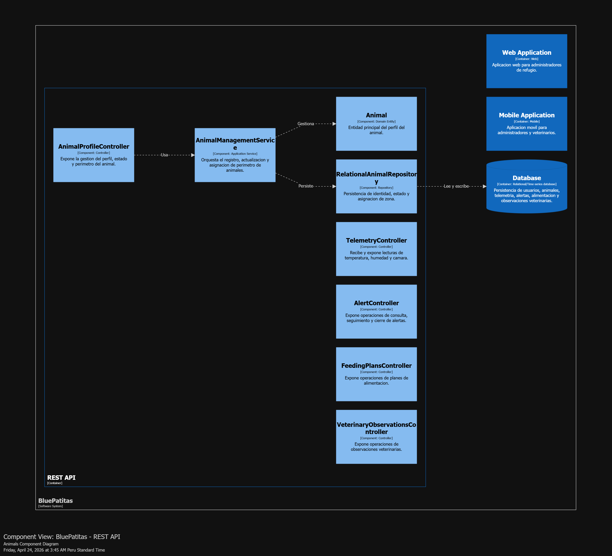

El Bounded Context Animals está compuesto por los siguientes componentes principales:

1. **Interface Layer**
   - `AnimalProfileController`: expone las solicitudes para registrar animales, consultar perfiles, actualizar el estado general y asignar zonas o perímetros.

2. **Application Layer**
   - `AnimalManagementService`: coordina el registro de nuevos animales, la actualización de información general y la asignación de perímetros.

3. **Domain Layer**
   - `Animal`: representa la identidad principal del animal dentro del sistema, incluyendo datos base, estado general y zona asignada.
   - `SpeciesInfo`: representa la información base de especie, raza y edad aproximada utilizada en el perfil del animal.

4. **Infrastructure Layer**
   - `RelationalAnimalRepository`: persiste la identidad, el estado general y la asignación de zona del animal.

Este contexto se relaciona con Monitoring porque provee el identificador y la zona asignada del animal para evaluar eventos de geocerca y monitoreo visual. También sirve como referencia para Feeding y Veterinary, ya que ambos contextos requieren asociar planes de alimentación, observaciones o recomendaciones a un animal registrado.

#### 4.2.2.6. Bounded Context Software Architecture Code Level Diagrams
Aquí se muestra el diagrama correspondiente, organizado dentro del bounded context de Analíticas. El modelo incorpora tablas que representan entidades persistentes, las cuales pueden ser mapeadas a clases de dominio dentro de una arquitectura orientada a objetos.

##### 4.2.2.6.1. Bounded Context Domain Layer Class Diagram (Animals)
El diagrama modela las reglas de negocio de los animales definiendo a Animal como Aggregate Root que garantiza la consistencia mediante sus métodos, a SpeciesInfo como Value Object que agrupa especie, raza y edad sin identificador propio, y a HealthStatus como Enumeration para limitar el estado de salud a valores controlados.

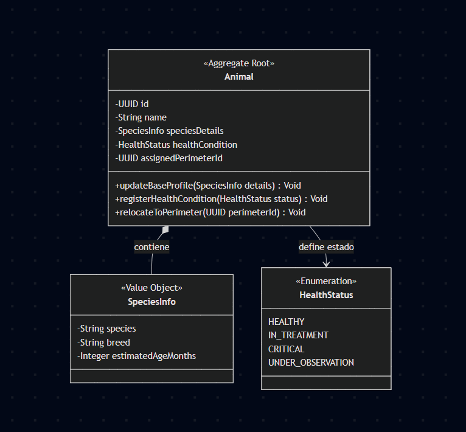

##### 4.2.2.6.2. Bounded Context Database Design Diagram
El diagrama muestra cómo el modelo de dominio se adapta a una base de datos relacional, aplanando el objeto de valor SpeciesInfo en columnas dentro de la tabla ANIMALS para optimizar consultas, y representando la tabla PERIMETERS para establecer una clave foránea que garantiza la integridad referencial, asegurando que cada animal esté asignado a una zona válida.

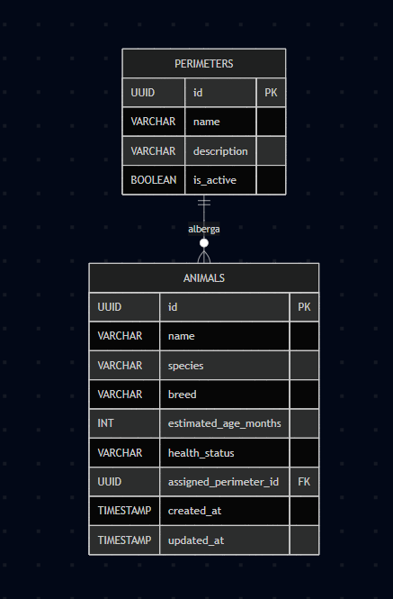

## 4.2.3. Bounded Context: Monitoring

### 4.2.3.1. Domain Layer

#### Entity: TelemetryRecord

**Descripción:**  
Representa las lecturas ambientales y de monitoreo visual en un instante de tiempo.

##### Attributes

| Nombre              | Tipo de dato | Visibilidad | Descripción                                                        |
|--------------------|-------------|------------|--------------------------------------------------------------------|
| id                 | UUID        | Private    | Identificador único del registro                                  |
| targetId           | UUID        | Private    | Identificador del sujeto monitoreado (animal)                     |
| ambientTemperature | Decimal     | Private    | Lectura actual de temperatura                                     |
| ambientHumidity    | Decimal     | Private    | Lectura actual de humedad                                         |
| visualData         | String      | Private    | Referencia o metadatos del monitoreo por cámara                   |
| recordedAt         | Date        | Private    | Fecha y hora exacta de la lectura                                 |

##### Methods

| Nombre                          | Tipo de retorno | Descripción                                                        |
|---------------------------------|----------------|--------------------------------------------------------------------|
| validateEnvironmentalThresholds() | Boolean        | Evalúa si la temperatura y humedad están en rangos seguros        |
| hasVisualAnomalies()            | Boolean        | Analiza la data visual en busca de comportamientos inusuales      |

---

#### Entity: PerimeterAlert

**Descripción:**  
Representa una alerta generada por la salida de una zona asignada y su seguimiento.

##### Attributes

| Nombre             | Tipo de dato      | Visibilidad | Descripción                                                        |
|--------------------|------------------|------------|--------------------------------------------------------------------|
| id                 | UUID             | Private    | Identificador único de la alerta                                  |
| targetId           | UUID             | Private    | Identificador del sujeto que generó la alerta                     |
| isBreachConfirmed  | Boolean          | Private    | Confirmación de la salida del perímetro                           |
| currentCoordinates | LocationContext  | Private    | Datos exactos de localización actual                              |
| trackingActive     | Boolean          | Private    | Estado de la activación de localización continua                  |

##### Methods

| Nombre                       | Tipo de retorno | Descripción                                                        |
|------------------------------|----------------|--------------------------------------------------------------------|
| confirmBreach()              | Void           | Registra y confirma la detección de salida del perímetro          |
| activateLocationTracking()   | Void           | Inicia la actualización constante de las coordenadas              |
| resolveAlert()               | Void           | Cierra la alerta una vez gestionada la incidencia                 |

---

### 4.2.3.2. Interface Layer

#### Controller: TelemetryController

| Ruta                                      | Método | Descripción                                                        |
|------------------------------------------|--------|--------------------------------------------------------------------|
| /api/monitoring/telemetry                | POST   | Ingresa nuevas lecturas de temperatura, humedad y cámara          |
| /api/monitoring/telemetry/{targetId}     | GET    | Obtiene el historial reciente de lecturas ambientales             |

---

#### Controller: AlertController

| Ruta                                              | Método | Descripción                                                        |
|--------------------------------------------------|--------|--------------------------------------------------------------------|
| /api/monitoring/alerts                           | GET    | Obtiene la lista de alertas de perímetro generadas                |
| /api/monitoring/alerts/{targetId}/tracking       | POST   | Activa la localización continua para un sujeto específico         |
| /api/monitoring/alerts/{id}/resolve              | PUT    | Marca una alerta como resuelta                                    |

---

### 4.2.3.3. Application Layer

#### Service: TelemetryAnalysisService

| Nombre                                                  | Descripción                                                        |
|----------------------------------------------------------|--------------------------------------------------------------------|
| processIncomingTelemetry(ProcessTelemetryCommand)        | Registra las lecturas y evalúa umbrales de temperatura y humedad  |
| analyzeVisualMonitoring(AnalyzeVisualDataQuery)          | Gestiona el procesamiento continuo de las entradas de cámara      |

---

#### Service: PerimeterAlertService

| Nombre                                                  | Descripción                                                        |
|----------------------------------------------------------|--------------------------------------------------------------------|
| evaluatePerimeterBreach(EvaluateBreachCommand)           | Detecta salidas del perímetro y genera alertas automáticamente    |
| enableContinuousTracking(EnableTrackingCommand)          | Activa y gestiona el flujo de localización tras una alerta        |

---

### 4.2.3.4. Infrastructure Layer

| Nombre                          | Categoría                    | Implementa            | Descripción                                                        |
|---------------------------------|------------------------------|------------------------|--------------------------------------------------------------------|
| TimeSeriesTelemetryRepository   | Repository Implementation     | TelemetryRepository   | Persistencia optimizada para lecturas secuenciales de monitoreo   |
| RelationalAlertRepository       | Repository Implementation     | AlertRepository       | Persistencia de alertas generadas y estados de localización       |

#### 4.2.3.5. Bounded Context Software Architecture Component Level Diagrams

En esta sección se presenta el diagrama de componentes del Bounded Context Monitoring. Este diagrama sigue el enfoque del C4 Model y muestra la organización interna del contexto, sus componentes principales, las responsabilidades de cada capa y su interacción con el Edge API / ESP32 Gateway, los dispositivos IoT y el servicio de notificaciones.

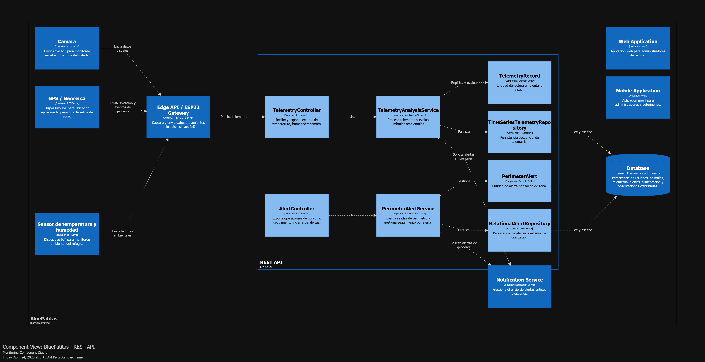

El Bounded Context Monitoring está compuesto por los siguientes componentes principales:

1. **Interface Layer**
   - `TelemetryController`: recibe nuevas lecturas de temperatura, humedad y monitoreo por cámara, y permite consultar el historial reciente de telemetría.
   - `AlertController`: expone operaciones para consultar alertas, activar seguimiento por ubicación y marcar alertas como resueltas.

2. **Application Layer**
   - `TelemetryAnalysisService`: procesa la telemetría entrante, registra lecturas y evalúa umbrales ambientales.
   - `PerimeterAlertService`: evalúa salidas del perímetro, genera alertas y gestiona el flujo de seguimiento por ubicación.

3. **Domain Layer**
   - `TelemetryRecord`: representa las lecturas ambientales y los metadatos del monitoreo visual en un instante de tiempo.
   - `PerimeterAlert`: representa una alerta generada por la salida de una zona asignada y su seguimiento operativo.
   - `LocationContext`: representa la ubicación aproximada asociada al evento de geocerca.

4. **Infrastructure Layer**
   - `TimeSeriesTelemetryRepository`: persiste lecturas secuenciales de monitoreo ambiental y visual.
   - `RelationalAlertRepository`: persiste alertas generadas y estados de seguimiento.
   - `Edge API / ESP32 Gateway`: entrega al contexto las lecturas provenientes de cámara, GPS/geocerca y sensor de temperatura y humedad.
   - `Notification Service`: permite emitir alertas críticas ante salida de zona permitida o valores ambientales fuera de rango.

Este contexto se comunica con Animals para asociar la telemetría y las alertas al animal o zona correspondiente. También se integra con Veterinary cuando una alerta requiere revisión profesional, y con el servicio de notificaciones para informar eventos críticos a administradores de refugios o veterinarios.

#### 4.2.3.6. Bounded Context Software Architecture Code Level Diagrams
Aquí se muestra el diagrama correspondiente, organizado dentro del bounded context de Analíticas. El modelo incorpora tablas que representan entidades persistentes, las cuales pueden ser mapeadas a clases de dominio dentro de una arquitectura orientada a objetos.

##### 4.2.3.6.1. Bounded Context Domain Layer Class Diagram (Monitoring)
El diagrama modela el núcleo del sistema en tiempo real con dos Aggregate Roots independientes: TelemetryRecord, que gestiona el flujo continuo de datos de sensores, y PerimeterAlert, que representa eventos críticos que requieren seguimiento; además, utiliza Value Objects para mejorar la claridad del modelo, agrupando temperatura y humedad en EnvironmentalMetrics y latitud y longitud en LocationContext, haciendo el diseño más expresivo y orientado al dominio.

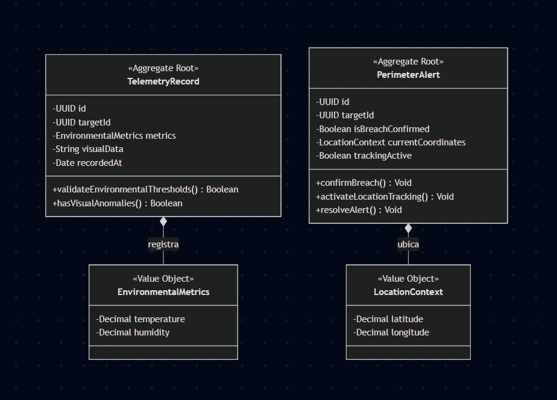

##### 4.2.3.6.2. Bounded Context Database Design Diagram
El diagrama aborda la persistencia considerando el alto volumen de datos, separando la tabla TELEMETRY_RECORDS para manejar inserciones masivas con marcas de tiempo, aplanando los Value Objects (LocationContext y EnvironmentalMetrics) en columnas primitivas como temperatura, humedad y coordenadas, e incluyendo una referencia a la tabla ANIMALS mediante una clave foránea (target_id) para vincular lecturas y alertas con el animal monitoreado.

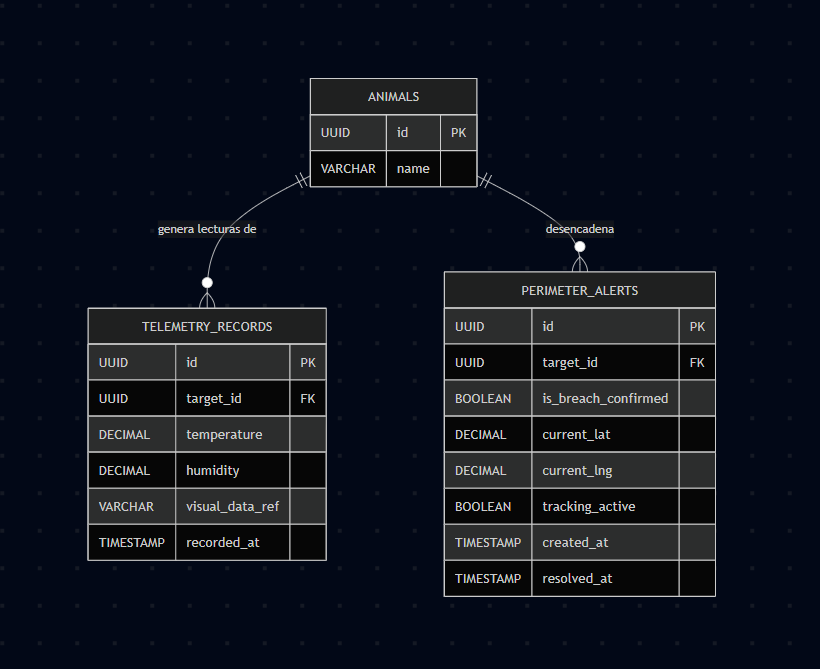

## 4.2.4. Bounded Context: Feeding

### 4.2.4.1. Domain Layer

#### Aggregate: FeedingPlan

**Descripción:**  
Representa el plan de alimentación asignado a un animal, incluyendo horarios, cantidad de alimento y tipo de dieta.

##### Attributes

| Nombre        | Tipo de dato        | Visibilidad | Descripción                                      |
|--------------|---------------------|------------|--------------------------------------------------|
| id           | UUID                | Private    | Identificador único del plan de alimentación      |
| animalId     | UUID                | Private    | Identificador del animal asociado                |
| dietType     | DietType            | Private    | Tipo de dieta asignada                           |
| foodAmount   | FoodAmount          | Private    | Cantidad de alimento                             |
| schedule     | FeedingSchedule     | Private    | Horarios de alimentación                         |
| status       | FeedingPlanStatus   | Private    | Estado del plan (activo/inactivo)                |
| createdAt    | LocalDateTime       | Private    | Fecha de creación                                |
| updatedAt    | LocalDateTime       | Private    | Fecha de última actualización                    |

##### Methods

| Nombre                         | Tipo de retorno | Descripción                                      |
|--------------------------------|----------------|--------------------------------------------------|
| create(...)                    | FeedingPlan    | Crea un nuevo plan de alimentación               |
| updateDiet(DietType)           | Void           | Actualiza el tipo de dieta                      |
| updateFoodAmount(FoodAmount)   | Void           | Modifica la cantidad de alimento                |
| updateSchedule(FeedingSchedule)| Void           | Actualiza los horarios                          |
| activate()                     | Void           | Activa el plan                                  |
| deactivate()                   | Void           | Desactiva el plan                               |
| canBeExecutedAt(LocalDateTime) | Boolean        | Verifica si se puede ejecutar la alimentación   |

---

#### Entity: FeedingEvent

**Descripción:**  
Representa una ejecución de alimentación programada o realizada.

##### Attributes

| Nombre          | Tipo de dato   | Visibilidad | Descripción                         |
|-----------------|----------------|------------|-------------------------------------|
| id              | UUID           | Private    | Identificador del evento            |
| feedingPlanId   | UUID           | Private    | Referencia al plan de alimentación  |
| scheduledAt     | LocalDateTime  | Private    | Hora programada                     |
| executedAt      | LocalDateTime  | Private    | Hora de ejecución                   |
| status          | String         | Private    | Estado del evento                   |

##### Methods

| Nombre            | Tipo de retorno | Descripción                        |
|------------------|----------------|------------------------------------|
| markAsExecuted() | Void           | Marca el evento como ejecutado     |
| markAsFailed()   | Void           | Marca el evento como fallido       |

---

### 4.2.4.2. Interface Layer

#### Controller: FeedingPlansController

| Ruta                               | Método | Descripción                                      |
|------------------------------------|--------|--------------------------------------------------|
| /api/feeding/plans                 | POST   | Crea un plan de alimentación                     |
| /api/feeding/plans/{animalId}      | GET    | Obtiene el plan de alimentación por animal       |
| /api/feeding/plans/{id}            | PUT    | Actualiza un plan de alimentación                |
| /api/feeding/plans/{id}/activate   | PUT    | Activa el plan                                  |
| /api/feeding/plans/{id}/deactivate | PUT    | Desactiva el plan                               |

---

### 4.2.4.3. Application Layer

#### Command: CreateFeedingPlanCommand

| Nombre        | Tipo de dato |
|--------------|-------------|
| animalId     | UUID        |
| dietType     | String      |
| foodAmount   | Decimal     |
| schedule     | List        |

---

#### Command: UpdateFeedingPlanCommand

| Nombre         | Tipo de dato |
|---------------|-------------|
| feedingPlanId | UUID        |
| dietType      | String      |
| foodAmount    | Decimal     |

---

#### Event Handler: VeterinaryFeedingRecommendationCreatedEventHandler

| Nombre  | Descripción |
|--------|------------|
| handle | Recibe recomendaciones veterinarias y evalúa la actualización del FeedingPlan |

---

### 4.2.4.4. Infrastructure Layer

| Nombre                     | Categoría                    | Implementa              | Descripción                                      |
|---------------------------|------------------------------|--------------------------|--------------------------------------------------|
| SqlFeedingPlanRepository  | Repository Implementation     | FeedingPlanRepository    | Persistencia de planes de alimentación            |
| DispenserDeviceService    | External Service              | -                        | Integración con el dispensador automático         |

#### 4.2.4.5. Bounded Context Software Architecture Component Level Diagrams

En esta sección se presenta el diagrama de componentes del Bounded Context Feeding. Este diagrama sigue el enfoque del C4 Model y muestra la organización interna del contexto, sus componentes principales, las responsabilidades de cada capa y su relación con el dispensador automático de comida y las recomendaciones veterinarias.

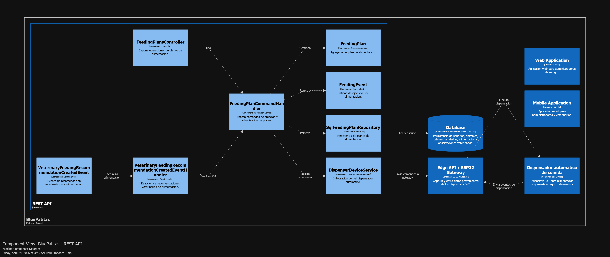

El Bounded Context Feeding está compuesto por los siguientes componentes principales:

1. **Interface Layer**
   - `FeedingPlansController`: expone operaciones para crear, consultar, actualizar, activar y desactivar planes de alimentación.

2. **Application Layer**
   - `CreateFeedingPlanCommand`: encapsula los datos necesarios para crear un plan de alimentación.
   - `UpdateFeedingPlanCommand`: encapsula los datos necesarios para actualizar un plan existente.
   - `VeterinaryFeedingRecommendationCreatedEventHandler`: recibe recomendaciones veterinarias y evalúa la actualización del plan de alimentación.

3. **Domain Layer**
   - `FeedingPlan`: representa el agregado principal del contexto, incluyendo dieta, cantidad de alimento, horario y estado.
   - `FeedingEvent`: representa una ejecución programada o realizada de alimentación.
   - `DietType`, `FoodAmount` y `FeedingSchedule`: representan objetos de valor utilizados para expresar la dieta, la cantidad y la programación de alimentación.

4. **Infrastructure Layer**
   - `SqlFeedingPlanRepository`: persiste los planes de alimentación y sus datos asociados.
   - `DispenserDeviceService`: integra el contexto con el dispensador automático de comida mediante el Edge API / ESP32 Gateway.

Este contexto se comunica con Veterinary para recibir recomendaciones de alimentación y con Animals para asociar cada plan al animal correspondiente. Además, interactúa con el Edge API / ESP32 Gateway para ejecutar la dispensación programada y registrar eventos generados por el dispositivo.

#### 4.2.4.6. Bounded Context Software Architecture Code Level Diagrams (Feeding)

En este apartado se presentan los diagramas que ofrecen un mayor nivel de detalle sobre la implementación de los componentes del Feeding Bounded Context. Estos diagramas están diseñados para ilustrar cómo se estructuran las clases, interfaces y relaciones dentro de las capas del contexto, proporcionando una visión técnica que facilita el desarrollo, mantenimiento y evolución del sistema.

##### 4.2.4.6.1. Bounded Context Domain Layer Class Diagrams
El diseño de la capa de dominio para el _Feeding Bounded Context_ encapsula la lógica central de la alimentación automatizada. El diagrama de clases a continuación ilustra cómo el _Aggregate Root_ (`FeedingPlan`) actúa como el guardián de la consistencia, gestionando las reglas de nutrición (dieta, cantidad y horarios) y orquestando el ciclo de vida de las entidades subordinadas (`FeedingEvent`), las cuales representan las ejecuciones físicas en el dispensador IoT.

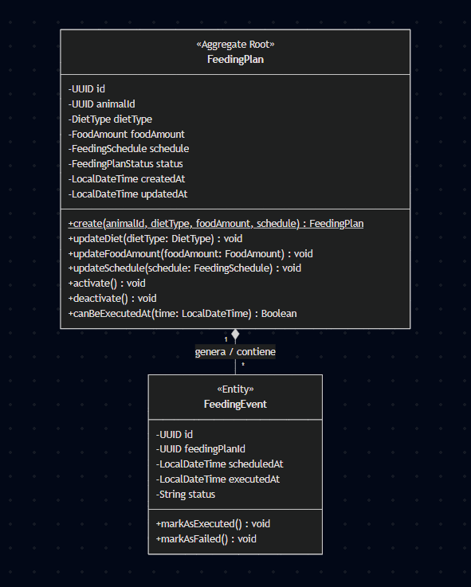

##### 4.2.4.6.2. Bounded Context Database Layer Class Diagrams
El diseño de la base de datos para el _Feeding Bounded Context_ refleja fielmente la estructura del dominio, asegurando que el plan nutricional y su historial de dispensación se representen de manera eficiente en el modelo relacional. Se establece una relación directa de uno a muchos entre los planes (`feeding_plans`) y sus ejecuciones (`feeding_events`), garantizando la trazabilidad de cada gramo de alimento liberado por el hardware.

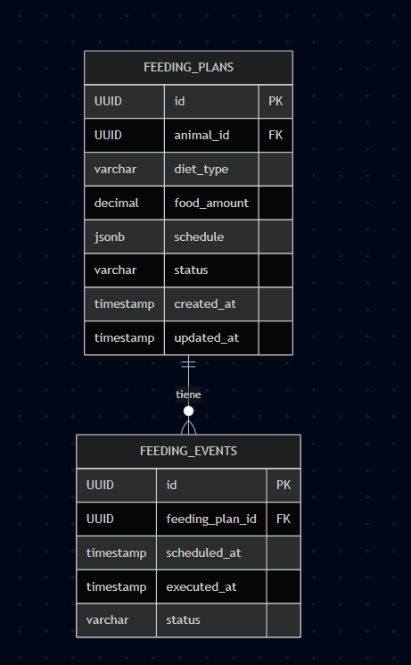

## 4.2.5. Bounded Context: Veterinary

### 4.2.5.1. Domain Layer

#### Aggregate: VeterinaryObservation

**Descripción:**  
Representa una observación veterinaria sobre el estado de un animal.

##### Attributes

| Nombre           | Tipo de dato   | Visibilidad | Descripción                                |
|------------------|---------------|------------|--------------------------------------------|
| id               | UUID          | Private    | Identificador de la observación            |
| animalId         | UUID          | Private    | Identificador del animal                   |
| veterinarianId   | UUID          | Private    | Identificador del veterinario              |
| description      | String        | Private    | Descripción de la observación              |
| recommendation   | String        | Private    | Recomendación veterinaria                  |
| createdAt        | LocalDateTime | Private    | Fecha de creación                          |

##### Methods

| Nombre                      | Tipo de retorno | Descripción                                      |
|---------------------------|----------------|--------------------------------------------------|
| create(...)               | VeterinaryObservation | Crea una observación                       |
| addRecommendation(...)    | Void           | Agrega una recomendación                        |
| createFeedingRecommendation(...) | Void    | Genera recomendación de alimentación            |

---

#### Entity: VeterinaryAlertReview

**Descripción:**  
Representa la revisión de una alerta generada por monitoreo.

##### Attributes

| Nombre         | Tipo de dato   | Visibilidad | Descripción                     |
|---------------|---------------|------------|---------------------------------|
| id            | UUID          | Private    | Identificador                   |
| alertId       | UUID          | Private    | Identificador de la alerta      |
| veterinarianId| UUID          | Private    | Veterinario responsable         |
| status        | String        | Private    | Estado de revisión              |

---

### 4.2.5.2. Interface Layer

#### Controller: VeterinaryObservationsController

| Ruta                                  | Método | Descripción                                      |
|---------------------------------------|--------|--------------------------------------------------|
| /api/veterinary/observations          | POST   | Registra una observación                         |
| /api/veterinary/observations/{id}     | GET    | Obtiene una observación                          |
| /api/veterinary/animals/{id}          | GET    | Lista observaciones por animal                   |

---

### 4.2.5.3. Application Layer

#### Command: CreateVeterinaryObservationCommand

| Nombre         | Tipo de dato |
|---------------|-------------|
| animalId      | UUID        |
| veterinarianId| UUID        |
| description   | String      |

---

#### Command: AddVeterinaryRecommendationCommand

| Nombre         | Tipo de dato |
|---------------|-------------|
| observationId | UUID        |
| recommendation| String      |

---

#### Domain Event: VeterinaryFeedingRecommendationCreatedEvent

| Nombre         | Tipo de dato |
|---------------|-------------|
| animalId      | UUID        |
| recommendation| String      |

---

### 4.2.5.4. Infrastructure Layer

| Nombre                             | Categoría                    | Implementa                      | Descripción                                      |
|-----------------------------------|------------------------------|----------------------------------|--------------------------------------------------|
| SqlVeterinaryObservationRepository| Repository Implementation     | VeterinaryObservationRepository | Persistencia de observaciones veterinarias       |
| VeterinaryNotificationService     | External Service              | -                                | Notificaciones al veterinario                    |

#### 4.2.5.5. Bounded Context Software Architecture Component Level Diagrams

En esta sección se presenta el diagrama de componentes del Bounded Context Veterinary. Este diagrama sigue el enfoque del C4 Model y muestra la organización interna del contexto, sus componentes principales, las responsabilidades de cada capa y su relación con los contextos de monitoreo y alimentación.

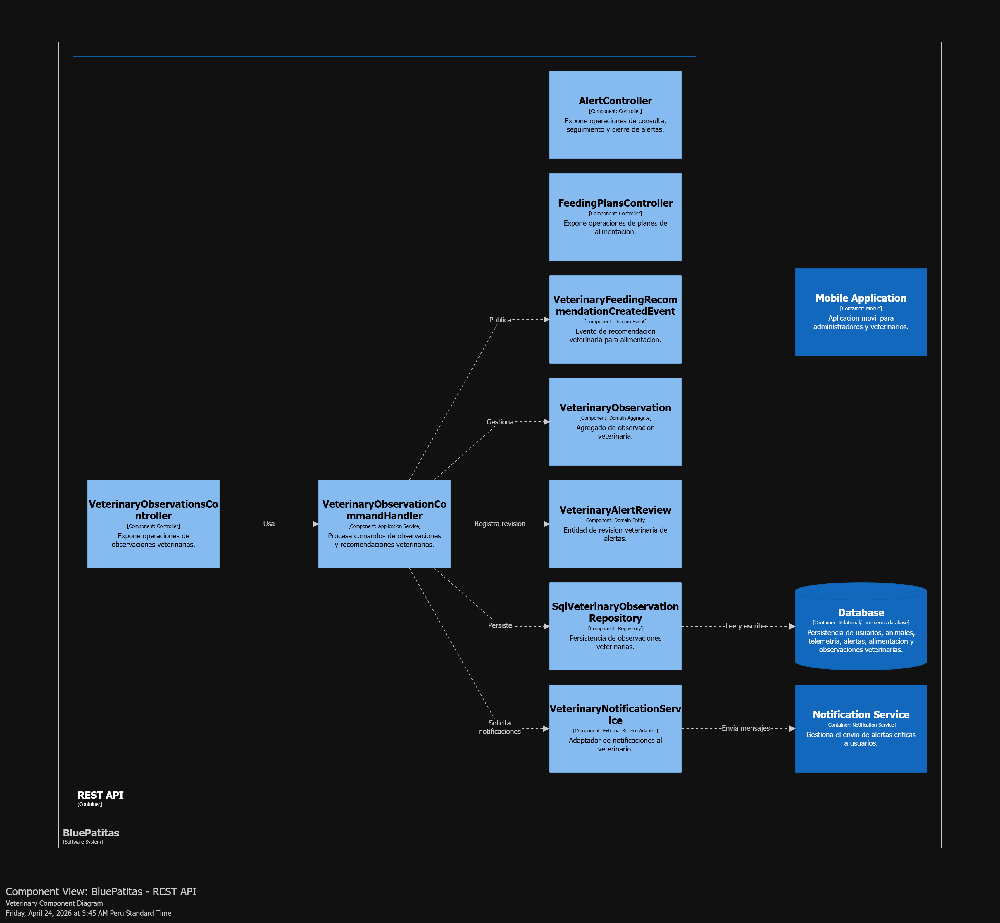

El Bounded Context Veterinary está compuesto por los siguientes componentes principales:

1. **Interface Layer**
   - `VeterinaryObservationsController`: expone operaciones para registrar observaciones veterinarias, consultar una observación específica y listar observaciones asociadas a un animal.

2. **Application Layer**
   - `CreateVeterinaryObservationCommand`: encapsula los datos necesarios para registrar una observación veterinaria.
   - `AddVeterinaryRecommendationCommand`: encapsula la recomendación agregada por el veterinario a una observación existente.
   - `VeterinaryFeedingRecommendationCreatedEvent`: comunica una recomendación veterinaria relacionada con alimentación hacia el contexto Feeding.

3. **Domain Layer**
   - `VeterinaryObservation`: representa el agregado principal de la observación veterinaria y concentra la recomendación asociada.
   - `VeterinaryAlertReview`: representa la revisión de una alerta generada por el monitoreo.

4. **Infrastructure Layer**
   - `SqlVeterinaryObservationRepository`: persiste las observaciones veterinarias y recomendaciones asociadas.
   - `VeterinaryNotificationService`: integra el contexto con el servicio de notificaciones para informar al veterinario cuando corresponde.

Este contexto se comunica con Monitoring cuando una alerta requiere revisión veterinaria y con Feeding cuando una recomendación modifica o genera criterios para el plan de alimentación. También utiliza información del contexto Animals para asociar observaciones y recomendaciones a un animal registrado.

#### 4.2.5.6. Bounded Context Software Architecture Code Level Diagrams (Veterinary)
En este apartado se presentan los diagramas que ofrecen un mayor nivel de detalle sobre la implementación de los componentes del Veterinary Bounded Context. Estos diagramas están diseñados para ilustrar cómo se estructuran las clases, interfaces y relaciones dentro de las capas del contexto, proporcionando una visión técnica que facilita el desarrollo, mantenimiento y evolución del sistema.

##### 4.2.5.6.1. Bounded Context Domain Layer Class Diagrams
El diseño de la capa de dominio para el _Veterinary Bounded Context_ se centra en la gestión de la salud clínica y la respuesta a la telemetría. El diagrama expone los _Aggregates_ principales responsables de registrar las observaciones médicas (`VeterinaryObservation`) y de gestionar las revisiones clínicas de las alertas emitidas por el hardware (`VeterinaryAlertReview`). Ambos elementos operan de manera independiente dentro del dominio médico para mantener un alto grado de cohesión en sus respectivas lógicas de negocio.

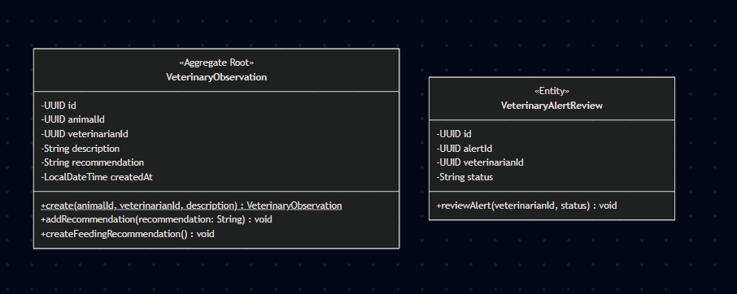

##### 4.2.5.6.2. Bounded Context Database Design Diagram
El diseño de la base de datos para el _Veterinary Bounded Context_ persiste la información clínica asegurando un bajo acoplamiento. Como se observa en el diagrama, las tablas `veterinary_observations` y `veterinary_alert_reviews` no poseen una relación física (Foreign Key) entre sí, ya que responden a flujos de negocio distintos (evaluación proactiva vs. reacción a alertas IoT). En su lugar, ambas tablas utilizan identificadores lógicos (Soft Links) como `animal_id` o `veterinarian_id` para referenciar información que pertenece y es gestionada por otros Bounded Contexts (Animals e IAM, respectivamente), respetando así las fronteras arquitectónicas dictadas por el Domain-Driven Design.

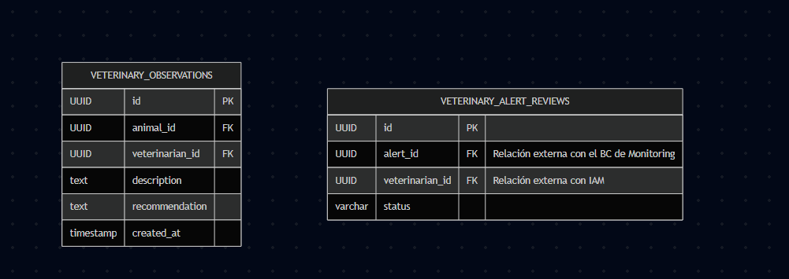

# Capítulo V: Solution UI/UX Design

## 5.1. Style Guidelines
### 5.1.1. General Style Guidelines
### 5.1.2. Web, Mobile and IoT Style Guidelines

## 5.2. Information Architecture
### 5.2.1. Organization Systems
### 5.2.2. Labeling Systems
### 5.2.3. SEO Tags and Meta Tags
### 5.2.4. Searching Systems
### 5.2.5. Navigation Systems

## 5.3. Landing Page UI Design
### 5.3.1. Landing Page Wireframe
### 5.3.2. Landing Page Mock-up

## 5.4. Applications UX/UI Design
### 5.4.1. Applications Wireframes
### 5.4.2. Applications Wireflow Diagrams
### 5.4.3. Applications Mock-ups
### 5.4.4. Applications User Flow Diagrams

## 5.5. Applications Prototyping
## 5.6. IoT Device Design

 

# Capítulo VI: Product Implementation, Validation & Deployment

## 6.1. Software Configuration Management
### 6.1.1. Software Development Environment Configuration
### 6.1.2. Source Code Management
### 6.1.3. Source Code Style Guide & Conventions
### 6.1.4. Software Deployment Configuration

## 6.2. Landing Page, Services & Applications Implementation
### 6.2.X. Sprint n
#### 6.2.X.1. Sprint Planning n
#### 6.2.X.2. Aspect Leaders and Collaborators
#### 6.2.X.3. Sprint Backlog n
#### 6.2.X.4. Development Evidence for Sprint Review
#### 6.2.X.5. Testing Suite Evidence for Sprint Review
#### 6.2.X.6. Execution Evidence for Sprint Review
#### 6.2.X.7. Services Documentation Evidence for Sprint Review
#### 6.2.X.8. Software Deployment Evidence for Sprint Review
#### 6.2.X.9. Team Collaboration Insights during Sprint

## 6.3. Validation Interviews
### 6.3.1. Diseño de Entrevistas
### 6.3.2. Registro de Entrevistas
### 6.3.3. Evaluaciones según heurísticas

## 6.4. Video About-the-Product

 

# Conclusiones
## Conclusiones y recomendaciones
## Video About-the-Team

 

# Bibliografía

 

# Anexos
Link del Repositorio del Informe: 
Link del Repositorio del Backend: 
Link del Repositorio del Frontend Aplicación Web: 
Link del Repositorio del Frontend Aplicación Móvil: 
