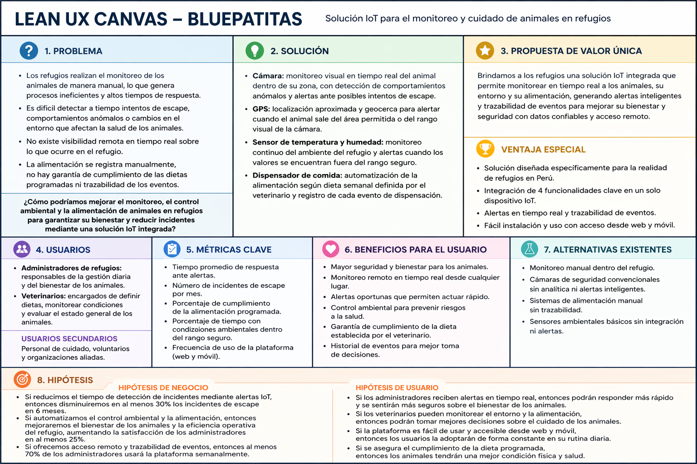

# 
Project Report

    <strong>Universidad Peruana de Ciencias Aplicadas</strong> 
     
    <strong>Ingeniería de Software - 2026-10</strong> 
    <strong>Desarrollo de Soluciones IOT - 17755</strong> 
    <strong>Profesor: Marco Antonio Leon Baca</strong> 
     <strong>Informe del Trabajo Final</strong>

    <strong>Startup: BluePatitas </strong> 
    <strong>Producto: </strong>

    <h3 align="center">Team Members:</h3>
    <table align="center">
        <tr>
            <th style="text-align:center;">Member</th>
            <th style="text-align:center;">Code</th>
        </tr>
        <tr>
            <td>Giancarlo Santiago Castañeda Guimas</td>
            <td>U202310601</td>
        </tr>
        <tr>
            <td>Luciana Carolina Choquehuanca Nuñez</td>
            <td>U202319431</td>
        </tr>
        <tr>
            <td>Carlos Matthew Gonzales Valverde</td>
            <td>U202314130</td>
        </tr>
        <tr>
            <td>María Patricia Hernández Uchuya</td>
            <td>U202311258</td>
        </tr>
        <tr>
            <td>Ronald Joel Peralta Chipa</td>
            <td>U202224619</td>
        </tr>
    </table>

    <strong>Abril, 2026</strong>

 

# Registro de versiones del Informe

<table align="center">
    <tr>
        <th>Versión</th>
        <th>Fecha</th>
        <th>Autor</th>
        <th>Descripción de modificaciones</th>
    </tr>
    <tr>
        <td>0</td>
        <td>11/04/2026</td>
        <td>María Hernández</td>
        <td>Creación del reporte</td>
    </tr>
    <tr>
    <td>0.1</td>
    <td>23/04/2026</td>
    <td>Carlos Gonzales</td>
    <td>Actualización del Capítulo I: descripción de la startup, solution profile, antecedentes y problemática, Lean UX Process, Student Outcome, bibliografía y segmentos objetivo.</td>
</tr>
</table>

 

# Project Report Collaboration Insights
Link del repositorio del reporte: 

 

# Contenido
- [Student Outcome](#student-outcome)
- [Capítulo I: Introducción](#capítulo-i-introducción)
    - [1.1. Startup Profile](#11-startup-profile)
        - [1.1.1. Descripción de la Startup](#111-descripción-de-la-startup)
        - [1.1.2. Perfiles de integrantes del equipo](#112-perfiles-de-integrantes-del-equipo)
    - [1.2. Solution Profile](#12-solution-profile)
        - [1.2.1 Antecedentes y problemática](#121-antecedentes-y-problemática)
        - [1.2.2 Lean UX Process](#122-lean-ux-process)
            - [1.2.2.1. Lean UX Problem Statements](#1221-lean-ux-problem-statements)
            - [1.2.2.2. Lean UX Assumptions](#1222-lean-ux-assumptions)
            - [1.2.2.3. Lean UX Hypothesis Statements](#1223-lean-ux-hypothesis-statements)
            - [1.2.2.4. Lean UX Canvas](#1224-lean-ux-canvas)
    - [1.3. Segmentos objetivo](#13-segmentos-objetivo)
- [Capítulo II: Requirements Elicitation & Analysis](#capítulo-ii-requirements-elicitation--analysis)
    - [2.1. Competidores](#21-competidores)
        - [2.1.1. Análisis competitivo](#211-análisis-competitivo)
        - [2.1.2. Estrategias y tácticas frente a competidores](#212-estrategias-y-tácticas-frente-a-competidores)
    - [2.2. Entrevistas](#22-entrevistas)
        - [2.2.1. Diseño de entrevistas](#221-diseño-de-entrevistas)
        - [2.2.2. Registro de entrevistas](#222-registro-de-entrevistas)
        - [2.2.3. Análisis de entrevistas](#223-análisis-de-entrevistas)
    - [2.3. Needfinding](#23-needfinding)
        - [2.3.1. User Personas](#231-user-personas)
        - [2.3.2. User Task Matrix](#232-user-task-matrix)
        - [2.3.3. User Journey Mapping](#233-user-journey-mapping)
        - [2.3.4. Empathy Mapping](#234-empathy-mapping)
    - [2.4. Big Picture EventStorming](#24-big-picture-eventstorming)
    - [2.5. Ubiquitous Language](#25-ubiquitous-language)
- [Capítulo III: Requirements Specification](#capítulo-iii-requirements-specification)
    - [3.1. User Stories](#31-user-stories)
    - [3.2. Impact Mapping](#32-impact-mapping)
    - [3.3. Product Backlog](#33-product-backlog)
- [Capítulo IV: Solution Software Design](#capítulo-iv-solution-software-design)
    - [4.1. Strategic-Level Domain-Driven Design](#41-strategic-level-domain-driven-design)
        - [4.1.1. Design-Level EventStorming](#411-design-level-eventstorming)
            - [4.1.1.1 Candidate Context Discovery](#4111-candidate-context-discovery)
            - [4.1.1.2 Domain Message Flows Modeling](#4112-domain-message-flows-modeling)
            - [4.1.1.3 Bounded Context Canvases](#4113-bounded-context-canvases)
        - [4.1.2. Context Mapping](#412-context-mapping)
        - [4.1.3. Software Architecture](#413-software-architecture)
            - [4.1.3.1. Software Architecture System Landscape Diagram](#4131-software-architecture-system-landscape-diagram)
            - [4.1.3.2. Software Architecture Context Level Diagrams](#4132-software-architecture-context-level-diagrams)
            - [4.1.3.3. Software Architecture Container Level Diagrams](#4133-software-architecture-container-level-diagrams)
            - [4.1.3.4. Software Architecture Deployment Diagrams](#4134-software-architecture-deployment-diagrams)
    - [4.2. Tactical-Level Domain-Driven Design](#42-tactical-level-domain-driven-design)
        - [4.2.X. Bounded Context: <Bounded Context Name>](#42x-bounded-context-bounded-context-name)
            - [4.2.X.1. Domain Layer](#42x1-domain-layer)
            - [4.2.X.2. Interface Layer](#42x2-interface-layer)
            - [4.2.X.3. Application Layer](#42x3-application-layer)
            - [4.2.X.4. Infrastructure Layer](#42x4-infrastructure-layer)
            - [4.2.X.5. Bounded Context Software Architecture Component Level Diagrams](#42x5-bounded-context-software-architecture-component-level-diagrams)
            - [4.2.X.6. Bounded Context Software Architecture Code Level Diagrams](#42x6-bounded-context-software-architecture-code-level-diagrams)
                - [4.2.X.6.1. Bounded Context Domain Layer Class Diagrams](#42x61-bounded-context-domain-layer-class-diagrams)
                - [4.2.X.6.2. Bounded Context Database Design Diagram](#42x62-bounded-context-database-design-diagram)
- [Capítulo V: Solution UI/UX Design](#capítulo-v-solution-uiux-design)
    - [5.1. Style Guidelines](#51-style-guidelines)
        - [5.1.1. General Style Guidelines](#511-general-style-guidelines)
        - [5.1.2. Web, Mobile and IoT Style Guidelines](#512-web-mobile-and-iot-style-guidelines)
    - [5.2. Information Architecture](#52-information-architecture)
        - [5.2.1. Organization Systems](#521-organization-systems)
        - [5.2.2. Labeling Systems](#522-labeling-systems)
        - [5.2.3. SEO Tags and Meta Tags](#523-seo-tags-and-meta-tags)
        - [5.2.4. Searching Systems](#524-searching-systems)
        - [5.2.5. Navigation Systems](#525-navigation-systems)
    - [5.3. Landing Page UI Design](#53-landing-page-ui-design)
        - [5.3.1. Landing Page Wireframe](#531-landing-page-wireframe)
        - [5.3.2. Landing Page Mock-up](#532-landing-page-mock-up)
    - [5.4. Applications UX/UI Design](#54-applications-uxui-design)
        - [5.4.1. Applications Wireframes](#541-applications-wireframes)
        - [5.4.2. Applications Wireflow Diagrams](#542-applications-wireflow-diagrams)
        - [5.4.3. Applications Mock-ups](#543-applications-mock-ups)
        - [5.4.4. Applications User Flow Diagrams](#544-applications-user-flow-diagrams)
    - [5.5. Applications Prototyping](#55-applications-prototyping)
    - [5.6. IoT Device Design](#56-iot-device-design)
- [Capítulo VI: Product Implementation, Validation & Deployment](#capítulo-vi-product-implementation-validation--deployment)
    - [6.1. Software Configuration Management](#61-software-configuration-management)
        - [6.1.1. Software Development Environment Configuration](#611-software-development-environment-configuration)
        - [6.1.2. Source Code Management](#612-source-code-management)
        - [6.1.3. Source Code Style Guide & Conventions](#613-source-code-style-guide--conventions)
        - [6.1.4. Software Deployment Configuration](#614-software-deployment-configuration)
    - [6.2. Landing Page, Services & Applications Implementation](#62-landing-page-services--applications-implementation)
        - [6.2.X. Sprint n](#62x-sprint-n)
            - [6.2.X.1. Sprint Planning n](#62x1-sprint-planning-n)
            - [6.2.X.2. Aspect Leaders and Collaborators](#62x2-aspect-leaders-and-collaborators)
            - [6.2.X.3. Sprint Backlog n](#62x3-sprint-backlog-n)
            - [6.2.X.4. Development Evidence for Sprint Review](#62x4-development-evidence-for-sprint-review)
            - [6.2.X.5. Testing Suite Evidence for Sprint Review](#62x5-testing-suite-evidence-for-sprint-review)
            - [6.2.X.6. Execution Evidence for Sprint Review](#62x6-execution-evidence-for-sprint-review)
            - [6.2.X.7. Services Documentation Evidence for Sprint Review](#62x7-services-documentation-evidence-for-sprint-review)
            - [6.2.X.8. Software Deployment Evidence for Sprint Review](#62x8-software-deployment-evidence-for-sprint-review)
            - [6.2.X.9. Team Collaboration Insights during Sprint](#62x9-team-collaboration-insights-during-sprint)
    - [6.3. Validation Interviews](#63-validation-interviews)
        - [6.3.1. Diseño de Entrevistas](#631-diseño-de-entrevistas)
        - [6.3.2. Registro de Entrevistas](#632-registro-de-entrevistas)
        - [6.3.3. Evaluaciones según heurísticas](#633-evaluaciones-según-heurísticas)
    - [6.4. Video About-the-Product](#64-video-about-the-product)
- [Conclusiones](#conclusiones)
- [Bibliografía](#bibliografía)
- [Anexos](#anexos)

 

# Student Outcome

<table align="center">
  <tr>
    <th>Criterio específico</th>
    <th>Acciones realizadas</th>
    <th>Conclusiones</th>
  </tr>
  <tr>
    <td>Trabaja en equipo para proporcionar liderazgo en forma conjunta.</td>
    <td>
      
<strong>Giancarlo Santiago Castañeda Guimas</strong> AV1: 

      
<strong>Luciana Carolina Choquehuanca Nuñez</strong> AV1: 

      
<strong>Carlos Matthew Gonzales Valverde</strong> AV1: 

      
<strong>María Patricia Hernández Uchuya</strong> AV1: 

      
<strong>Ronald Joel Peralta Chipa</strong> AV1: 

    </td>
    <td>
      Como equipo, durante AV1 se evidenció liderazgo compartido en la organización inicial del proyecto, la distribución de responsabilidades y la consolidación progresiva del informe. Cada integrante asumió tareas específicas y contribuyó al avance del documento, permitiendo construir una base común para el desarrollo del proyecto BluePatitas.
    </td>
  </tr>
  <tr>
    <td>Crea un entorno colaborativo e inclusivo, establece metas, planifica tareas y cumple objetivos.</td>
    <td>
      
<strong>Giancarlo Santiago Castañeda Guimas</strong> AV1: 

      
<strong>Luciana Carolina Choquehuanca Nuñez</strong> AV1: 

      
<strong>Carlos Matthew Gonzales Valverde</strong> AV1: 

      
<strong>María Patricia Hernández Uchuya</strong> AV1: 

      
<strong>Ronald Joel Peralta Chipa</strong> AV1: 

    </td>
    <td>
      Durante AV1, el equipo estableció una estructura inicial de trabajo colaborativo mediante el uso de GitHub y un tablero de tareas, lo que permitió organizar actividades, priorizar entregables y avanzar de forma ordenada en la elaboración del informe. Este proceso contribuyó a construir un entorno de coordinación y planificación alineado con los objetivos del curso.
    </td>
  </tr>
</table>

 

# Capítulo I: Introducción

## 1.1. Startup Profile
### 1.1.1. Descripción de la Startup

BluePatitas es una startup orientada al desarrollo de soluciones tecnológicas para mejorar el cuidado y monitoreo de animales en refugios. Surge a partir de la identificación de dificultades operativas frecuentes en estos entornos, tales como la supervisión manual de los animales, la limitada capacidad de respuesta ante incidentes y la falta de visibilidad continua sobre condiciones relevantes para su bienestar.

La propuesta de BluePatitas se enfoca en brindar una solución accesible e innovadora que apoye a administradores de refugios y veterinarios mediante el uso de tecnología IoT y herramientas digitales. De esta manera, la startup busca contribuir a una gestión más eficiente, preventiva y ordenada del cuidado animal, facilitando el seguimiento de eventos relevantes y fortaleciendo la toma de decisiones en contextos donde el tiempo, el personal y los recursos suelen ser limitados.

Como iniciativa de base tecnológica, BluePatitas proyecta integrar dispositivos IoT con productos digitales como aplicaciones web y móviles, permitiendo que la información recolectada se transforme en alertas, registros y soporte operativo útil para el entorno de refugios. Así, la startup plantea una propuesta con potencial de escalabilidad, enfocada en resolver una problemática real mediante una combinación de innovación, accesibilidad y compromiso con el bienestar animal.
### 1.1.2. Perfiles de integrantes del equipo

<table align="center" border="1" cellspacing="0" cellpadding="8" style="width: 90%; border-collapse: collapse;">
  <tr>
    <td style="width: 150px; text-align: center;">
      </img>
    </td>
    <td>
      
<strong>Giancarlo Santiago Castañeda Guimas - U202310601</strong>

      

        ...
      

    </td>
  </tr>
</table>

<table align="center" border="1" cellspacing="0" cellpadding="10" style="width: 90%; border-collapse: collapse;">
  <tr>    
    <td style="width: 200px; text-align: center;">
      
    </td>
    <td>
      

        <strong>Luciana Carolina Choquehuanca Nuñez - U202319431</strong>
      
    
      

        Mi nombre es Luciana Carolina, soy estudiante de la carrera de Ingeniería de Software, actualmente cursando el séptimo ciclo, y tengo 20 años. Me considero una persona proactiva, con gran interés en participar en proyectos que impliquen adquirir nuevos conocimientos y seguir aprendiendo constantemente. Me gusta mantener el orden en mi trabajo, por lo que siempre busco entregar resultados que cumplan con los estándares requeridos. Además, disfruto aprender tanto de mis profesores como de mis compañeros, ya que considero que el aprendizaje colaborativo es clave para mi desarrollo profesional.
      

    </td>
  </tr>
</table>

<table align="center" border="1" cellspacing="0" cellpadding="8" style="width: 90%; border-collapse: collapse;">
  <tr>
    <td style="width: 150px; text-align: center;">
      </img>
    </td>
    <td>
      
<strong>Carlos Matthew Gonzales Valverde - U202314130</strong>

      

        ...
      

    </td>
  </tr>
</table>

<table align="center" border="1" cellspacing="0" cellpadding="8" style="width: 90%; border-collapse: collapse;">
  <tr>
    <td style="width: 150px; text-align: center;">
      </img>
    </td>
    <td>
      
<strong>María Patricia Hernández Uchuya - U202311258</strong>

      

        Estudio la carrera de Ingeniería de Software, tengo 20 años y actualmente me encuentro cursando el séptimo ciclo de dicha carrera. Me considero una persona con responsabilidad, optimismo y honestidad, cualidades que considero fundamentales para una colaboración efectiva en equipo y un buen desarrollo en este proyecto.
      

    </td>
  </tr>
</table>

<table align="center" border="1" cellspacing="0" cellpadding="8" style="width: 90%; border-collapse: collapse;">
  <tr>
    <td style="width: 150px; text-align: center;">
      </img>
    </td>
    <td>
      
<strong>Ronald Joel Peralta Chipa - U202224619</strong>

      

         ...
      

    </td>
  </tr>
</table>

## 1.2. Solution Profile

BluePatitas es una propuesta de solución IoT orientada al monitoreo y cuidado de animales en refugios, desarrollada en el contexto del curso Desarrollo de Soluciones IoT. El proyecto plantea integrar una aplicación web con dispositivos de campo que permitan obtener información relevante del entorno y de eventos operativos, con el fin de fortalecer la supervisión diaria y apoyar la toma de decisiones de administradores de refugios y veterinarios.

El MVP definido para el proyecto se concentra en cuatro componentes de alcance realista: una cámara para monitoreo visual del animal dentro de una zona delimitada, un dispositivo GPS para localización aproximada y geocerca, un sensor de temperatura y humedad para control ambiental, y un dispensador de comida para automatizar la alimentación según una programación semanal prescrita por el veterinario. Esta selección responde a restricciones de presupuesto y prioriza funciones con impacto directo en la seguridad, seguimiento y cuidado cotidiano dentro del refugio.

En ese sentido, BluePatitas no busca reemplazar la observación profesional ni emitir diagnósticos veterinarios automatizados, sino proporcionar soporte tecnológico para mejorar la visibilidad remota, la capacidad de respuesta ante alertas y la trazabilidad de eventos relevantes, especialmente aquellos vinculados con escapes, condiciones ambientales y alimentación programada.

| **Misión** | **Visión** | **Valores** |
|------------|------------|-------------|
| Nuestra misión es contribuir al bienestar de los animales en refugios mediante el uso de tecnologías IoT que apoyen el monitoreo, el control ambiental y la alimentación programada, fortaleciendo la gestión diaria de administradores y veterinarios. | Aspiramos a que los refugios incorporen soluciones tecnológicas accesibles y útiles para mejorar el cuidado, la supervisión y la capacidad de respuesta ante eventos que afecten la seguridad y bienestar de los animales. | Responsabilidad Colaboración Innovación |

### 1.2.1. Antecedentes y problemática

El cuidado de animales en refugios representa un reto operativo y social relevante en el contexto peruano, especialmente cuando la cantidad de animales supera la capacidad del personal disponible para supervisarlos de manera continua. En el ámbito nacional, investigaciones académicas del repositorio de la Pontificia Universidad Católica del Perú han señalado vacíos y limitaciones en la regulación y comprensión del bienestar animal en el país, lo que evidencia la necesidad de fortalecer no solo el marco normativo, sino también las prácticas e instrumentos de cuidado y seguimiento en entornos de atención animal (Valdelomar Martínez, 2024).

#### What?

La problemática principal radica en la limitada capacidad de los refugios para monitorear, de forma oportuna y sistemática, eventos críticos del cuidado diario. Entre estos se encuentran los intentos de escape o salidas del área permitida, la pérdida de visibilidad del animal dentro de la zona observable, las variaciones de temperatura y humedad que puedan afectar su bienestar y la falta de trazabilidad sobre la alimentación programada. La ausencia de una solución integrada reduce la capacidad de reacción del personal y dificulta la coordinación con los veterinarios responsables.

#### When?

El problema se manifiesta durante toda la permanencia del animal en el refugio, pero se vuelve más crítico en horarios de menor supervisión, durante jornadas con alta carga operativa o cuando un mismo cuidador debe atender a varios animales de manera simultánea. En esos momentos, la detección tardía de un escape, de una condición ambiental fuera de rango o de una falla en la rutina de alimentación puede comprometer el cuidado adecuado.

#### Where?

El problema se localiza principalmente en los refugios y albergues temporales, donde la infraestructura, la distribución de espacios y la disponibilidad de personal limitan la supervisión constante. No obstante, también se refleja en el entorno digital, ya que los administradores de refugios y veterinarios no siempre cuentan con una plataforma centralizada que les permita revisar alertas, condiciones ambientales, ubicación aproximada y eventos de dispensación de manera remota.

#### Who?

Esta situación afecta directamente a dos grupos principales:

1. **Administradores de refugios:** Responsables de coordinar el cuidado diario, supervisar instalaciones y responder ante incidentes operativos relacionados con seguridad, ambiente y alimentación.
2. **Veterinarios:** Profesionales que requieren información oportuna sobre condiciones del entorno y cumplimiento de la dieta prescrita para apoyar el seguimiento del bienestar animal.

#### Why?

La problemática persiste por una combinación de recursos limitados, infraestructura variable y procesos altamente manuales. Desde una perspectiva técnica, la falta de integración entre monitoreo visual, geocerca, control ambiental y trazabilidad de alimentación mantiene un modelo de supervisión reactivo, en el que el personal actúa cuando el incidente ya ocurrió o cuando la verificación presencial lo hace evidente. Este escenario resulta consistente con los vacíos y debilidades identificados en trabajos académicos sobre bienestar animal y regulación en el Perú (Valdelomar Martínez, 2024).

#### How?

Los actores enfrentan este escenario a través de actividades presenciales de observación y control que consumen tiempo y no siempre ofrecen visibilidad continua. La ausencia de alertas automatizadas y de registros consolidados obliga a depender de revisiones manuales para confirmar si el animal permanece en el área esperada, si el ambiente es adecuado o si la alimentación fue dispensada conforme a lo programado.

BluePatitas propone mejorar esta dinámica mediante una solución IoT que combine una cámara para monitoreo visual, un GPS con geocerca, un sensor de temperatura y humedad y un dispensador automático con registro de eventos. Con ello, administradores de refugios y veterinarios pueden acceder a información relevante de forma remota y responder con mayor rapidez ante situaciones que requieren intervención.

#### How Much?

La magnitud del problema también puede observarse desde una dimensión cuantitativa. Un reporte periodístico de *El Comercio*, basado en estimaciones de especialistas y organizaciones de protección animal, indicó que en el Perú habría más de 6 millones de perros y gatos en situación de abandono, y que alrededor de 4 millones se encontrarían en Lima. Aunque estas cifras no provienen de un registro oficial unificado, permiten dimensionar la escala del problema que enfrentan los refugios y redes de rescate (El Comercio, 2023).

Como referencia internacional complementaria, la Fundación Affinity reportó que en 2023 se recogieron más de 286,000 perros y gatos en refugios y protectoras. Si bien esta cifra corresponde al contexto español, sirve para evidenciar que la sobrecarga de los sistemas de atención y la necesidad de mecanismos más eficientes de monitoreo, control y respuesta constituyen un problema estructural en el ámbito del bienestar animal (Fundación Affinity, 2024).

### 1.2.2 Lean UX Process
#### 1.2.2.1. Lean UX Problem Statements
Los refugios de animales enfrentan limitaciones operativas para supervisar de forma continua el estado y la permanencia segura de los animales bajo su cuidado. En muchos casos, el monitoreo sigue dependiendo de rondas manuales, observación presencial y registros dispersos, lo que dificulta detectar a tiempo intentos de escape, cambios inusuales en el comportamiento dentro del área observable, condiciones ambientales inadecuadas y el cumplimiento de rutinas de alimentación.

Esta situación genera respuesta tardía del personal ante incidentes críticos, baja visibilidad remota sobre lo que ocurre en el refugio y escasa trazabilidad de eventos relevantes para la gestión diaria. Para administradores de refugios y veterinarios, estas brechas reducen la capacidad de tomar decisiones oportunas y de mantener condiciones de cuidado consistentes, especialmente cuando los recursos humanos y el tiempo disponible son limitados.

BluePatitas plantea abordar este problema mediante un MVP IoT distribuido compuesto por una cámara para monitoreo visual y apoyo a alertas, un dispositivo GPS para localización aproximada y geocerca, un sensor de temperatura y humedad para monitoreo ambiental, y un dispensador de comida para automatizar la alimentación según una dieta semanal prescrita por el veterinario y registrar cada evento de dispensación. De esta manera, la solución busca mejorar el monitoreo, el control operativo y la capacidad de respuesta del refugio sin reemplazar el criterio del personal responsable.

En ese contexto, surge la siguiente pregunta problema: ¿Cómo mejorar el monitoreo, control y capacidad de respuesta de los refugios ante escapes, condiciones ambientales no seguras y eventos de alimentación, mediante una solución IoT accesible que permita supervisión remota y trazabilidad operativa?
#### 1.2.2.2. Lean UX Assumptions
**Assumptions Worksheet**

- Los administradores de refugios necesitan visibilidad remota del estado de los animales y del entorno para complementar la supervisión presencial.
- Los veterinarios requieren información básica y oportuna sobre condiciones ambientales y cumplimiento de alimentación para apoyar el seguimiento del bienestar animal.
- Los refugios tienen restricciones de presupuesto, por lo que priorizan un conjunto reducido de dispositivos con valor operativo claro.
- La conectividad en refugios puede ser variable, por lo que el sistema debe tolerar interrupciones parciales y registrar eventos relevantes cuando sea posible.
- El mantenimiento de dispositivos debe ser simple, debido a que el personal disponible suele ser limitado y no necesariamente especializado en tecnología.
- Las alertas son útiles solo si se enfocan en eventos accionables, como salida de geocerca, pérdida del rango visual de la cámara, condiciones ambientales fuera de rango y ejecución o ausencia de dispensación programada.

**Business Outcomes**

- Mejorar la capacidad operativa del refugio para supervisar animales de forma continua sin depender exclusivamente de rondas manuales.
- Reducir incidentes asociados a escapes o detección tardía de situaciones anormales dentro del entorno monitoreado.
- Fortalecer la trazabilidad de eventos clave, especialmente en alimentación programada y alertas relevantes para la gestión diaria.
- Validar la viabilidad de una solución IoT de alcance realista y costo controlado para un contexto de refugios.

**User Outcomes**

- Los administradores de refugios podrán monitorear remotamente el área observable del animal y recibir alertas ante eventos que requieran intervención.
- Los veterinarios podrán revisar información ambiental y registros de alimentación como soporte para el seguimiento del cuidado indicado.
- El personal del refugio podrá responder con mayor rapidez ante salidas del área permitida o cambios del entorno que afecten el bienestar del animal.
- Los responsables del cuidado tendrán un historial básico de eventos de dispensación que facilite el control de la dieta semanal prescrita.

**Features**

- Monitoreo visual del animal dentro de una zona delimitada mediante cámara.
- Detección de salidas del rango visual observable y generación de alertas asociadas.
- Localización aproximada mediante GPS y configuración de geocerca para identificar salidas del área permitida.
- Monitoreo de temperatura y humedad dentro del refugio, con alertas cuando los valores salgan del rango seguro definido.
- Dispensación automatizada de comida según una programación semanal indicada por el veterinario.
- Registro de eventos de dispensación para asegurar trazabilidad operativa.
- Visualización centralizada de alertas y eventos relevantes para administradores de refugios y veterinarios.
#### 1.2.2.3. Lean UX Hypothesis Statements
**Business Hypothesis**

Creemos que, si BluePatitas integra monitoreo visual, geocerca, monitoreo ambiental y alimentación automatizada con registro de eventos, los refugios podrán reducir la ocurrencia o severidad de incidentes asociados a escapes, mejorar la supervisión remota y contar con evidencia básica para el seguimiento operativo. Sabremos que esta hipótesis es válida si, durante la evaluación inicial del MVP, se observa una disminución razonable de incidentes no detectados a tiempo, una mejora en los tiempos de respuesta del personal ante alertas y un mayor cumplimiento de la alimentación programada.

**User Hypothesis**

Creemos que los administradores de refugios y los veterinarios usarán BluePatitas si la solución les permite identificar con mayor rapidez cuando un animal sale del área permitida o deja de estar dentro del rango visual esperado, verificar si la temperatura y humedad del entorno permanecen dentro de límites seguros y revisar el registro de dispensación de comida. Sabremos que esta hipótesis es válida si los usuarios reportan una mejor capacidad de monitoreo remoto, demuestran uso recurrente de alertas y registros para tomar decisiones operativas, y perciben que el sistema facilita el control diario sin agregar una carga excesiva de mantenimiento.
#### 1.2.2.4. Lean UX Canvas
El Lean UX Canvas sintetiza el problema principal del proyecto, los usuarios involucrados, las hipótesis de valor, los beneficios esperados y la dirección inicial de la solución BluePatitas para el contexto de refugios. Este artefacto sirve como soporte visual del enfoque de análisis adoptado en la etapa AV1.

## 1.3 Segmentos objetivo

| Segmento | Descripción | Características |
|----------|-------------|-----------------|
| **Segmento 1: Administradores de refugios** | Este segmento es prioritario porque asume la gestión operativa del cuidado diario de los animales en el refugio. Necesita herramientas que faciliten el monitoreo remoto, la recepción de alertas ante posibles escapes o eventos anormales, la supervisión de condiciones ambientales y la verificación del cumplimiento de la alimentación programada. | - **Edades:** 20 a 50 años   - **Ubicación:** Perú   - **Motivaciones:** Mejorar el cuidado de los animales y optimizar la capacidad de respuesta del refugio.   - **Intereses:** Bienestar animal, gestión operativa, supervisión remota y uso práctico de tecnología.   - **Comportamiento:** Valoran soluciones accesibles que reduzcan tareas manuales y centralicen información relevante para la toma de decisiones. |
| **Segmento 2: Veterinarios** | Este segmento comprende a los profesionales que brindan seguimiento clínico y recomendaciones de cuidado para animales alojados en refugios. Requieren acceso a información confiable sobre condiciones ambientales, alertas relevantes y cumplimiento de la dieta semanal prescrita, de modo que puedan coordinar mejor con los administradores del refugio. | - **Edades:** 20 a 60 años   - **Ubicación:** Perú   - **Motivaciones:** Asegurar continuidad en el cuidado indicado y mejorar la coordinación con refugios.   - **Intereses:** Bienestar animal, seguimiento de condiciones de cuidado, eficiencia operativa e innovación aplicada.   - **Comportamiento:** Utilizan información sintetizada y registros de eventos como apoyo para emitir recomendaciones y priorizar intervenciones. |

# Capítulo II: Requirements Elicitation & Analysis

## 2.1. Competidores
### 2.1.1. Análisis competitivo
### 2.1.2. Estrategias y tácticas frente a competidores

## 2.2. Entrevistas
### 2.2.1. Diseño de entrevistas
### 2.2.2. Registro de entrevistas
### 2.2.3. Análisis de entrevistas

## 2.3. Needfinding
### 2.3.1. User Personas
### 2.3.2. User Task Matrix
### 2.3.3. User Journey Mapping
### 2.3.4. Empathy Mapping

## 2.4. Big Picture EventStorming
## 2.5. Ubiquitous Language

 

# Capítulo III: Requirements Specification

## 3.1. User Stories
## 3.2. Impact Mapping
## 3.3. Product Backlog

 

# Capítulo IV: Solution Software Design

## 4.1. Strategic-Level Domain-Driven Design
### 4.1.1. Design-Level EventStorming
#### 4.1.1.1 Candidate Context Discovery
#### 4.1.1.2 Domain Message Flows Modeling
#### 4.1.1.3 Bounded Context Canvases
### 4.1.2. Context Mapping
### 4.1.3. Software Architecture
#### 4.1.3.1. Software Architecture System Landscape Diagram
#### 4.1.3.2. Software Architecture Context Level Diagrams
#### 4.1.3.3. Software Architecture Container Level Diagrams
#### 4.1.3.4. Software Architecture Deployment Diagrams

## 4.2. Tactical-Level Domain-Driven Design
### 4.2.X. Bounded Context: <Bounded Context Name>
#### 4.2.X.1. Domain Layer
#### 4.2.X.2. Interface Layer
#### 4.2.X.3. Application Layer
#### 4.2.X.4. Infrastructure Layer
#### 4.2.X.5. Bounded Context Software Architecture Component Level Diagrams
#### 4.2.X.6. Bounded Context Software Architecture Code Level Diagrams
##### 4.2.X.6.1. Bounded Context Domain Layer Class Diagrams
##### 4.2.X.6.2. Bounded Context Database Design Diagram

 

# Capítulo V: Solution UI/UX Design

## 5.1. Style Guidelines
### 5.1.1. General Style Guidelines
### 5.1.2. Web, Mobile and IoT Style Guidelines

## 5.2. Information Architecture
### 5.2.1. Organization Systems
### 5.2.2. Labeling Systems
### 5.2.3. SEO Tags and Meta Tags
### 5.2.4. Searching Systems
### 5.2.5. Navigation Systems

## 5.3. Landing Page UI Design
### 5.3.1. Landing Page Wireframe
### 5.3.2. Landing Page Mock-up

## 5.4. Applications UX/UI Design
### 5.4.1. Applications Wireframes
### 5.4.2. Applications Wireflow Diagrams
### 5.4.3. Applications Mock-ups
### 5.4.4. Applications User Flow Diagrams

## 5.5. Applications Prototyping
## 5.6. IoT Device Design

 

# Capítulo VI: Product Implementation, Validation & Deployment

## 6.1. Software Configuration Management
### 6.1.1. Software Development Environment Configuration
### 6.1.2. Source Code Management
### 6.1.3. Source Code Style Guide & Conventions
### 6.1.4. Software Deployment Configuration

## 6.2. Landing Page, Services & Applications Implementation
### 6.2.X. Sprint n
#### 6.2.X.1. Sprint Planning n
#### 6.2.X.2. Aspect Leaders and Collaborators
#### 6.2.X.3. Sprint Backlog n
#### 6.2.X.4. Development Evidence for Sprint Review
#### 6.2.X.5. Testing Suite Evidence for Sprint Review
#### 6.2.X.6. Execution Evidence for Sprint Review
#### 6.2.X.7. Services Documentation Evidence for Sprint Review
#### 6.2.X.8. Software Deployment Evidence for Sprint Review
#### 6.2.X.9. Team Collaboration Insights during Sprint

## 6.3. Validation Interviews
### 6.3.1. Diseño de Entrevistas
### 6.3.2. Registro de Entrevistas
### 6.3.3. Evaluaciones según heurísticas

## 6.4. Video About-the-Product

 

# Conclusiones
## Conclusiones y recomendaciones
## Video About-the-Team

 

# Bibliografía

Valdelomar Martínez, D. E. (2024). *Deconstrucción de los conceptos de bienestar animal y sufrimiento innecesario animal en el sistema jurídico peruano* [Tesis de licenciatura, Pontificia Universidad Católica del Perú]. Repositorio Institucional PUCP. https://tesis.pucp.edu.pe/

El Comercio. (2023). *Perros y gatos sin hogar en Lima: ¿Existe un registro de animales en situación de abandono?* https://elcomercio.pe/lima/sucesos/perros-y-gatos-sin-hogar-en-lima-existe-un-registro-de-animales-en-situacion-de-abandono-que-se-sabe-de-la-ley-4-patas-adopcion-responsable-esterilizacion-albergues-rescatistas-noticia/

Fundación Affinity. (2024). *Las cifras del abandono de perros y gatos aún lejos de descender*. https://www.fundacion-affinity.org/es/biblioteca/las-cifras-del-abandono-de-perros-y-gatos-aun-lejos-de-descender

 

# Anexos
Link del Repositorio del Informe: 
Link del Repositorio del Backend: 
Link del Repositorio del Frontend Aplicación Web: 
Link del Repositorio del Frontend Aplicación Móvil: 

