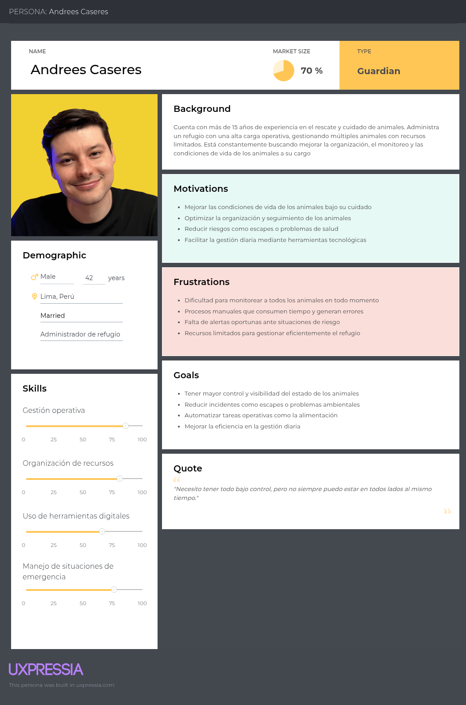
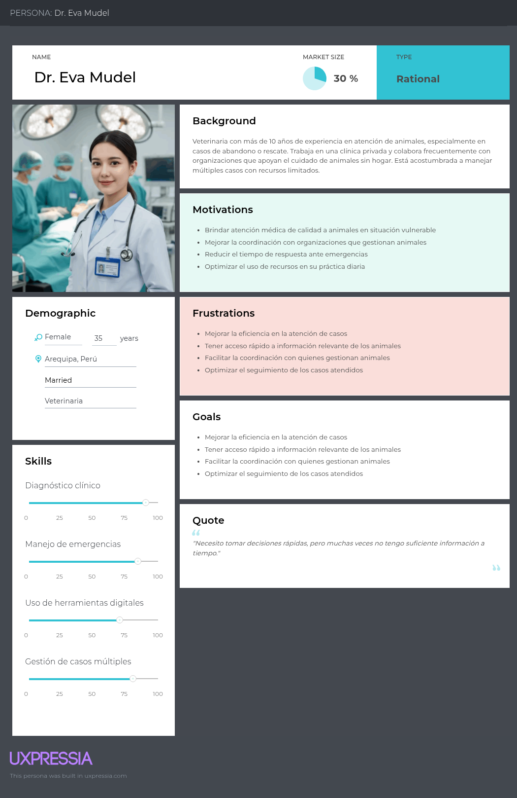
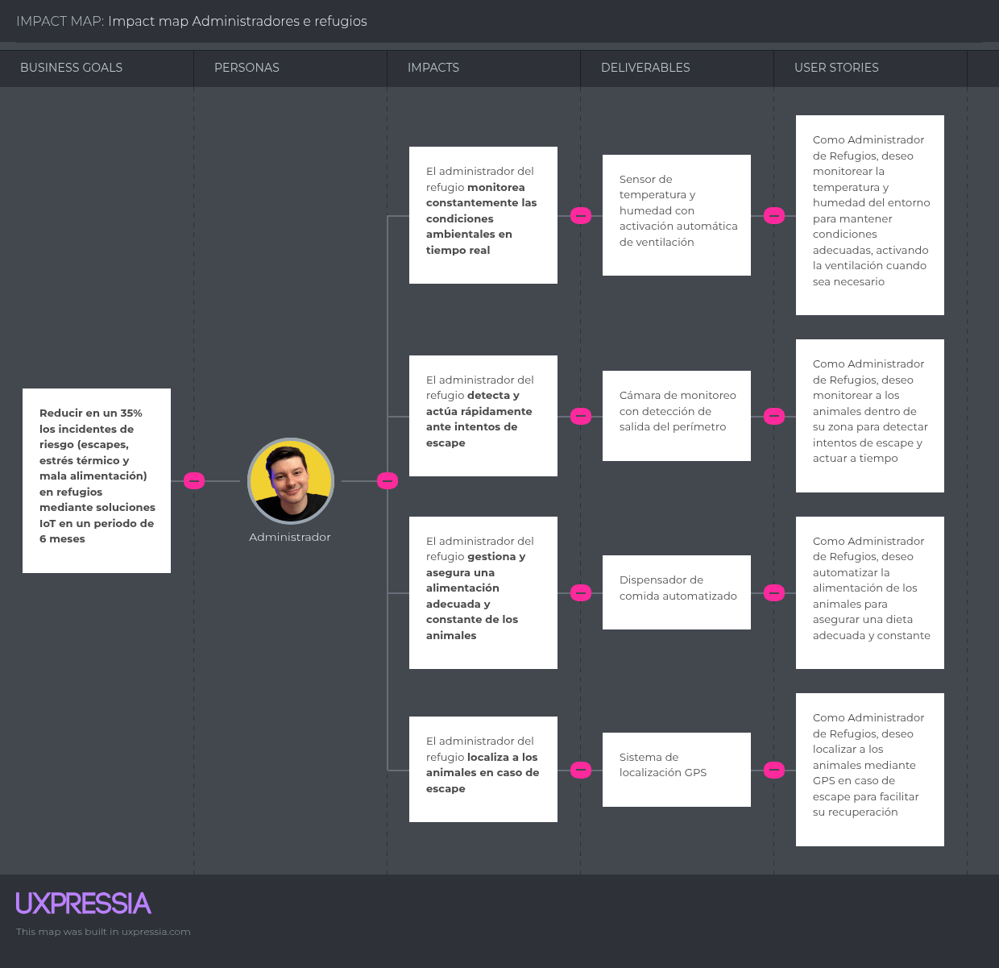
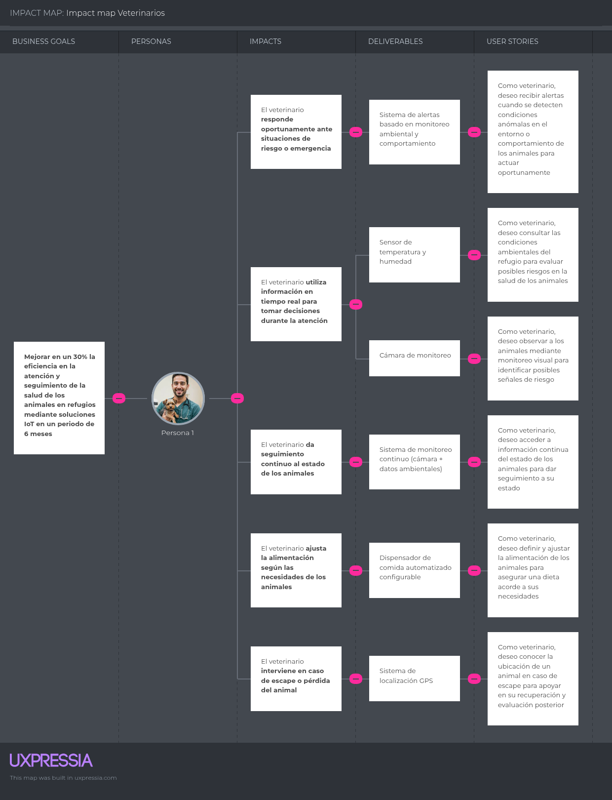

# 
Project Report

    <strong>Universidad Peruana de Ciencias Aplicadas</strong> 
     
    <strong>Ingeniería de Software - 2026-10</strong> 
    <strong>Desarrollo de Soluciones IOT - 17755</strong> 
    <strong>Profesor: Marco Antonio Leon Baca</strong> 
     <strong>Informe del Trabajo Final</strong>

    <strong>Startup: </strong> 
    <strong>Producto: </strong>

    <h3 align="center">Team Members:</h3>
    <table align="center">
        <tr>
            <th style="text-align:center;">Member</th>
            <th style="text-align:center;">Code</th>
        </tr>
        <tr>
            <td>Giancarlo Santiago Castañeda Guimas</td>
            <td>U202310601</td>
        </tr>
        <tr>
            <td>Luciana Carolina Choquehuanca Nuñez</td>
            <td>U202319431</td>
        </tr>
        <tr>
            <td>Carlos Matthew Gonzales Valverde</td>
            <td>U202314130</td>
        </tr>
        <tr>
            <td>María Patricia Hernández Uchuya</td>
            <td>U202311258</td>
        </tr>
        <tr>
            <td>Ronald Joel Peralta Chipa</td>
            <td>U202224619</td>
        </tr>
    </table>

    <strong>Abril, 2026</strong>

 

# Registro de versiones del Informe

<table align="center">
    <tr>
        <th>Versión</th>
        <th>Fecha</th>
        <th>Autor</th>
        <th>Descripción de modificaciones</th>
    </tr>
    <tr>
        <td>0</td>
        <td>11/04/2026</td>
        <td>María Hernández</td>
        <td>Creación del reporte</td>
    </tr>
</table>

 

# Project Report Collaboration Insights
Link del repositorio del reporte: 

 

# Contenido
- [Student Outcome](#student-outcome)
- [Capítulo I: Introducción](#capítulo-i-introducción)
    - [1.1. Startup Profile](#11-startup-profile)
        - [1.1.1. Descripción de la Startup](#111-descripción-de-la-startup)
        - [1.1.2. Perfiles de integrantes del equipo](#112-perfiles-de-integrantes-del-equipo)
    - [1.2. Solution Profile](#12-solution-profile)
        - [1.2.1 Antecedentes y problemática](#121-antecedentes-y-problemática)
        - [1.2.2 Lean UX Process](#122-lean-ux-process)
            - [1.2.2.1. Lean UX Problem Statements](#1221-lean-ux-problem-statements)
            - [1.2.2.2. Lean UX Assumptions](#1222-lean-ux-assumptions)
            - [1.2.2.3. Lean UX Hypothesis Statements](#1223-lean-ux-hypothesis-statements)
            - [1.2.2.4. Lean UX Canvas](#1224-lean-ux-canvas)
    - [1.3. Segmentos objetivo](#13-segmentos-objetivo)
- [Capítulo II: Requirements Elicitation & Analysis](#capítulo-ii-requirements-elicitation--analysis)
    - [2.1. Competidores](#21-competidores)
        - [2.1.1. Análisis competitivo](#211-análisis-competitivo)
        - [2.1.2. Estrategias y tácticas frente a competidores](#212-estrategias-y-tácticas-frente-a-competidores)
    - [2.2. Entrevistas](#22-entrevistas)
        - [2.2.1. Diseño de entrevistas](#221-diseño-de-entrevistas)
        - [2.2.2. Registro de entrevistas](#222-registro-de-entrevistas)
        - [2.2.3. Análisis de entrevistas](#223-análisis-de-entrevistas)
    - [2.3. Needfinding](#23-needfinding)
        - [2.3.1. User Personas](#231-user-personas)
        - [2.3.2. User Task Matrix](#232-user-task-matrix)
        - [2.3.3. User Journey Mapping](#233-user-journey-mapping)
        - [2.3.4. Empathy Mapping](#234-empathy-mapping)
    - [2.4. Big Picture EventStorming](#24-big-picture-eventstorming)
    - [2.5. Ubiquitous Language](#25-ubiquitous-language)
- [Capítulo III: Requirements Specification](#capítulo-iii-requirements-specification)
    - [3.1. User Stories](#31-user-stories)
    - [3.2. Impact Mapping](#32-impact-mapping)
    - [3.3. Product Backlog](#33-product-backlog)
- [Capítulo IV: Solution Software Design](#capítulo-iv-solution-software-design)
    - [4.1. Strategic-Level Domain-Driven Design](#41-strategic-level-domain-driven-design)
        - [4.1.1. Design-Level EventStorming](#411-design-level-eventstorming)
            - [4.1.1.1 Candidate Context Discovery](#4111-candidate-context-discovery)
            - [4.1.1.2 Domain Message Flows Modeling](#4112-domain-message-flows-modeling)
            - [4.1.1.3 Bounded Context Canvases](#4113-bounded-context-canvases)
        - [4.1.2. Context Mapping](#412-context-mapping)
        - [4.1.3. Software Architecture](#413-software-architecture)
            - [4.1.3.1. Software Architecture System Landscape Diagram](#4131-software-architecture-system-landscape-diagram)
            - [4.1.3.2. Software Architecture Context Level Diagrams](#4132-software-architecture-context-level-diagrams)
            - [4.1.3.3. Software Architecture Container Level Diagrams](#4133-software-architecture-container-level-diagrams)
            - [4.1.3.4. Software Architecture Deployment Diagrams](#4134-software-architecture-deployment-diagrams)
    - [4.2. Tactical-Level Domain-Driven Design](#42-tactical-level-domain-driven-design)
        - [4.2.X. Bounded Context: <Bounded Context Name>](#42x-bounded-context-bounded-context-name)
            - [4.2.X.1. Domain Layer](#42x1-domain-layer)
            - [4.2.X.2. Interface Layer](#42x2-interface-layer)
            - [4.2.X.3. Application Layer](#42x3-application-layer)
            - [4.2.X.4. Infrastructure Layer](#42x4-infrastructure-layer)
            - [4.2.X.5. Bounded Context Software Architecture Component Level Diagrams](#42x5-bounded-context-software-architecture-component-level-diagrams)
            - [4.2.X.6. Bounded Context Software Architecture Code Level Diagrams](#42x6-bounded-context-software-architecture-code-level-diagrams)
                - [4.2.X.6.1. Bounded Context Domain Layer Class Diagrams](#42x61-bounded-context-domain-layer-class-diagrams)
                - [4.2.X.6.2. Bounded Context Database Design Diagram](#42x62-bounded-context-database-design-diagram)
- [Capítulo V: Solution UI/UX Design](#capítulo-v-solution-uiux-design)
    - [5.1. Style Guidelines](#51-style-guidelines)
        - [5.1.1. General Style Guidelines](#511-general-style-guidelines)
        - [5.1.2. Web, Mobile and IoT Style Guidelines](#512-web-mobile-and-iot-style-guidelines)
    - [5.2. Information Architecture](#52-information-architecture)
        - [5.2.1. Organization Systems](#521-organization-systems)
        - [5.2.2. Labeling Systems](#522-labeling-systems)
        - [5.2.3. SEO Tags and Meta Tags](#523-seo-tags-and-meta-tags)
        - [5.2.4. Searching Systems](#524-searching-systems)
        - [5.2.5. Navigation Systems](#525-navigation-systems)
    - [5.3. Landing Page UI Design](#53-landing-page-ui-design)
        - [5.3.1. Landing Page Wireframe](#531-landing-page-wireframe)
        - [5.3.2. Landing Page Mock-up](#532-landing-page-mock-up)
    - [5.4. Applications UX/UI Design](#54-applications-uxui-design)
        - [5.4.1. Applications Wireframes](#541-applications-wireframes)
        - [5.4.2. Applications Wireflow Diagrams](#542-applications-wireflow-diagrams)
        - [5.4.3. Applications Mock-ups](#543-applications-mock-ups)
        - [5.4.4. Applications User Flow Diagrams](#544-applications-user-flow-diagrams)
    - [5.5. Applications Prototyping](#55-applications-prototyping)
    - [5.6. IoT Device Design](#56-iot-device-design)
- [Capítulo VI: Product Implementation, Validation & Deployment](#capítulo-vi-product-implementation-validation--deployment)
    - [6.1. Software Configuration Management](#61-software-configuration-management)
        - [6.1.1. Software Development Environment Configuration](#611-software-development-environment-configuration)
        - [6.1.2. Source Code Management](#612-source-code-management)
        - [6.1.3. Source Code Style Guide & Conventions](#613-source-code-style-guide--conventions)
        - [6.1.4. Software Deployment Configuration](#614-software-deployment-configuration)
    - [6.2. Landing Page, Services & Applications Implementation](#62-landing-page-services--applications-implementation)
        - [6.2.X. Sprint n](#62x-sprint-n)
            - [6.2.X.1. Sprint Planning n](#62x1-sprint-planning-n)
            - [6.2.X.2. Aspect Leaders and Collaborators](#62x2-aspect-leaders-and-collaborators)
            - [6.2.X.3. Sprint Backlog n](#62x3-sprint-backlog-n)
            - [6.2.X.4. Development Evidence for Sprint Review](#62x4-development-evidence-for-sprint-review)
            - [6.2.X.5. Testing Suite Evidence for Sprint Review](#62x5-testing-suite-evidence-for-sprint-review)
            - [6.2.X.6. Execution Evidence for Sprint Review](#62x6-execution-evidence-for-sprint-review)
            - [6.2.X.7. Services Documentation Evidence for Sprint Review](#62x7-services-documentation-evidence-for-sprint-review)
            - [6.2.X.8. Software Deployment Evidence for Sprint Review](#62x8-software-deployment-evidence-for-sprint-review)
            - [6.2.X.9. Team Collaboration Insights during Sprint](#62x9-team-collaboration-insights-during-sprint)
    - [6.3. Validation Interviews](#63-validation-interviews)
        - [6.3.1. Diseño de Entrevistas](#631-diseño-de-entrevistas)
        - [6.3.2. Registro de Entrevistas](#632-registro-de-entrevistas)
        - [6.3.3. Evaluaciones según heurísticas](#633-evaluaciones-según-heurísticas)
    - [6.4. Video About-the-Product](#64-video-about-the-product)
- [Conclusiones](#conclusiones)
- [Bibliografía](#bibliografía)
- [Anexos](#anexos)

 

# Student Outcome

 

# Capítulo I: Introducción

## 1.1. Startup Profile
### 1.1.1. Descripción de la Startup
### 1.1.2. Perfiles de integrantes del equipo

<table align="center" border="1" cellspacing="0" cellpadding="8" style="width: 90%; border-collapse: collapse;">
  <tr>
    <td style="width: 150px; text-align: center;">
      </img>
    </td>
    <td>
      
<strong>Giancarlo Santiago Castañeda Guimas - U202310601</strong>

      

        ...
      

    </td>
  </tr>
</table>

<table align="center" border="1" cellspacing="0" cellpadding="8" style="width: 90%; border-collapse: collapse;">
  <tr>
    <td style="width: 150px; text-align: center;">
      </img>
    </td>
    <td>
      
<strong>Luciana Carolina Choquehuanca Nuñez - U202319431</strong>

      

        ...
      

    </td>
  </tr>
</table>

<table align="center" border="1" cellspacing="0" cellpadding="8" style="width: 90%; border-collapse: collapse;">
  <tr>
    <td style="width: 150px; text-align: center;">
      </img>
    </td>
    <td>
      
<strong>Carlos Matthew Gonzales Valverde - U202314130</strong>

      

        ...
      

    </td>
  </tr>
</table>

<table align="center" border="1" cellspacing="0" cellpadding="8" style="width: 90%; border-collapse: collapse;">
  <tr>
    <td style="width: 150px; text-align: center;">
      </img>
    </td>
    <td>
      
<strong>María Patricia Hernández Uchuya - U202311258</strong>

      

        Estudio la carrera de Ingeniería de Software, tengo 20 años y actualmente me encuentro cursando el septimo ciclo de dicha carrera. Me considero una persona con responsabilidad, optimismo y honestidad, cualidades que considero fundamentales para una colaboración efectiva en equipo y un buen desarrollo en este proyecto.
      

    </td>
  </tr>
</table>

<table align="center" border="1" cellspacing="0" cellpadding="8" style="width: 90%; border-collapse: collapse;">
  <tr>
    <td style="width: 150px; text-align: center;">
      </img>
    </td>
    <td>
      
<strong>Ronald Joel Peralta Chipa - U202224619</strong>

      

         ...
      

    </td>
  </tr>
</table>

## 1.2. Solution Profile
### 1.2.1 Antecedentes y problemática
### 1.2.2 Lean UX Process
#### 1.2.2.1. Lean UX Problem Statements
#### 1.2.2.2. Lean UX Assumptions
#### 1.2.2.3. Lean UX Hypothesis Statements
#### 1.2.2.4. Lean UX Canvas

## 1.3. Segmentos objetivo

 

# Capítulo II: Requirements Elicitation & Analysis

## 2.1. Competidores
### 2.1.1. Análisis competitivo
### 2.1.2. Estrategias y tácticas frente a competidores

## 2.2. Entrevistas
### 2.2.1. Diseño de entrevistas
### 2.2.2. Registro de entrevistas
### 2.2.3. Análisis de entrevistas

## 2.3. Needfinding
### 2.3.1. User Personas
## User Persona

En esta sección se encuentran los User Persona definidos para el proyecto, los cuales representan a los principales actores involucrados en el uso de la solución. Para su construcción, se consideraron aspectos clave como el contexto de trabajo, responsabilidades, motivaciones, objetivos y frustraciones, con el fin de comprender mejor sus necesidades y orientar el diseño del sistema.

### Administrador del refugio

En este segmento se definió el User Persona **Andrees Caseres**, considerando su experiencia en el cuidado y gestión de animales, así como su rol operativo dentro del refugio. Se tomaron en cuenta sus motivaciones orientadas a mejorar las condiciones de vida de los animales y optimizar la gestión diaria, junto con las dificultades que enfrenta en el monitoreo, organización y control de recursos.

### Veterinario

En este segmento se definió el User Persona **Dr. Eva Mudel**, tomando en cuenta su trayectoria profesional, entorno de trabajo y enfoque en la atención médica de animales. Se consideraron sus motivaciones relacionadas con brindar un servicio eficiente y de calidad, así como sus principales frustraciones asociadas a la coordinación de casos, la falta de información oportuna y la gestión de recursos limitados.

### 2.3.2. User Task Matrix
### 2.3.3. User Journey Mapping
### 2.3.4. Empathy Mapping

## 2.4. Big Picture EventStorming
## 2.5. Ubiquitous Language

 

# Capítulo III: Requirements Specification

## 3.1. User Stories
### Epics

| Epic ID | Título | Descripción | US Asociadas |
| :--- | :--- | :--- | :--- | 
| **EP01** | Monitoreo y Control del Entorno en Refugios (IoT) | Como Administrador de Refugios, quiero utilizar tecnología para monitorear y controlar el ambiente del refugio, garantizando la seguridad y el bienestar de los animales | US01, US02, US03, US06, US07, US08, US09, US10, US12, US14, US15, US21, US22, US23, US24 |
| **EP02** | Monitoreo de Salud y Bienestar de los Animales | Como Veterinario, quiero utilizar la información recopilada por los dispositivos para monitorear la salud y el bienestar de los animales, permitiéndome tomar decisiones informadas y actuar rápidamente en caso de emergencias | US04, US05, US11, US13, US16, US17, US18, US19, US20, US25, US26, US27 |

### User Stories

|  Story ID | Título | Descripción | Criterios de Aceptación | Relacionado con (Epic ID) |
| :--- | :--- | :--- | :--- | :--- |
| **US01** | Control de movimiento en refugios | Como Administrador de Refugios, quiero sensores de movimiento para detectar si un animal intenta escapar del área designada, para garantizar su seguridad. | **Escenario 1 - Detección de escape exitosa:** Dado que el Administrador de Refugios está monitoreando el área. Cuando el sensor detecta movimiento fuera del área designada. Entonces se generará una alerta visible en la plataforma.  **Escenario 2 - Alerta por escape prolongado:** Dado que el Administrador de Refugios está revisando el sistema. Cuando el movimiento continúa durante más de 5 minutos. Entonces el sistema enviará una notificación al teléfono del Administrador. | EP01 |
| **US02** | Monitoreo de temperatura ambiental | Como Administrador de Refugios, quiero monitorear la temperatura del ambiente en tiempo real para evitar que los animales se sofoquen. | **Escenario 1 - Activación automática de ventilación:** Dado que el Administrador de Refugios está observando los datos del sistema. Cuando la temperatura excede los 30°C. Entonces el sistema activará automáticamente la ventilación.  **Escenario 2 - Notificación de emergencia por alta temperatura:** Dado que el Administrador de Refugios está revisando los datos. Cuando la temperatura supera los 35°C durante más de 10 minutos. Entonces el sistema enviará una notificación de emergencia. | EP01 |
| **US03** | Control de alimentación con sensores de peso | Como Administrador de Refugios, quiero monitorear la cantidad de alimento consumido por cada animal utilizando sensores de peso en los comederos. | **Escenario 1 - Registro de consumo de alimento:** Dado que el Administrador de Refugios está revisando la alimentación. Cuando un animal come de su comedero. Entonces el sistema registrará la cantidad consumida basada en la diferencia de peso.  **Escenario 2 - Alerta por bajo consumo:** Dado que el Administrador de Refugios monitorea la alimentación. Cuando un animal consume menos del 70% de su ración diaria. Entonces el sistema generará una alerta para revisión veterinaria. | EP01 |
| **US04** | Notificaciones de emergencia veterinaria | Como veterinario, quiero recibir notificaciones automáticas cuando un animal requiere atención urgente, para poder actuar rápidamente. | **Escenario 1 - Alerta por signos vitales anormales:** Dado que el veterinario está de guardia. Cuando los sensores detectan signos vitales fuera de rango normal. Entonces el sistema enviará una notificación de emergencia al veterinario.  **Escenario 2 - Priorización de casos urgentes:** Dado que el veterinario recibe múltiples alertas. Cuando el sistema detecta un caso de mayor gravedad. Entonces priorizará y destacará esta alerta sobre las demás. | EP02 |
| **US05** | Monitoreo de signos vitales en tiempo real | Como veterinario, quiero acceder a datos de salud en tiempo real de los animales, para tomar decisiones informadas durante la consulta. | **Escenario 1 - Visualización de signos vitales:** Dado que el veterinario está examinando a un animal. Cuando accede a la aplicación de monitoreo. Entonces podrá ver los signos vitales actuales del animal en tiempo real.  **Escenario 2 - Alerta por cambios súbitos:** Dado que el veterinario está monitoreando a un animal. Cuando hay un cambio súbito en los signos vitales. Entonces el sistema generará una alerta inmediata. | EP02 |
| **US06** | Monitoreo de humedad ambiental | Como Administrador de Refugios, quiero monitorear la humedad del ambiente en tiempo real para mantener condiciones adecuadas para los animales. | **Escenario 1 - Humedad fuera de rango:** Dado que el Administrador de Refugios está revisando el ambiente del refugio. Cuando la humedad esté fuera del rango permitido. Entonces el sistema mostrará una alerta en la plataforma.  **Escenario 2 - Notificación por humedad crítica:** Dado que el sistema está monitoreando la humedad. Cuando la humedad permanezca en nivel crítico por más de 10 minutos. Entonces se enviará una notificación push al Administrador. | EP01 |
| **US07** | Visualización de cámara en tiempo real | Como Administrador de Refugios, quiero ver la cámara del área del animal en tiempo real para supervisar su comportamiento y ubicación. | **Escenario 1 - Visualización correcta:** Dado que el Administrador de Refugios accede al módulo de monitoreo. Cuando selecciona una cámara disponible. Entonces el sistema mostrará la transmisión en tiempo real.  **Escenario 2 - Cámara no disponible:** Dado que el Administrador intenta visualizar una cámara. Cuando la cámara no tenga conexión. Entonces el sistema mostrará un mensaje indicando que el dispositivo no está disponible. | EP01 |
| **US08** | Alerta por pérdida de rango visual | Como Administrador de Refugios, quiero recibir una alerta si el animal deja de estar dentro del rango visual de la cámara para verificar su seguridad. | **Escenario 1 - Animal fuera del rango visual:** Dado que la cámara está monitoreando al animal. Cuando el animal deja de aparecer dentro del área delimitada. Entonces el sistema generará una alerta visual en la plataforma.  **Escenario 2 - Notificación al administrador:** Dado que el animal permanece fuera del rango visual. Cuando la ausencia supera el tiempo configurado. Entonces el sistema enviará una notificación push al Administrador. | EP01 |
| **US09** | Configuración de geocerca | Como Administrador de Refugios, quiero configurar una geocerca para delimitar el área segura del animal dentro del refugio. | **Escenario 1 - Registro de geocerca:** Dado que el Administrador accede a la configuración del animal. Cuando define el área permitida en el mapa. Entonces el sistema guardará la geocerca configurada.  **Escenario 2 - Geocerca incompleta:** Dado que el Administrador está configurando la geocerca. Cuando intenta guardar sin definir un área válida. Entonces el sistema mostrará un mensaje de validación. | EP01 |
| **US10** | Alerta por salida de geocerca | Como Administrador de Refugios, quiero recibir una alerta cuando el GPS detecte que un animal salió de la geocerca para actuar rápidamente. | **Escenario 1 - Salida detectada:** Dado que el animal tiene una geocerca configurada. Cuando el GPS detecta que salió del área permitida. Entonces el sistema generará una alerta en la plataforma.  **Escenario 2 - Notificación push por escape:** Dado que el sistema detectó la salida de geocerca. Cuando el evento es confirmado. Entonces se enviará una notificación push al Administrador. | EP01 |
| **US11** | Programación de alimentación semanal | Como Veterinario, quiero programar la alimentación semanal de cada animal para asegurar que reciba la ración indicada. | **Escenario 1 - Programación exitosa:** Dado que el Veterinario accede al perfil del animal. Cuando registra horarios y cantidades de comida. Entonces el sistema guardará la programación semanal.  **Escenario 2 - Datos incompletos:** Dado que el Veterinario está creando una programación. Cuando deja campos obligatorios vacíos. Entonces el sistema mostrará un mensaje de validación. | EP02 |
| **US12** | Ejecución automática de alimentación | Como Administrador de Refugios, quiero que el dispensador entregue alimento según la programación definida para reducir tareas manuales. | **Escenario 1 - Dispensación programada:** Dado que existe una programación activa. Cuando llega el horario indicado. Entonces el sistema enviará el comando al dispensador para entregar la ración.  **Escenario 2 - Fallo de dispensación:** Dado que el sistema intenta ejecutar la alimentación. Cuando el dispensador no responde. Entonces se generará una alerta para revisión del dispositivo. | EP01 |
| **US13** | Registro de eventos de alimentación    | Como Veterinario, quiero revisar los eventos de dispensación de comida para verificar el cumplimiento de la dieta indicada. | **Escenario 1 - Consulta de historial:** Dado que el Veterinario ingresa al perfil del animal. Cuando selecciona el historial de alimentación. Entonces el sistema mostrará los eventos registrados.  **Escenario 2 - Evento no ejecutado:** Dado que existe una alimentación programada. Cuando el dispensador no registra la entrega. Entonces el sistema marcará el evento como no ejecutado. | EP02 |
| **US14** | Dashboard de alertas del refugio | Como Administrador de Refugios, quiero visualizar un panel con las alertas activas para priorizar la atención de incidentes. | **Escenario 1 - Visualización de alertas activas:** Dado que el Administrador ingresa al dashboard. Cuando existen alertas pendientes. Entonces el sistema las mostrará ordenadas por prioridad.  **Escenario 2 - Sin alertas activas:** Dado que no hay incidentes registrados. Cuando el Administrador ingresa al dashboard. Entonces el sistema mostrará un estado sin alertas activas. | EP01 |
| **US15** | Estado de conexión de dispositivos | Como Administrador de Refugios, quiero visualizar el estado de conexión de los dispositivos IoT para identificar fallas rápidamente. | **Escenario 1 - Dispositivo conectado:** Dado que el dispositivo está funcionando correctamente. Cuando el Administrador revisa el panel de dispositivos. Entonces el sistema mostrará el estado como conectado.  **Escenario 2 - Dispositivo desconectado:** Dado que un dispositivo deja de enviar datos. Cuando pasa el tiempo máximo sin comunicación. Entonces el sistema mostrará el estado como desconectado. | EP01 |
| **US16** | Historial ambiental del animal | Como Veterinario, quiero revisar el historial de temperatura y humedad del ambiente para evaluar posibles riesgos en el bienestar del animal. | **Escenario 1 - Consulta de historial ambiental:** Dado que el Veterinario accede al perfil del animal. Cuando selecciona el historial ambiental. Entonces el sistema mostrará los registros de temperatura y humedad.  **Escenario 2 - Filtro por fecha:** Dado que el Veterinario revisa el historial. Cuando selecciona un rango de fechas. Entonces el sistema mostrará solo los registros correspondientes. | EP02 |
| **US17** | Registro de observaciones veterinarias | Como Veterinario, quiero registrar observaciones sobre el estado del animal para mantener un seguimiento básico de su bienestar. | **Escenario 1 - Registro exitoso:** Dado que el Veterinario está en el perfil del animal. Cuando escribe una observación y la guarda. Entonces el sistema registrará la observación en el historial.  **Escenario 2 - Observación vacía:** Dado que el Veterinario intenta guardar una observación. Cuando el campo está vacío. Entonces el sistema mostrará un mensaje de validación. | EP02 |
| **US18** | Priorización de alertas veterinarias | Como Veterinario, quiero que las alertas críticas se destaquen para atender primero los casos más urgentes. | **Escenario 1 - Alerta crítica destacada:** Dado que existen varias alertas activas. Cuando una alerta es clasificada como crítica. Entonces el sistema la mostrará en la parte superior del listado.  **Escenario 2 - Alertas normales:** Dado que las alertas no son críticas. Cuando el Veterinario revisa el listado. Entonces el sistema las mostrará con prioridad normal. | EP02 |
| **US19** | Consulta de perfil del animal | Como Veterinario, quiero acceder al perfil de cada animal para revisar su información básica, dieta y eventos recientes. | **Escenario 1 - Visualización del perfil:** Dado que el Veterinario selecciona un animal. Cuando ingresa a su perfil. Entonces el sistema mostrará su información básica, dieta y eventos recientes.  **Escenario 2 - Animal sin registros recientes:** Dado que el animal no tiene eventos registrados. Cuando el Veterinario accede al perfil. Entonces el sistema mostrará la información disponible sin historial reciente. | EP02 |
| **US20** | Reporte básico de bienestar | Como Veterinario, quiero generar un reporte básico del animal para revisar su alimentación, ambiente y alertas recientes. | **Escenario 1 - Generación de reporte:** Dado que el Veterinario está en el perfil del animal. Cuando solicita generar un reporte. Entonces el sistema mostrará un resumen de alimentación, ambiente y alertas.  **Escenario 2 - Reporte sin datos suficientes:** Dado que el animal tiene poca información registrada. Cuando el Veterinario genera el reporte. Entonces el sistema mostrará solo los datos disponibles. | EP02 |
| **US21** | Configuración de rangos ambientales seguros | Como Administrador de Refugios, quiero configurar rangos seguros de temperatura y humedad para recibir alertas cuando el ambiente no sea adecuado. | **Escenario 1 - Configuración exitosa:** Dado que el Administrador de Refugios accede a la configuración ambiental. Cuando ingresa los valores mínimos y máximos permitidos. Entonces el sistema guardará los rangos configurados.  **Escenario 2 - Valores inválidos:** Dado que el Administrador está configurando los rangos ambientales. Cuando ingresa un valor mínimo mayor al valor máximo. Entonces el sistema mostrará un mensaje de validación. | EP01 |
| **US22** | Control manual del dispensador | Como Administrador de Refugios, quiero activar manualmente el dispensador de comida para alimentar a un animal cuando sea necesario. | **Escenario 1 - Dispensación manual exitosa:** Dado que el Administrador accede al módulo de alimentación. Cuando selecciona la opción de dispensar comida manualmente. Entonces el sistema enviará el comando al dispensador.  **Escenario 2 - Dispensador no disponible:** Dado que el Administrador intenta activar el dispensador. Cuando el dispositivo no tiene conexión. Entonces el sistema mostrará una alerta indicando que no se pudo ejecutar la acción.   | EP01 |
| **US23** | Sincronización de eventos ante pérdida de conexión | Como Administrador de Refugios, quiero que los eventos IoT se sincronicen cuando vuelva la conexión para no perder información importante. | **Escenario 1 - Guardado temporal de eventos:** Dado que el refugio pierde conexión a internet. Cuando los dispositivos generan eventos. Entonces el sistema los almacenará temporalmente en el IoT Edge.  **Escenario 2 - Sincronización posterior:** Dado que existen eventos almacenados temporalmente. Cuando se restablece la conexión. Entonces el sistema sincronizará los eventos con la plataforma. | EP01 |
| **US24** | Visualización de ubicación del animal en mapa | Como Administrador de Refugios, quiero visualizar la ubicación aproximada del animal en un mapa para responder ante posibles escapes. | **Escenario 1 - Ubicación disponible:** Dado que el GPS del animal está activo. Cuando el Administrador accede al mapa. Entonces el sistema mostrará la ubicación aproximada del animal.  **Escenario 2 - Ubicación no disponible:** Dado que el Administrador intenta consultar la ubicación. Cuando el GPS no envía datos recientes. Entonces el sistema mostrará un mensaje indicando que la ubicación no está disponible. | EP01 |
| **US25** | Alerta por alimentación no realizada | Como Veterinario, quiero recibir una alerta cuando no se realice una alimentación programada para evaluar si el animal requiere seguimiento. | **Escenario 1 - Alimentación omitida:** Dado que existe una alimentación programada para un animal. Cuando el dispensador no registra la entrega de comida. Entonces el sistema generará una alerta para el Veterinario.  **Escenario 2 - Revisión de alerta:** Dado que el Veterinario recibe una alerta de alimentación no realizada. Cuando accede al detalle de la alerta. Entonces el sistema mostrará el animal, horario y ración programada. | EP02 |
| **US26** | Registro de recomendaciones veterinarias | Como Veterinario, quiero registrar recomendaciones de cuidado para que el refugio pueda aplicarlas correctamente. | **Escenario 1 - Recomendación registrada:** Dado que el Veterinario accede al perfil del animal. Cuando escribe y guarda una recomendación. Entonces el sistema registrará la recomendación en el historial del animal.  **Escenario 2 - Recomendación vacía:** Dado que el Veterinario intenta guardar una recomendación. Cuando el campo está vacío. Entonces el sistema mostrará un mensaje de validación. | EP02 |
| **US27** | Reporte de eventos críticos del animal | Como Veterinario, quiero generar un reporte de eventos críticos del animal para revisar alertas, alimentación y condiciones ambientales relevantes. | **Escenario 1 - Reporte generado:** Dado que el Veterinario está en el perfil del animal. Cuando solicita el reporte de eventos críticos. Entonces el sistema mostrará alertas, alimentación y condiciones ambientales relevantes.  **Escenario 2 - Reporte filtrado por fecha:** Dado que el Veterinario desea revisar un periodo específico. Cuando selecciona un rango de fechas. Entonces el sistema generará el reporte solo con los eventos de ese periodo. | EP02 |

## 3.2. Impact Mapping

## Impact Mapping

En esta sección se presenta el Impact Mapping del modelo de negocio digital, el cual permite visualizar la relación entre los objetivos del negocio, los actores involucrados, los impactos esperados en su comportamiento y las soluciones propuestas para alcanzarlos. Este enfoque facilita asegurar que cada funcionalidad desarrollada aporte valor real al objetivo principal del sistema.

Para su elaboración, se definieron Business Goals siguiendo criterios SMART, junto con los principales actores identificados previamente en los User Persona, como el administrador del refugio y el veterinario. A partir de ello, se establecieron los impactos esperados, describiendo cómo se espera que estos usuarios actúen o cambien su comportamiento para contribuir al logro de los objetivos.

Asimismo, se identificaron los deliverables como las soluciones tecnológicas del sistema, tales como monitoreo IoT, alertas, geolocalización y automatización de la alimentación. Finalmente, se formularon las User Stories, asegurando que cada funcionalidad esté orientada a generar valor y responder a necesidades reales de los usuarios.

#### Impact Mapping – Administrador del refugio

#### Impact Mapping – Veterinario

## 3.3. Product Backlog

| # Orden | User Story Id | Título | Descripción | Story Points |
| :------ | :------------ | :----- | :---------- | :----------- |
| 1 | US07 | Visualización de cámara en tiempo real | Como Administrador de Refugios, quiero ver la cámara del área del animal en tiempo real para supervisar su comportamiento y ubicación. | 5 |
| 2 | US01 | Control de movimiento en refugios | Como Administrador de Refugios, quiero sensores de movimiento para detectar si un animal intenta escapar del área designada, para garantizar su seguridad. | 5 |
| 3 | US08 | Alerta por pérdida de rango visual | Como Administrador de Refugios, quiero recibir una alerta si el animal deja de estar dentro del rango visual de la cámara para verificar su seguridad. | 5 |
| 4 | US09 | Configuración de geocerca | Como Administrador de Refugios, quiero configurar una geocerca para delimitar el área segura del animal dentro del refugio. | 3 |
| 5 | US10 | Alerta por salida de geocerca | Como Administrador de Refugios, quiero recibir una alerta cuando el GPS detecte que un animal salió de la geocerca para actuar rápidamente. | 5 |
| 6 | US24 | Visualización de ubicación del animal en mapa | Como Administrador de Refugios, quiero visualizar la ubicación aproximada del animal en un mapa para responder ante posibles escapes. | 3 |
| 7 | US14 | Dashboard de alertas del refugio | Como Administrador de Refugios, quiero visualizar un panel con las alertas activas para priorizar la atención de incidentes. | 3 |
| 8 | US02 | Monitoreo de temperatura ambiental | Como Administrador de Refugios, quiero monitorear la temperatura del ambiente en tiempo real para evitar que los animales se sofoquen. | 5 |
| 9 | US06 | Monitoreo de humedad ambiental | Como Administrador de Refugios, quiero monitorear la humedad del ambiente en tiempo real para mantener condiciones adecuadas para los animales. | 3 |
| 10 | US21 | Configuración de rangos ambientales seguros | Como Administrador de Refugios, quiero configurar rangos seguros de temperatura y humedad para recibir alertas cuando el ambiente no sea adecuado. | 3 |
| 11 | US15 | Estado de conexión de dispositivos | Como Administrador de Refugios, quiero visualizar el estado de conexión de los dispositivos IoT para identificar fallas rápidamente. | 3 |
| 12 | US11 | Programación de alimentación semanal | Como Veterinario, quiero programar la alimentación semanal de cada animal para asegurar que reciba la ración indicada. | 3 |
| 13 | US12 | Ejecución automática de alimentación | Como Administrador de Refugios, quiero que el dispensador entregue alimento según la programación definida para reducir tareas manuales. | 5 |
| 14 | US13 | Registro de eventos de alimentación | Como Veterinario, quiero revisar los eventos de dispensación de comida para verificar el cumplimiento de la dieta indicada. | 3 |
| 15 | US25 | Alerta por alimentación no realizada | Como Veterinario, quiero recibir una alerta cuando no se realice una alimentación programada para evaluar si el animal requiere seguimiento. | 3 |
| 16 | US03 | Control de alimentación con sensores de peso | Como Administrador de Refugios, quiero monitorear la cantidad de alimento consumido por cada animal utilizando sensores de peso en los comederos. | 5 |
| 17 | US22 | Control manual del dispensador | Como Administrador de Refugios, quiero activar manualmente el dispensador de comida para alimentar a un animal cuando sea necesario. | 3 |
| 18 | US23 | Sincronización de eventos ante pérdida de conexión | Como Administrador de Refugios, quiero que los eventos IoT se sincronicen cuando vuelva la conexión para no perder información importante. | 8 |
| 19 | US16 | Historial ambiental del animal | Como Veterinario, quiero revisar el historial de temperatura y humedad del ambiente para evaluar posibles riesgos en el bienestar del animal. | 3 |
| 20 | US19 | Consulta de perfil del animal | Como Veterinario, quiero acceder al perfil de cada animal para revisar su información básica, dieta y eventos recientes. | 2 |
| 21 | US17 | Registro de observaciones veterinarias | Como Veterinario, quiero registrar observaciones sobre el estado del animal para mantener un seguimiento básico de su bienestar. | 2 |
| 22 | US26 | Registro de recomendaciones veterinarias | Como Veterinario, quiero registrar recomendaciones de cuidado para que el refugio pueda aplicarlas correctamente. | 2 |
| 23 | US20 | Reporte básico de bienestar | Como Veterinario, quiero generar un reporte básico del animal para revisar su alimentación, ambiente y alertas recientes. | 3 |
| 24 | US27 | Reporte de eventos críticos del animal | Como Veterinario, quiero generar un reporte de eventos críticos del animal para revisar alertas, alimentación y condiciones ambientales relevantes. | 5 |
| 25 | US18 | Priorización de alertas veterinarias | Como Veterinario, quiero que las alertas críticas se destaquen para atender primero los casos más urgentes. | 3 |
| 26 | US04 | Notificaciones de emergencia veterinaria | Como veterinario, quiero recibir notificaciones automáticas cuando un animal requiere atención urgente, para poder actuar rápidamente. | 5 |
| 27 | US05 | Monitoreo de signos vitales en tiempo real | Como veterinario, quiero acceder a datos de salud en tiempo real de los animales, para tomar decisiones informadas durante la consulta. | 8 |

 

# Capítulo IV: Solution Software Design

## 4.1. Strategic-Level Domain-Driven Design
### 4.1.1. Design-Level EventStorming
#### 4.1.1.1 Candidate Context Discovery
#### 4.1.1.2 Domain Message Flows Modeling
#### 4.1.1.3 Bounded Context Canvases
### 4.1.2. Context Mapping
### 4.1.3. Software Architecture
#### 4.1.3.1. Software Architecture System Landscape Diagram
#### 4.1.3.2. Software Architecture Context Level Diagrams
#### 4.1.3.3. Software Architecture Container Level Diagrams
#### 4.1.3.4. Software Architecture Deployment Diagrams

## 4.2. Tactical-Level Domain-Driven Design
### 4.2.X. Bounded Context: <Bounded Context Name>
#### 4.2.X.1. Domain Layer
#### 4.2.X.2. Interface Layer
#### 4.2.X.3. Application Layer
#### 4.2.X.4. Infrastructure Layer
#### 4.2.X.5. Bounded Context Software Architecture Component Level Diagrams
#### 4.2.X.6. Bounded Context Software Architecture Code Level Diagrams
##### 4.2.X.6.1. Bounded Context Domain Layer Class Diagrams
##### 4.2.X.6.2. Bounded Context Database Design Diagram

 

# Capítulo V: Solution UI/UX Design

## 5.1. Style Guidelines
### 5.1.1. General Style Guidelines
### 5.1.2. Web, Mobile and IoT Style Guidelines

## 5.2. Information Architecture
### 5.2.1. Organization Systems
### 5.2.2. Labeling Systems
### 5.2.3. SEO Tags and Meta Tags
### 5.2.4. Searching Systems
### 5.2.5. Navigation Systems

## 5.3. Landing Page UI Design
### 5.3.1. Landing Page Wireframe
### 5.3.2. Landing Page Mock-up

## 5.4. Applications UX/UI Design
### 5.4.1. Applications Wireframes
### 5.4.2. Applications Wireflow Diagrams
### 5.4.3. Applications Mock-ups
### 5.4.4. Applications User Flow Diagrams

## 5.5. Applications Prototyping
## 5.6. IoT Device Design

 

# Capítulo VI: Product Implementation, Validation & Deployment

## 6.1. Software Configuration Management
### 6.1.1. Software Development Environment Configuration
### 6.1.2. Source Code Management
### 6.1.3. Source Code Style Guide & Conventions
### 6.1.4. Software Deployment Configuration

## 6.2. Landing Page, Services & Applications Implementation
### 6.2.X. Sprint n
#### 6.2.X.1. Sprint Planning n
#### 6.2.X.2. Aspect Leaders and Collaborators
#### 6.2.X.3. Sprint Backlog n
#### 6.2.X.4. Development Evidence for Sprint Review
#### 6.2.X.5. Testing Suite Evidence for Sprint Review
#### 6.2.X.6. Execution Evidence for Sprint Review
#### 6.2.X.7. Services Documentation Evidence for Sprint Review
#### 6.2.X.8. Software Deployment Evidence for Sprint Review
#### 6.2.X.9. Team Collaboration Insights during Sprint

## 6.3. Validation Interviews
### 6.3.1. Diseño de Entrevistas
### 6.3.2. Registro de Entrevistas
### 6.3.3. Evaluaciones según heurísticas

## 6.4. Video About-the-Product

 

# Conclusiones
## Conclusiones y recomendaciones
## Video About-the-Team

 

# Bibliografía

 

# Anexos
Link del Repositorio del Informe: 
Link del Repositorio del Backend: 
Link del Repositorio del Frontend Aplicación Web: 
Link del Repositorio del Frontend Aplicación Móvil: 
