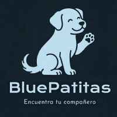
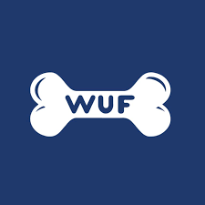
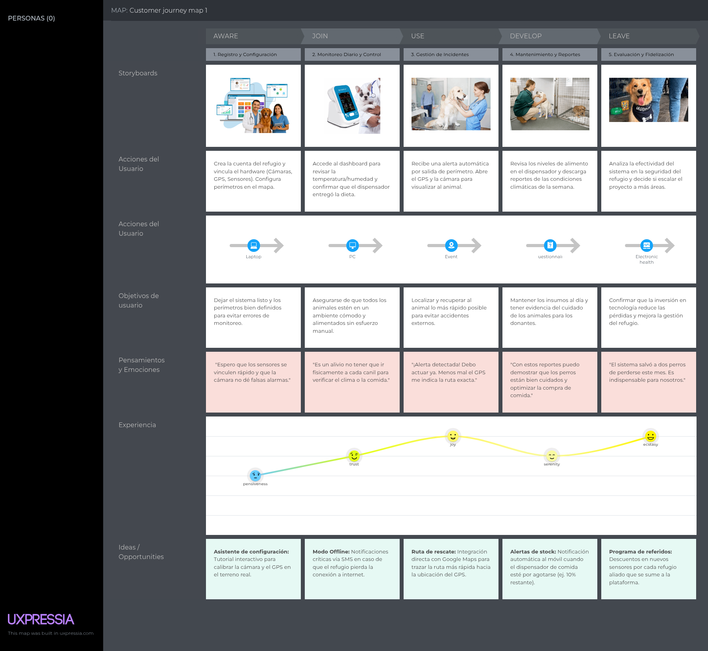
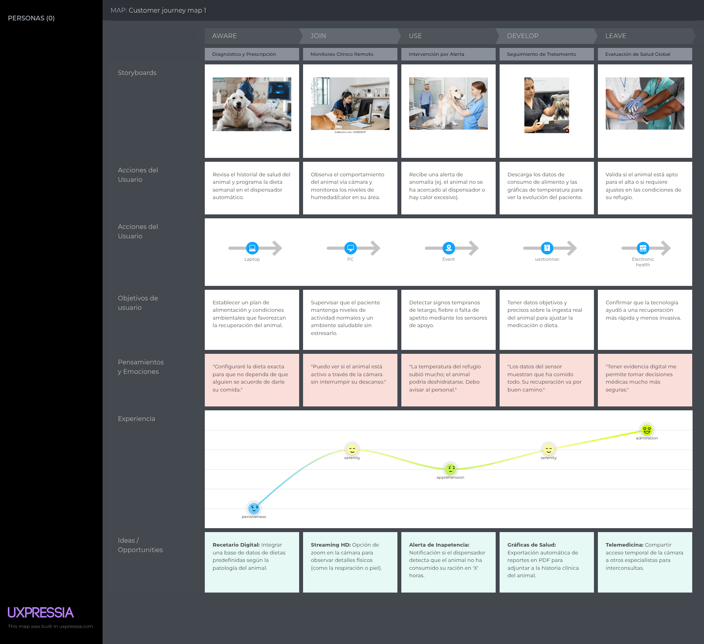
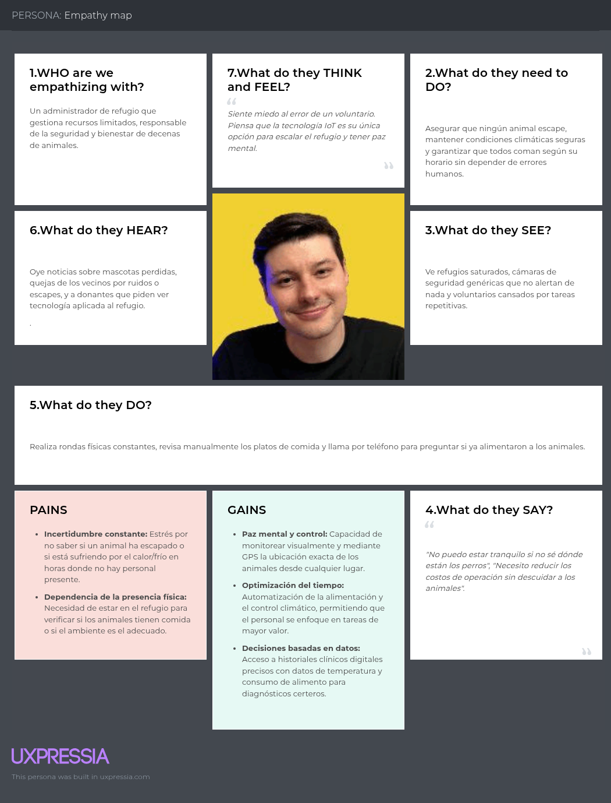
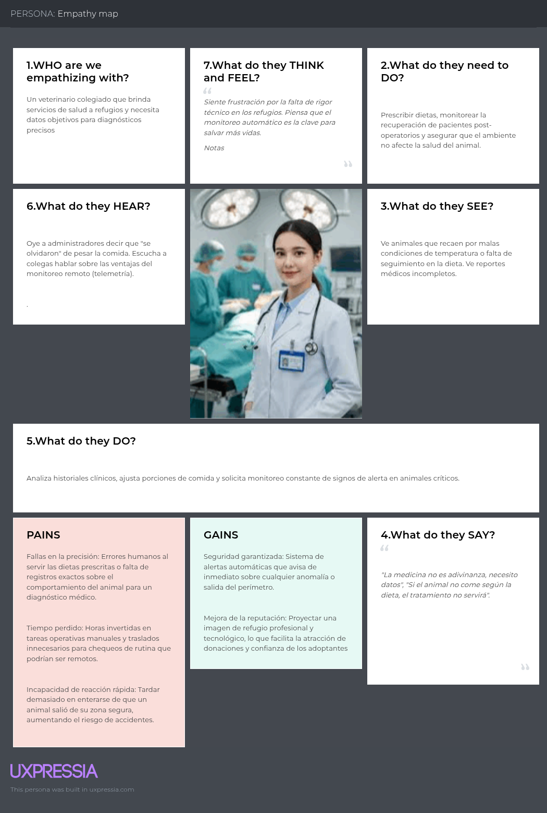

# 
Project Report

    <strong>Universidad Peruana de Ciencias Aplicadas</strong> 
     
    <strong>Ingeniería de Software - 2026-10</strong> 
    <strong>Desarrollo de Soluciones IOT - 17755</strong> 
    <strong>Profesor: Marco Antonio Leon Baca</strong> 
     <strong>Informe del Trabajo Final</strong>

    <strong>Startup: </strong> 
    <strong>Producto: </strong>

    <h3 align="center">Team Members:</h3>
    <table align="center">
        <tr>
            <th style="text-align:center;">Member</th>
            <th style="text-align:center;">Code</th>
        </tr>
        <tr>
            <td>Giancarlo Santiago Castañeda Guimas</td>
            <td>U202310601</td>
        </tr>
        <tr>
            <td>Luciana Carolina Choquehuanca Nuñez</td>
            <td>U202319431</td>
        </tr>
        <tr>
            <td>Carlos Matthew Gonzales Valverde</td>
            <td>U202314130</td>
        </tr>
        <tr>
            <td>María Patricia Hernández Uchuya</td>
            <td>U202311258</td>
        </tr>
        <tr>
            <td>Ronald Joel Peralta Chipa</td>
            <td>U202224619</td>
        </tr>
    </table>

    <strong>Abril, 2026</strong>

 

# Registro de versiones del Informe

<table align="center">
    <tr>
        <th>Versión</th>
        <th>Fecha</th>
        <th>Autor</th>
        <th>Descripción de modificaciones</th>
    </tr>
    <tr>
        <td>0</td>
        <td>11/04/2026</td>
        <td>María Hernández</td>
        <td>Creación del reporte</td>
    </tr>
</table>

 

# Project Report Collaboration Insights
Link del repositorio del reporte: 

 

# Contenido
- [Student Outcome](#student-outcome)
- [Capítulo I: Introducción](#capítulo-i-introducción)
    - [1.1. Startup Profile](#11-startup-profile)
        - [1.1.1. Descripción de la Startup](#111-descripción-de-la-startup)
        - [1.1.2. Perfiles de integrantes del equipo](#112-perfiles-de-integrantes-del-equipo)
    - [1.2. Solution Profile](#12-solution-profile)
        - [1.2.1 Antecedentes y problemática](#121-antecedentes-y-problemática)
        - [1.2.2 Lean UX Process](#122-lean-ux-process)
            - [1.2.2.1. Lean UX Problem Statements](#1221-lean-ux-problem-statements)
            - [1.2.2.2. Lean UX Assumptions](#1222-lean-ux-assumptions)
            - [1.2.2.3. Lean UX Hypothesis Statements](#1223-lean-ux-hypothesis-statements)
            - [1.2.2.4. Lean UX Canvas](#1224-lean-ux-canvas)
    - [1.3. Segmentos objetivo](#13-segmentos-objetivo)
- [Capítulo II: Requirements Elicitation & Analysis](#capítulo-ii-requirements-elicitation--analysis)
    - [2.1. Competidores](#21-competidores)
        - [2.1.1. Análisis competitivo](#211-análisis-competitivo)
        - [2.1.2. Estrategias y tácticas frente a competidores](#212-estrategias-y-tácticas-frente-a-competidores)
    - [2.2. Entrevistas](#22-entrevistas)
        - [2.2.1. Diseño de entrevistas](#221-diseño-de-entrevistas)
        - [2.2.2. Registro de entrevistas](#222-registro-de-entrevistas)
        - [2.2.3. Análisis de entrevistas](#223-análisis-de-entrevistas)
    - [2.3. Needfinding](#23-needfinding)
        - [2.3.1. User Personas](#231-user-personas)
        - [2.3.2. User Task Matrix](#232-user-task-matrix)
        - [2.3.3. User Journey Mapping](#233-user-journey-mapping)
        - [2.3.4. Empathy Mapping](#234-empathy-mapping)
    - [2.4. Big Picture EventStorming](#24-big-picture-eventstorming)
    - [2.5. Ubiquitous Language](#25-ubiquitous-language)
- [Capítulo III: Requirements Specification](#capítulo-iii-requirements-specification)
    - [3.1. User Stories](#31-user-stories)
    - [3.2. Impact Mapping](#32-impact-mapping)
    - [3.3. Product Backlog](#33-product-backlog)
- [Capítulo IV: Solution Software Design](#capítulo-iv-solution-software-design)
    - [4.1. Strategic-Level Domain-Driven Design](#41-strategic-level-domain-driven-design)
        - [4.1.1. Design-Level EventStorming](#411-design-level-eventstorming)
            - [4.1.1.1 Candidate Context Discovery](#4111-candidate-context-discovery)
            - [4.1.1.2 Domain Message Flows Modeling](#4112-domain-message-flows-modeling)
            - [4.1.1.3 Bounded Context Canvases](#4113-bounded-context-canvases)
        - [4.1.2. Context Mapping](#412-context-mapping)
        - [4.1.3. Software Architecture](#413-software-architecture)
            - [4.1.3.1. Software Architecture System Landscape Diagram](#4131-software-architecture-system-landscape-diagram)
            - [4.1.3.2. Software Architecture Context Level Diagrams](#4132-software-architecture-context-level-diagrams)
            - [4.1.3.3. Software Architecture Container Level Diagrams](#4133-software-architecture-container-level-diagrams)
            - [4.1.3.4. Software Architecture Deployment Diagrams](#4134-software-architecture-deployment-diagrams)
    - [4.2. Tactical-Level Domain-Driven Design](#42-tactical-level-domain-driven-design)
        - [4.2.X. Bounded Context: <Bounded Context Name>](#42x-bounded-context-bounded-context-name)
            - [4.2.X.1. Domain Layer](#42x1-domain-layer)
            - [4.2.X.2. Interface Layer](#42x2-interface-layer)
            - [4.2.X.3. Application Layer](#42x3-application-layer)
            - [4.2.X.4. Infrastructure Layer](#42x4-infrastructure-layer)
            - [4.2.X.5. Bounded Context Software Architecture Component Level Diagrams](#42x5-bounded-context-software-architecture-component-level-diagrams)
            - [4.2.X.6. Bounded Context Software Architecture Code Level Diagrams](#42x6-bounded-context-software-architecture-code-level-diagrams)
                - [4.2.X.6.1. Bounded Context Domain Layer Class Diagrams](#42x61-bounded-context-domain-layer-class-diagrams)
                - [4.2.X.6.2. Bounded Context Database Design Diagram](#42x62-bounded-context-database-design-diagram)
- [Capítulo V: Solution UI/UX Design](#capítulo-v-solution-uiux-design)
    - [5.1. Style Guidelines](#51-style-guidelines)
        - [5.1.1. General Style Guidelines](#511-general-style-guidelines)
        - [5.1.2. Web, Mobile and IoT Style Guidelines](#512-web-mobile-and-iot-style-guidelines)
    - [5.2. Information Architecture](#52-information-architecture)
        - [5.2.1. Organization Systems](#521-organization-systems)
        - [5.2.2. Labeling Systems](#522-labeling-systems)
        - [5.2.3. SEO Tags and Meta Tags](#523-seo-tags-and-meta-tags)
        - [5.2.4. Searching Systems](#524-searching-systems)
        - [5.2.5. Navigation Systems](#525-navigation-systems)
    - [5.3. Landing Page UI Design](#53-landing-page-ui-design)
        - [5.3.1. Landing Page Wireframe](#531-landing-page-wireframe)
        - [5.3.2. Landing Page Mock-up](#532-landing-page-mock-up)
    - [5.4. Applications UX/UI Design](#54-applications-uxui-design)
        - [5.4.1. Applications Wireframes](#541-applications-wireframes)
        - [5.4.2. Applications Wireflow Diagrams](#542-applications-wireflow-diagrams)
        - [5.4.3. Applications Mock-ups](#543-applications-mock-ups)
        - [5.4.4. Applications User Flow Diagrams](#544-applications-user-flow-diagrams)
    - [5.5. Applications Prototyping](#55-applications-prototyping)
    - [5.6. IoT Device Design](#56-iot-device-design)
- [Capítulo VI: Product Implementation, Validation & Deployment](#capítulo-vi-product-implementation-validation--deployment)
    - [6.1. Software Configuration Management](#61-software-configuration-management)
        - [6.1.1. Software Development Environment Configuration](#611-software-development-environment-configuration)
        - [6.1.2. Source Code Management](#612-source-code-management)
        - [6.1.3. Source Code Style Guide & Conventions](#613-source-code-style-guide--conventions)
        - [6.1.4. Software Deployment Configuration](#614-software-deployment-configuration)
    - [6.2. Landing Page, Services & Applications Implementation](#62-landing-page-services--applications-implementation)
        - [6.2.X. Sprint n](#62x-sprint-n)
            - [6.2.X.1. Sprint Planning n](#62x1-sprint-planning-n)
            - [6.2.X.2. Aspect Leaders and Collaborators](#62x2-aspect-leaders-and-collaborators)
            - [6.2.X.3. Sprint Backlog n](#62x3-sprint-backlog-n)
            - [6.2.X.4. Development Evidence for Sprint Review](#62x4-development-evidence-for-sprint-review)
            - [6.2.X.5. Testing Suite Evidence for Sprint Review](#62x5-testing-suite-evidence-for-sprint-review)
            - [6.2.X.6. Execution Evidence for Sprint Review](#62x6-execution-evidence-for-sprint-review)
            - [6.2.X.7. Services Documentation Evidence for Sprint Review](#62x7-services-documentation-evidence-for-sprint-review)
            - [6.2.X.8. Software Deployment Evidence for Sprint Review](#62x8-software-deployment-evidence-for-sprint-review)
            - [6.2.X.9. Team Collaboration Insights during Sprint](#62x9-team-collaboration-insights-during-sprint)
    - [6.3. Validation Interviews](#63-validation-interviews)
        - [6.3.1. Diseño de Entrevistas](#631-diseño-de-entrevistas)
        - [6.3.2. Registro de Entrevistas](#632-registro-de-entrevistas)
        - [6.3.3. Evaluaciones según heurísticas](#633-evaluaciones-según-heurísticas)
    - [6.4. Video About-the-Product](#64-video-about-the-product)
- [Conclusiones](#conclusiones)
- [Bibliografía](#bibliografía)
- [Anexos](#anexos)

 

# Student Outcome

 

# Capítulo I: Introducción

## 1.1. Startup Profile
### 1.1.1. Descripción de la Startup
### 1.1.2. Perfiles de integrantes del equipo

<table align="center" border="1" cellspacing="0" cellpadding="8" style="width: 90%; border-collapse: collapse;">
  <tr>
    <td style="width: 150px; text-align: center;">
      </img>
    </td>
    <td>
      
<strong>Giancarlo Santiago Castañeda Guimas - U202310601</strong>

      

        ...
      

    </td>
  </tr>
</table>

<table align="center" border="1" cellspacing="0" cellpadding="8" style="width: 90%; border-collapse: collapse;">
  <tr>
    <td style="width: 150px; text-align: center;">
      </img>
    </td>
    <td>
      
<strong>Luciana Carolina Choquehuanca Nuñez - U202319431</strong>

      

        ...
      

    </td>
  </tr>
</table>

<table align="center" border="1" cellspacing="0" cellpadding="8" style="width: 90%; border-collapse: collapse;">
  <tr>
    <td style="width: 150px; text-align: center;">
      </img>
    </td>
    <td>
      
<strong>Carlos Matthew Gonzales Valverde - U202314130</strong>

      

        ...
      

    </td>
  </tr>
</table>

<table align="center" border="1" cellspacing="0" cellpadding="8" style="width: 90%; border-collapse: collapse;">
  <tr>
    <td style="width: 150px; text-align: center;">
      </img>
    </td>
    <td>
      
<strong>María Patricia Hernández Uchuya - U202311258</strong>

      

        Estudio la carrera de Ingeniería de Software, tengo 20 años y actualmente me encuentro cursando el septimo ciclo de dicha carrera. Me considero una persona con responsabilidad, optimismo y honestidad, cualidades que considero fundamentales para una colaboración efectiva en equipo y un buen desarrollo en este proyecto.
      

    </td>
  </tr>
</table>

<table align="center" border="1" cellspacing="0" cellpadding="8" style="width: 90%; border-collapse: collapse;">
  <tr>
    <td style="width: 150px; text-align: center;">
      </img>
    </td>
    <td>
      
<strong>Ronald Joel Peralta Chipa - U202224619</strong>

      

         ...
      

    </td>
  </tr>
</table>

## 1.2. Solution Profile
### 1.2.1 Antecedentes y problemática
### 1.2.2 Lean UX Process
#### 1.2.2.1. Lean UX Problem Statements
#### 1.2.2.2. Lean UX Assumptions
#### 1.2.2.3. Lean UX Hypothesis Statements
#### 1.2.2.4. Lean UX Canvas

## 1.3. Segmentos objetivo

 

# Capítulo II: Requirements Elicitation & Analysis

## 2.1. Competidores 

Para esta sección analizaremos y compararemos a diversos competidores que pudimos llegar a encontrar para así transferir conocimiento detectando las mejores opciones y prácticas que aplicar para nuestra aplicación.

Los competidores se pueden dividir en varios tipos, como los que hacen exactamente lo mismo que nosotros, los que no hacen lo mismo pero pueden llegar a solucionarlo, los de mayor rango que serían los que consideramos que estamos muy lejos de alcanzarlos, etc. 

Al terminar el análisis competitivo y teniendo en mente las ventajas y desventajas de nuestros competidores podremos emplear mejores estrategias contra ellos.

Como competidores tenemos:
* WUF
* DogHero
* Petfinder

A continuación se presenta una tabla evaluando a estos competidores para la solución propuesta:

| Nombre | Descripción | Características | Distribución |
| :--- | :--- | :--- | :--- |
| **WUF** | Organización sin fines de lucro en Perú dedicada a reducir el número de perros callejeros mediante campañas de esterilización, educación y promoción de la adopción. | Cuenta con una fuerte presencia local y una red establecida de voluntarios y aliados. Sin embargo, su enfoque se limita principalmente a los perros y tiene alta dependencia de donaciones externas. | Plataforma web y fuerte presencia en redes sociales (Facebook, Instagram) para campañas locales, recaudación de fondos y promoción de adopciones. |
| **DogHero** | Plataforma en América Latina enfocada en servicios de cuidado de mascotas (como paseos y alojamiento) que también ofrece opciones para promover la adopción. | Posee una amplia red de usuarios en LATAM debido a la diversificación de sus servicios, aunque su enfoque principal no es la adopción, lo que enfrenta a la plataforma con un alto nivel de competencia. | Aplicación y plataforma digital disponible a nivel regional (Brasil y otros países de América Latina). |
| **Petfinder** | Plataforma internacional para la adopción de mascotas que funciona como intermediario para conectar refugios y rescates con personas que buscan adoptar. | Tiene un alcance global y una base tecnológica muy fuerte que incluye funciones avanzadas de búsqueda y filtros, aunque su enfoque global dificulta la adaptación a necesidades locales. | Plataforma web a nivel global y distribución digital a gran escala. |

### 2.1.1. Análisis competitivo 

| **Competitive Analysis Landscape** | **Escriba en el recuadro la pregunta que busca responder o el objetivo de este análisis.** |
| :---- | :---- |
| ¿Por qué llevar a cabo este análisis?  | Deseamos analizar a nuestros competidores para buscar en qué puntos podemos mejorar, contra que nos estamos enfrentando en el mercado y como nos distinguimos de estos |

| Categoría | Factores | **BluePatitas**    | **WUF**    | **DogHero**     | **Petfinder**     |
| :--- | :--- | :--- | :--- | :--- | :--- |
| **Perfil** | **Overview** | Startup peruana B2B que integra software de gestión y hardware IoT para automatizar la nutrición, el monitoreo clínico, la seguridad y el control ambiental en refugios de animales. | ONG peruana dedicada a la promoción de la adopción responsable y la gestión de una plataforma de marketplace para financiar refugios. | Plataforma digital que conecta a dueños de mascotas con una red de anfitriones certificados para hospedaje, paseos y guardería. | El directorio de adopción de animales más grande a nivel global, facilitando la conexión entre miles de refugios y potenciales adoptantes. |
| | **Ventaja competitiva** | •Automatización física (climatización y dispensadores de comida) guiada por reglas médicas. • Telemetría en tiempo real (Cámaras y GPS) para detección temprana de escapes y anomalías.  • Reducción drástica de la carga operativa del personal. | • Marca líder y reconocida en el mercado peruano. • Alianzas estratégicas con empresas de retail y consumo masivo. • Comunidad digital sólida y activa ("Wulovers"). | • Confianza basada en un sistema riguroso de reseñas y evaluaciones. • Incluye "Garantía Veterinaria" en cada reserva. • App móvil con UX optimizada para reservas rápidas. | • Base de datos masiva con integración de miles de organizaciones internacionales. • Herramientas avanzadas de filtrado. • Respaldo corporativo de Nestlé Purina. |
| **Perfil de Marketing** | **Mercado objetivo** | Administradores de refugios de animales, organizaciones de rescate y médicos veterinarios afiliados que buscan eficiencia operativa. | Personas en Perú interesadas en la adopción responsable y consumidores de productos con impacto social. | Dueños de mascotas de áreas urbanas que requieren cuidado personalizado por viajes o trabajo. | Público global interesado en la adopción y organizaciones de rescate que buscan visibilidad. |
| | **Estrategias de marketing** | Demostración de reducción de costos operativos en refugios (ROI), ventas directas B2B (SaaS) y alianzas con instituciones veterinarias. | Colaboraciones B2B, campañas de sensibilización emocional y eventos presenciales de adopción. | Marketing de influencers, sistemas de referidos y publicidad segmentada en redes sociales. | Optimización masiva en buscadores (SEO) para términos de adopción y patrocinios de marcas de alimentos. |
| **Perfil de Producto** | **Productos & Servicios** | Plataforma SaaS de gestión operativa/clínica, Collares GPS, Cámaras IP de seguridad perimetral, Sensores ambientales (Clima) y Dispensadores inteligentes de alimento. | Marketplace de accesorios, plataforma de adopción y programas de padrinazgo para albergues. | Servicios de hospedaje en casas particulares, paseos diarios, guardería y visitas a domicilio. | Directorio de búsqueda de mascotas, recursos educativos sobre cuidado animal y gestión de voluntarios. |
| | **Precios & Costos** | Modelo B2B de Suscripción (SaaS) mensual para refugios, más costos de instalación o arrendamiento (Leasing) de la infraestructura IoT. | Productos con precios competitivos; las adopciones pueden incluir un costo administrativo o donación sugerida. | Tarifas flexibles establecidas por cada anfitrión (promedio S/ 30 - S/ 70 por noche). | Gratuito para adoptantes; ingresos vía publicidad y financiamiento corporativo. |
| | **Canales de distribución** | Aplicación Web para gestión clínica/operativa, notificaciones móviles e instalación física de los dispositivos IoT en el refugio. | Plataforma web (e-commerce) y redes sociales. | App móvil nativa (iOS/Android) y sitio web interactivo. | Portal web global y aplicación móvil. |
| **Análisis SWOT** | **Fortalezas** | • Única solución en el mercado con integración directa de hardware IoT y motores de reglas médicas. • Capacidad de rastreo continuo y geolocalización in-situ.| • Alta reputación y confianza en el mercado local. • Red consolidada de albergues afiliados en todo el país. | • Modelo de negocio escalable con baja inversión en infraestructura física. • Excelente sistema de atención al cliente y seguros. | • Dominio absoluto del tráfico de búsqueda internacional. • Capacidad tecnológica avanzada para manejo de Big Data. |
| | **Debilidades** | • CCostos iniciales de adquisición de hardware e implementación técnica. • Curva de aprendizaje del personal para el uso de la telemetría. | • Dependencia directa de ventas de terceros y donaciones. • Limitación geográfica al mercado nacional (Perú). | • Riesgos operativos inherentes al cuidado en hogares externos. • Percepción de precios altos por las comisiones. | • Dificultad para verificar la actualización en tiempo real de refugios pequeños. • Interfaz web saturada. |
| | **Oportunidades** | • Monetización de Big Data sobre comportamiento animal y tendencias nutricionales. • Expansión a granjas, zoológicos o clínicas veterinarias privadas. | • Implementación de servicios veterinarios digitales o telemedicina. • Desarrollo de una línea de productos propia. | • Expansión hacia servicios de entrenamiento y salud preventiva. • Alianzas con aerolíneas y hoteles. | • Integración de IA para el "match" perfecto de adopción. • Expansión en mercados emergentes de Latam. |
| | **Amenazas** | • Rápida evolución u obsolescencia de los componentes de hardware IoT. • Problemas de conectividad o cortes de red e internet en refugios remotos. | • Volatilidad económica que afecte el consumo. • Surgimiento de nuevas ONGs con modelos similares. | • Competencia directa de hoteles caninos y veterinarias. • Cambios en regulaciones de hospedaje animal. | • Aparición de apps locales con enfoques más personalizados. • Cambios en los algoritmos de búsqueda. |

### 2.1.2. Estrategias y tácticas frente a competidores 

#### **Estrategia 1: Liderazgo tecnológico mediante la automatización operativa y telemetría**

A diferencia de competidores como WUF o Petfinder que se centran en la visibilidad y adopción, BluePatitas se diferencia por intervenir directamente en la operación física del refugio.

**Táctica 1.1: Implementación de un Dashboard IoT de gestión integral**

-   Desarrollar una interfaz centralizada donde el administrador pueda monitorear en tiempo real los cuatro pilares del sistema: ubicación (GPS), seguridad perimetral (Cámaras), condiciones ambientales (Sensores Temp/Hum) y estado de alimentación (Dispensadores).
    
-   Configurar un motor de reglas que dispare alertas críticas automáticas al móvil del personal ante anomalías térmicas en los hábitats o detecciones de movimiento en zonas de riesgo de escape, permitiendo una reacción inmediata basada en datos.
    

**Táctica 1.2: Historial clínico inteligente con telemetría vinculada**

-   Integrar los datos de salud capturados por los sensores directamente en el módulo de _Veterinary_, permitiendo que el médico veterinario vea gráficas de actividad y comportamiento del animal antes de una consulta, facilitando diagnósticos preventivos.
    
-   Generar "Certificados de Bienestar Digital" basados en los logs de alimentación y clima del sistema, proporcionando una garantía técnica de cuidado a las organizaciones que financian los refugios o a los futuros adoptantes.
    
----------

#### **Estrategia 2: Optimización de recursos y reducción de costos operativos**

_Nuestra estrategia busca profesionalizar los refugios mediante la eficiencia, reduciendo el desperdicio de insumos y el error humano._

**Táctica 2.1: Gestión inteligente de nutrición e inventarios**

-   Utilizar los dispensadores automáticos para ejecutar raciones precisas según la prescripción del veterinario, evitando el sobrecosto por desperdicio de alimento y asegurando la salud nutricional del animal sin requerir personal dedicado exclusivamente a esta tarea.
    
-   Implementar alertas de bajo nivel de inventario en las tolvas de los dispensadores, permitiendo que la administración del refugio planifique las compras de suministros de manera anticipada y eficiente.
    

**Táctica 2.2: Control ambiental automatizado para la salud preventiva**

-   Vincular los sensores ambientales con actuadores físicos (ventiladores/calefacción) para mantener los hábitats en rangos óptimos de temperatura automáticamente, reduciendo la incidencia de enfermedades respiratorias y, por ende, disminuyendo los gastos en tratamientos médicos de emergencia.
    
----------

#### **Estrategia 3: Alianzas estratégicas para la sostenibilidad del ecosistema B2B**

_Posicionar a BluePatitas como el socio tecnológico indispensable para las entidades de bienestar animal y clínicas veterinarias._

**Táctica 3.1: Red de Refugios "Smart" y soporte técnico especializado**

-   Establecer convenios con refugios estratégicos en Lima para convertirlos en centros de referencia tecnológica, demostrando mediante métricas reales cómo el uso de BluePatitas reduce las tasas de escapes y mejora los tiempos de recuperación médica.
    
-   Ofrecer servicios de soporte técnico y mantenimiento preventivo del hardware IoT como parte del modelo de suscripción, asegurando la continuidad operativa del refugio y fidelizando al cliente B2B.
    

**Táctica 3.2: Escalabilidad basada en métricas de impacto**

-   Recolectar y analizar los datos agregados de telemetría para generar reportes de impacto sectorial (ej. reducción de mortalidad por control climático), utilizando estos resultados para atraer alianzas con grandes marcas de alimento o instituciones gubernamentales interesadas en la estandarización de refugios.
    
-   Expandir la solución hacia clínicas veterinarias con áreas de hospitalización, adaptando los sensores y el software para el monitoreo de pacientes críticos en entornos médicos profesionales.

## 2.2. Entrevistas
### 2.2.1. Diseño de entrevistas

En esta sección se presenta el diseño de entrevistas dirigido a los principales segmentos del proyecto. Estas entrevistas tienen como objetivo comprender el contexto de los usuarios, sus necesidades, comportamientos, objetivos y frustraciones, con el fin de obtener información relevante para la construcción de los User Persona y el diseño de la solución. Se incluyeron preguntas principales para explorar los temas clave y preguntas complementarias que permiten profundizar en situaciones específicas, facilitando la obtención de insights más significativos.

#### Segmento 1: Administradores de refugios

##### Preguntas generales

- ¿Cómo organizas el seguimiento diario de los animales que tienes a cargo?
- ¿Qué es lo más complicado al momento de preparar animales para adopción?
- ¿Cómo manejas actualmente el seguimiento de recursos o apoyos necesarios para el cuidado de los animales?
- ¿Qué herramientas digitales has utilizado para apoyarte en tu trabajo y qué tan útiles te han resultado?
- ¿Qué te gustaría mejorar en la forma en que gestionas a los animales actualmente?
- ¿Qué funcionalidades te harían más fácil tu trabajo en una plataforma digital?

##### Preguntas complementarias

- ¿Puedes contarme una situación reciente que haya sido difícil de manejar?
- ¿Cómo resolviste ese problema?
- ¿Qué fue lo más frustrante de esa experiencia?
- ¿Qué crees que te hubiera ayudado a resolverlo mejor?

#### Segmento 2: Veterinarios

##### Preguntas generales

- ¿Cómo coordinas actualmente con quienes llevan animales para atención?
- ¿Qué es lo más difícil al tratar animales que no tienen un seguimiento previo?
- ¿Cómo gestionas la información de los animales que atiendes?
- ¿Qué herramientas digitales utilizas en tu trabajo diario y qué tan útiles te resultan?
- ¿Qué te gustaría mejorar en la atención y seguimiento de los animales?
- ¿Qué funcionalidades te ayudarían a trabajar mejor con quienes reportan o derivan animales?

##### Preguntas complementarias

- ¿Puedes contarme un caso reciente que haya sido complicado?
- ¿Qué hiciste para resolverlo?
- ¿Qué parte del proceso te tomó más tiempo o esfuerzo?
- ¿Qué crees que hubiera facilitado ese trabajo?

### 2.2.2. Registro de entrevistas
### 2.2.3. Análisis de entrevistas

## 2.3. Needfinding
### 2.3.1. User Personas
### 2.3.2. User Task Matrix
En esta sección se detallan las tareas que realizan los usuarios clave de nuestra solución digital “SmartHire”. Se han identificado dos segmentos principales:

- Segmento 1: Equipos de Recursos Humanos encargados del proceso de contratación

- Segmento 2: Postulantes o candidatos que aplican a las vacantes

Las tareas aquí descritas no dependen exclusivamente del uso del software, ya que representan acciones que los usuarios deben realizar en cualquier proceso de selección, sea manual o automatizado. Para cada tarea, se especifica su frecuencia y nivel de importancia, permitiendo identificar qué funciones son más críticas para cada perfil.

#### 🧑‍💼 User Task Matrix – Administradores de refugios

| Tarea                                             | Frecuencia | Importancia |
|--------------------------------------------------|------------|-------------|
| Gestionar el control ambiental usando sensores de temperatura y humedad  | A menudo     | Alta        |
| Monitorear intentos de escape mediante cámaras                              | A menudo     | Alta        |
| Supervisar el bienestar animal a través de alertas automáticas de cámaras             | Alta     | Alta        |
| Confirmar la ubicación exacta del animal mediante el sistema       | A veces     | Media        |
| Analizar alertas de irregularidades en la ingesta alimentaria    | A menudo    | Alta       |

#### 🙋‍♂️ User Task Matrix – Veterinarios

| Tarea                                          | Frecuencia | Importancia |
|-----------------------------------------------|------------|-------------|
| Monitorear el estado de salud y bienestar mediante camaras de seguridad     | A menudo     | Alta        |
| Configurar dietas especiales vinculadas a los sensores de los comederos             | A veces      | Alta        |
| Gestionar la alimentación automática con bebederos y comederos inteligentes     | A veces  | Alta        |
| Recibir notificaciones de emergencia por anomalías detectadas por sensores o camaras                         | A menudo  | Alta        |
| Analizar cambios de comportamiento inusual detectados por la camara                 | A veces    | Media       |

En el caso del Administrador de refugios, las tareas con mayor frecuencia e importancia se centran en la seguridad perimetral y el control del entorno. El uso de cámaras para alertas automáticas y sensores de clima es vital para prevenir incidentes de escape o sofocación. Estas actividades, que antes requerían recorridos manuales y conteos físicos propensos a errores, ahora se automatizan para garantizar que los animales permanezcan en zonas seguras y con condiciones climáticas óptimas

En el caso del Veterinario, las tareas más relevantes giran en torno a la medicina preventiva y personalizada. El monitoreo constante a través de cámaras permite detectar problemas de salud de forma temprana , mientras que el control de dietas mediante dispensadores inteligentes asegura que cada animal reciba la nutrición prescrita sin necesidad de supervisión humana constante. El sistema de alertas permite que el profesional priorice casos urgentes basados en datos reales de los sensores en lugar de revisiones aleatorias.

En resumen, ambos segmentos interactúan con la tecnología IoT para reducir la carga operativa y mejorar la respuesta ante emergencias. Mientras el administrador se enfoca en la gestión y seguridad de las instalaciones, el veterinario utiliza los mismos recursos para optimizar la salud y nutrición individualizada de los animales.

### 2.3.3. User Journey Mapping
Para desarrollar el User Journey Mapping de cada User Persona, se analizaron las distintas etapas de interacción del usuario con el producto o servicio, identificando sus objetivos, emociones y posibles fricciones en cada punto del recorrido. Este proceso se apoyó en la información previamente recopilada sobre el segmento y en las características específicas definidas para cada perfil, con el fin de representar de manera coherente su experiencia completa.

Segmento 1: Andrees Caseres

Segmento 2: Eva Mudel

### 2.3.4. Empathy Mapping
Para construir el Empathy Map de cada User Persona, se tomó como base la perspectiva global del segmento previamente definido, integrando los rasgos de personalidad y el contexto específico del personaje establecidos durante el proceso de diseño de cada User Persona.

Segmento 1: Andrees Caseres

Segmento 2: Eva Mudel

## 2.4. Big Picture EventStorming

El diseño de la arquitectura y lógica de negocio de BluePatitas inició con una sesión colaborativa de EventStorming. Para llevar a cabo esta dinámica, el equipo siguió las fases recomendadas de la metodología, asegurando una exploración profunda de nuestro dominio, el cual combina la gestión operativa de un refugio con el procesamiento de telemetría de hardware IoT. A continuación, se detalla el desarrollo de la sesión:

"Imagen"

#### **Preparing the Room** 
Para llevar a cabo nuestra sesión de EventStorming, decidimos reunirnos de manera virtual. Nos conectamos a un canal de voz en Discord el miércoles 22 a las 10:00 p.m., asegurándonos de que todos los miembros del equipo tuvieran acceso y permisos de edición al tablero de Miro, el cual configuramos previamente como nuestro lienzo infinito para la dinámica.

"Imagen"

#### **Energizing the Audience** 
Antes de entrar de lleno a la creación técnica, tomamos unos minutos para "romper el hielo" y alinear la energía del equipo. Hablamos un poco sobre la carga de trabajos de la semana y compartimos anécdotas rápidas sobre nuestras propias mascotas. Este espacio nos sirvió para despejar la mente y entrar con la creatividad a tope antes de iniciar el trabajo duro.

"Imagen"

#### **Briefing and Presenting the Agenda** 
Una vez concentrados, hicimos un repaso rápido del core de nuestra startup: BluePatitas busca automatizar y optimizar la gestión operativa y de salud en refugios animales mediante tecnología IoT (sensores de temperatura, cámaras térmicas, bebederos inteligentes), centralizando esta información en una plataforma web. La agenda de la noche era clara: mapear todo el flujo de nuestro sistema, desde que un animal es ingresado al albergue hasta que el personal del refugio o el veterinario utiliza los datos recolectados para asegurar su bienestar y registrar sus tratamientos.

"Imagen"

#### **Generating Domain Events** 
Comenzamos la lluvia de ideas lanzando "Eventos de Dominio" (utilizando post-its naranjas y siempre redactados en tiempo pasado). Al principio salieron ideas muy variadas, abarcando tanto el software como el hardware. Surgieron eventos como: Animal ingresado al sistema, Alerta de escape generada, Temperatura crítica detectada, Tratamiento médico registrado, Historial clínico actualizado y Nivel bajo de agua registrado en bebedero.

"Imagen"

#### **Sorting Domain Events**
 Con la pantalla llena de post-its naranjas, procedimos a ordenarlos de manera cronológica de izquierda a derecha. Nos dimos cuenta de que nuestro sistema seguía una línea de tiempo basada en cuatro grandes fases operativas:

1.  La admisión del animal y la asignación de su identificador/hardware.
    
2.  El ciclo constante de monitoreo ambiental y biométrico (IoT).
    
3.  La respuesta operativa ante alertas de seguridad (como intentos de escape).
    
4.  El análisis de datos de salud y actualización del historial clínico por parte del personal.
    
"Imagen"

#### **Adding Actors and External Systems** 
En esta etapa, le dimos vida y contexto al tablero. Identificamos a nuestros actores principales (post-its amarillos): el Administrador del Refugio, el Voluntario/Cuidador y el Veterinario. Luego, añadimos las piezas clave de nuestra arquitectura, los Sistemas Externos (post-its lilas). Mapeamos un Servicio de Notificaciones (Email/SMS) para las alertas de emergencia y nuestros componentes de hardware, los cuales actúan de forma autónoma enviando comandos al sistema: Sensores de Movimiento, Módulo DHT11 (Temperatura/Humedad) y Cámaras Térmicas.

"Imagen"

#### **Storytelling** 
Con el tablero estructurado, leímos la historia cronológicamente para validar el flujo del usuario y del dato. Contamos cómo el Administrador registra a un animal y le asigna un área, lo que activa el monitoreo de los sensores. Explicamos que, de manera automatizada, si la temperatura ambiental baja de un umbral seguro o si la cámara térmica detecta una anomalía, el hardware dispara un evento que el sistema convierte en una alerta. En paralelo, relatamos cómo la plataforma procesa esta telemetría y la traduce en un "Reporte de Bienestar" para que el Veterinario y el Administrador evalúen la evolución del animal y ajusten sus cuidados o alimentación.

"Imagen"

#### **Reverse Storytelling** 
Para asegurar que no hubiéramos omitido ninguna regla de negocio, hicimos el ejercicio a la inversa. Nos posicionamos al final del tablero y nos preguntamos repetidamente: "¿Qué tuvo que pasar para que esto se desencadenara?". Por ejemplo, frente al evento 'Alerta de prevención de escape enviada al voluntario', notamos que nos faltaba el gatillador de hardware, por lo que actualizamos el tablero añadiendo el evento Movimiento inusual detectado en perímetro'.

"Imagen"

#### **Closing**
Cerca de la medianoche, dimos por concluida la sesión. El equipo logró obtener una visión panorámica muy clara de cómo interactúa nuestra capa física (IoT) con nuestra capa lógica (plataforma web de gestión). Validamos que el flujo principal estaba completo, identificamos oportunidades de mejora en la comunicación con los veterinarios y definimos que el siguiente paso sería agrupar estos eventos por afinidad para construir nuestros Bounded Contexts.

"Imagen"

## 2.5. Ubiquitous Language

 

# Capítulo III: Requirements Specification

## 3.1. User Stories
## 3.2. Impact Mapping
## 3.3. Product Backlog

 

# Capítulo IV: Solution Software Design

## 4.1. Strategic-Level Domain-Driven Design
### 4.1.1. Design-Level EventStorming
#### 4.1.1.1 Candidate Context Discovery
#### 4.1.1.2 Domain Message Flows Modeling
#### 4.1.1.3 Bounded Context Canvases
### 4.1.2. Context Mapping
### 4.1.3. Software Architecture
#### 4.1.3.1. Software Architecture System Landscape Diagram
#### 4.1.3.2. Software Architecture Context Level Diagrams
#### 4.1.3.3. Software Architecture Container Level Diagrams
#### 4.1.3.4. Software Architecture Deployment Diagrams

## 4.2. Tactical-Level Domain-Driven Design
### 4.2.X. Bounded Context: <Bounded Context Name>
#### 4.2.X.1. Domain Layer
#### 4.2.X.2. Interface Layer
#### 4.2.X.3. Application Layer
#### 4.2.X.4. Infrastructure Layer
#### 4.2.X.5. Bounded Context Software Architecture Component Level Diagrams
#### 4.2.X.6. Bounded Context Software Architecture Code Level Diagrams
##### 4.2.X.6.1. Bounded Context Domain Layer Class Diagrams
##### 4.2.X.6.2. Bounded Context Database Design Diagram

 

# Capítulo V: Solution UI/UX Design

## 5.1. Style Guidelines
### 5.1.1. General Style Guidelines
### 5.1.2. Web, Mobile and IoT Style Guidelines

## 5.2. Information Architecture
### 5.2.1. Organization Systems
### 5.2.2. Labeling Systems
### 5.2.3. SEO Tags and Meta Tags
### 5.2.4. Searching Systems
### 5.2.5. Navigation Systems

## 5.3. Landing Page UI Design
### 5.3.1. Landing Page Wireframe
### 5.3.2. Landing Page Mock-up

## 5.4. Applications UX/UI Design
### 5.4.1. Applications Wireframes
### 5.4.2. Applications Wireflow Diagrams
### 5.4.3. Applications Mock-ups
### 5.4.4. Applications User Flow Diagrams

## 5.5. Applications Prototyping
## 5.6. IoT Device Design

 

# Capítulo VI: Product Implementation, Validation & Deployment

## 6.1. Software Configuration Management
### 6.1.1. Software Development Environment Configuration
### 6.1.2. Source Code Management
### 6.1.3. Source Code Style Guide & Conventions
### 6.1.4. Software Deployment Configuration

## 6.2. Landing Page, Services & Applications Implementation
### 6.2.X. Sprint n
#### 6.2.X.1. Sprint Planning n
#### 6.2.X.2. Aspect Leaders and Collaborators
#### 6.2.X.3. Sprint Backlog n
#### 6.2.X.4. Development Evidence for Sprint Review
#### 6.2.X.5. Testing Suite Evidence for Sprint Review
#### 6.2.X.6. Execution Evidence for Sprint Review
#### 6.2.X.7. Services Documentation Evidence for Sprint Review
#### 6.2.X.8. Software Deployment Evidence for Sprint Review
#### 6.2.X.9. Team Collaboration Insights during Sprint

## 6.3. Validation Interviews
### 6.3.1. Diseño de Entrevistas
### 6.3.2. Registro de Entrevistas
### 6.3.3. Evaluaciones según heurísticas

## 6.4. Video About-the-Product

 

# Conclusiones
## Conclusiones y recomendaciones
## Video About-the-Team

 

# Bibliografía

 

# Anexos
Link del Repositorio del Informe: 
Link del Repositorio del Backend: 
Link del Repositorio del Frontend Aplicación Web: 
Link del Repositorio del Frontend Aplicación Móvil: 
