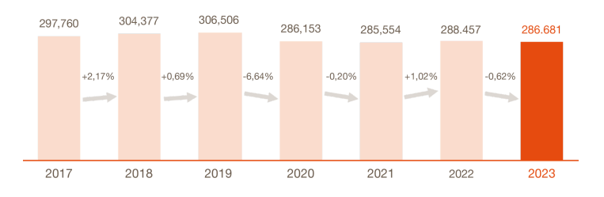
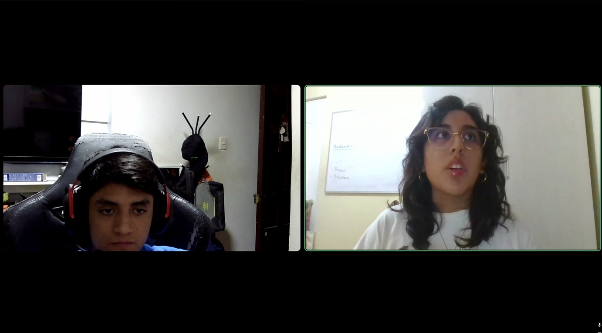
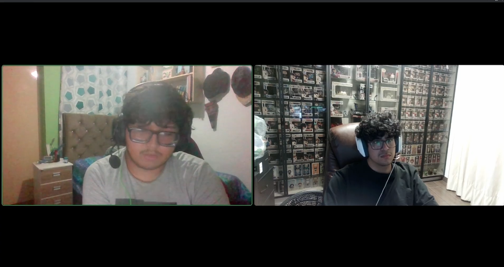
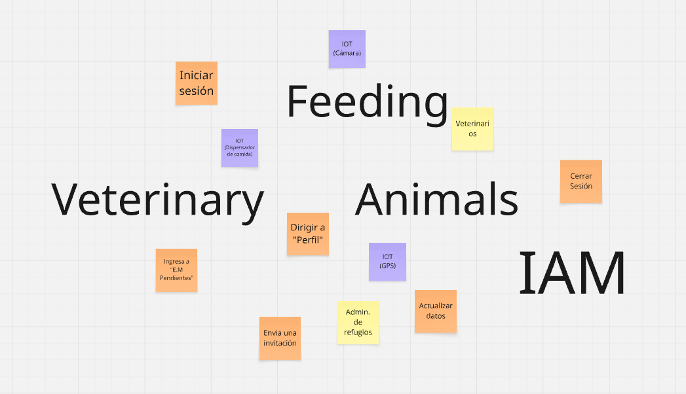

# 
Project Report

    <strong>Universidad Peruana de Ciencias Aplicadas</strong> 
     
    <strong>Ingeniería de Software - 2026-10</strong> 
    <strong>Desarrollo de Soluciones IOT - 17755</strong> 
    <strong>Profesor: Marco Antonio Leon Baca</strong> 
     <strong>Informe del Trabajo Final</strong>

    <strong>Startup: BluePatitas </strong> 
    <strong>Producto: </strong>

    <h3 align="center">Team Members:</h3>
    <table align="center">
        <tr>
            <th style="text-align:center;">Member</th>
            <th style="text-align:center;">Code</th>
        </tr>
        <tr>
            <td>Giancarlo Santiago Castañeda Guimas</td>
            <td>U202310601</td>
        </tr>
        <tr>
            <td>Luciana Carolina Choquehuanca Nuñez</td>
            <td>U202319431</td>
        </tr>
        <tr>
            <td>Carlos Matthew Gonzales Valverde</td>
            <td>U202314130</td>
        </tr>
        <tr>
            <td>María Patricia Hernández Uchuya</td>
            <td>U202311258</td>
        </tr>
        <tr>
            <td>Ronald Joel Peralta Chipa</td>
            <td>U202224619</td>
        </tr>
    </table>

    <strong>Abril, 2026</strong>

 

# Registro de versiones del Informe

<table align="center">
    <tr>
        <th>Versión</th>
        <th>Fecha</th>
        <th>Autor</th>
        <th>Descripción de modificaciones</th>
    </tr>
    <tr>
        <td>0</td>
        <td>11/04/2026</td>
        <td>María Hernández</td>
        <td>Creación del reporte</td>
    </tr>
    <tr>
      <td>0.1</td>
      <td>23/04/2026</td>
      <td>Carlos Gonzales</td>
      <td>Actualización del Capítulo I: descripción de la startup, solution profile, antecedentes y problemática, Lean UX Process, Student Outcome, bibliografía y segmentos objetivo.</td>
    
  </tr>

  <tr>
        <td>0.2</td>
        <td>23/04/2026</td>
        <td>Ronald Peralta</td>
        <td>Mejora del Capítulo I: descripción de la startup, solution profile, antecedentes y problemática, segmento objetivo, User Task Matrix, User Journey Mapping, Mapa de Empatía, Tactical-Level Domain-Driven Design, Diagramas de clases de dominio y diagramas entidad-relación</td>
    </tr>
</table>

 

# Project Report Collaboration Insights
Link del repositorio del reporte: 

 

# Contenido
- [Student Outcome](#student-outcome)
- [Capítulo I: Introducción](#capítulo-i-introducción)
    - [1.1. Startup Profile](#11-startup-profile)
        - [1.1.1. Descripción de la Startup](#111-descripción-de-la-startup)
        - [1.1.2. Perfiles de integrantes del equipo](#112-perfiles-de-integrantes-del-equipo)
    - [1.2. Solution Profile](#12-solution-profile)
        - [1.2.1 Antecedentes y problemática](#121-antecedentes-y-problemática)
        - [1.2.2 Lean UX Process](#122-lean-ux-process)
            - [1.2.2.1. Lean UX Problem Statements](#1221-lean-ux-problem-statements)
            - [1.2.2.2. Lean UX Assumptions](#1222-lean-ux-assumptions)
            - [1.2.2.3. Lean UX Hypothesis Statements](#1223-lean-ux-hypothesis-statements)
            - [1.2.2.4. Lean UX Canvas](#1224-lean-ux-canvas)
    - [1.3. Segmentos objetivo](#13-segmentos-objetivo)
- [Capítulo II: Requirements Elicitation & Analysis](#capítulo-ii-requirements-elicitation--analysis)
    - [2.1. Competidores](#21-competidores)
        - [2.1.1. Análisis competitivo](#211-análisis-competitivo)
        - [2.1.2. Estrategias y tácticas frente a competidores](#212-estrategias-y-tácticas-frente-a-competidores)
    - [2.2. Entrevistas](#22-entrevistas)
        - [2.2.1. Diseño de entrevistas](#221-diseño-de-entrevistas)
        - [2.2.2. Registro de entrevistas](#222-registro-de-entrevistas)
        - [2.2.3. Análisis de entrevistas](#223-análisis-de-entrevistas)
    - [2.3. Needfinding](#23-needfinding)
        - [2.3.1. User Personas](#231-user-personas)
        - [2.3.2. User Task Matrix](#232-user-task-matrix)
        - [2.3.3. User Journey Mapping](#233-user-journey-mapping)
        - [2.3.4. Empathy Mapping](#234-empathy-mapping)
    - [2.4. Big Picture EventStorming](#24-big-picture-eventstorming)
    - [2.5. Ubiquitous Language](#25-ubiquitous-language)
- [Capítulo III: Requirements Specification](#capítulo-iii-requirements-specification)
    - [3.1. User Stories](#31-user-stories)
    - [3.2. Impact Mapping](#32-impact-mapping)
    - [3.3. Product Backlog](#33-product-backlog)
- [Capítulo IV: Solution Software Design](#capítulo-iv-solution-software-design)
    - [4.1. Strategic-Level Domain-Driven Design](#41-strategic-level-domain-driven-design)
        - [4.1.1. Design-Level EventStorming](#411-design-level-eventstorming)
            - [4.1.1.1 Candidate Context Discovery](#4111-candidate-context-discovery)
            - [4.1.1.2 Domain Message Flows Modeling](#4112-domain-message-flows-modeling)
            - [4.1.1.3 Bounded Context Canvases](#4113-bounded-context-canvases)
        - [4.1.2. Context Mapping](#412-context-mapping)
        - [4.1.3. Software Architecture](#413-software-architecture)
            - [4.1.3.1. Software Architecture System Landscape Diagram](#4131-software-architecture-system-landscape-diagram)
            - [4.1.3.2. Software Architecture Context Level Diagrams](#4132-software-architecture-context-level-diagrams)
            - [4.1.3.3. Software Architecture Container Level Diagrams](#4133-software-architecture-container-level-diagrams)
            - [4.1.3.4. Software Architecture Deployment Diagrams](#4134-software-architecture-deployment-diagrams)
    - [4.2. Tactical-Level Domain-Driven Design](#42-tactical-level-domain-driven-design)
        - [4.2.X. Bounded Context: <Bounded Context Name>](#42x-bounded-context-bounded-context-name)
            - [4.2.X.1. Domain Layer](#42x1-domain-layer)
            - [4.2.X.2. Interface Layer](#42x2-interface-layer)
            - [4.2.X.3. Application Layer](#42x3-application-layer)
            - [4.2.X.4. Infrastructure Layer](#42x4-infrastructure-layer)
            - [4.2.X.5. Bounded Context Software Architecture Component Level Diagrams](#42x5-bounded-context-software-architecture-component-level-diagrams)
            - [4.2.X.6. Bounded Context Software Architecture Code Level Diagrams](#42x6-bounded-context-software-architecture-code-level-diagrams)
                - [4.2.X.6.1. Bounded Context Domain Layer Class Diagrams](#42x61-bounded-context-domain-layer-class-diagrams)
                - [4.2.X.6.2. Bounded Context Database Design Diagram](#42x62-bounded-context-database-design-diagram)
- [Capítulo V: Solution UI/UX Design](#capítulo-v-solution-uiux-design)
    - [5.1. Style Guidelines](#51-style-guidelines)
        - [5.1.1. General Style Guidelines](#511-general-style-guidelines)
        - [5.1.2. Web, Mobile and IoT Style Guidelines](#512-web-mobile-and-iot-style-guidelines)
    - [5.2. Information Architecture](#52-information-architecture)
        - [5.2.1. Organization Systems](#521-organization-systems)
        - [5.2.2. Labeling Systems](#522-labeling-systems)
        - [5.2.3. SEO Tags and Meta Tags](#523-seo-tags-and-meta-tags)
        - [5.2.4. Searching Systems](#524-searching-systems)
        - [5.2.5. Navigation Systems](#525-navigation-systems)
    - [5.3. Landing Page UI Design](#53-landing-page-ui-design)
        - [5.3.1. Landing Page Wireframe](#531-landing-page-wireframe)
        - [5.3.2. Landing Page Mock-up](#532-landing-page-mock-up)
    - [5.4. Applications UX/UI Design](#54-applications-uxui-design)
        - [5.4.1. Applications Wireframes](#541-applications-wireframes)
        - [5.4.2. Applications Wireflow Diagrams](#542-applications-wireflow-diagrams)
        - [5.4.3. Applications Mock-ups](#543-applications-mock-ups)
        - [5.4.4. Applications User Flow Diagrams](#544-applications-user-flow-diagrams)
    - [5.5. Applications Prototyping](#55-applications-prototyping)
    - [5.6. IoT Device Design](#56-iot-device-design)
- [Capítulo VI: Product Implementation, Validation & Deployment](#capítulo-vi-product-implementation-validation--deployment)
    - [6.1. Software Configuration Management](#61-software-configuration-management)
        - [6.1.1. Software Development Environment Configuration](#611-software-development-environment-configuration)
        - [6.1.2. Source Code Management](#612-source-code-management)
        - [6.1.3. Source Code Style Guide & Conventions](#613-source-code-style-guide--conventions)
        - [6.1.4. Software Deployment Configuration](#614-software-deployment-configuration)
    - [6.2. Landing Page, Services & Applications Implementation](#62-landing-page-services--applications-implementation)
        - [6.2.X. Sprint n](#62x-sprint-n)
            - [6.2.X.1. Sprint Planning n](#62x1-sprint-planning-n)
            - [6.2.X.2. Aspect Leaders and Collaborators](#62x2-aspect-leaders-and-collaborators)
            - [6.2.X.3. Sprint Backlog n](#62x3-sprint-backlog-n)
            - [6.2.X.4. Development Evidence for Sprint Review](#62x4-development-evidence-for-sprint-review)
            - [6.2.X.5. Testing Suite Evidence for Sprint Review](#62x5-testing-suite-evidence-for-sprint-review)
            - [6.2.X.6. Execution Evidence for Sprint Review](#62x6-execution-evidence-for-sprint-review)
            - [6.2.X.7. Services Documentation Evidence for Sprint Review](#62x7-services-documentation-evidence-for-sprint-review)
            - [6.2.X.8. Software Deployment Evidence for Sprint Review](#62x8-software-deployment-evidence-for-sprint-review)
            - [6.2.X.9. Team Collaboration Insights during Sprint](#62x9-team-collaboration-insights-during-sprint)
    - [6.3. Validation Interviews](#63-validation-interviews)
        - [6.3.1. Diseño de Entrevistas](#631-diseño-de-entrevistas)
        - [6.3.2. Registro de Entrevistas](#632-registro-de-entrevistas)
        - [6.3.3. Evaluaciones según heurísticas](#633-evaluaciones-según-heurísticas)
    - [6.4. Video About-the-Product](#64-video-about-the-product)
- [Conclusiones](#conclusiones)
- [Bibliografía](#bibliografía)
- [Anexos](#anexos)

 

# Student Outcome

<table align="center">
  <tr>
    <th>Criterio específico</th>
    <th>Acciones realizadas</th>
    <th>Conclusiones</th>
  </tr>
  <tr>
    <td>Trabaja en equipo para proporcionar liderazgo en forma conjunta.</td>
    <td>
      
<strong>Giancarlo Santiago Castañeda Guimas</strong> AV1: A lo largo del diseño y conceptualización de BluePatitas, el equipo demostró un liderazgo distribuido y complementario. Durante las fases de investigación (Antecedentes y Problemática) y el Análisis Competitivo, nos dividimos el estudio de soluciones existentes en el mercado (como WUF o Petfinder) para luego converger en sesiones de debate. A través de este análisis conjunto, tomamos la decisión estratégica y de negocio de pivotar nuestra solución hacia un modelo SaaS B2B puramente enfocado en la automatización IoT. Asimismo, durante las dinámicas técnicas de diseño, como la sesión de EventStorming, el liderazgo fue rotativo: distintos miembros del equipo tomaron la iniciativa para guiar la identificación de eventos de dominio, comandos y sistemas externos (sensores, GPS, dispensadores), asegurando que tanto las perspectivas de hardware como las de desarrollo de software guiaran la definición de nuestros Bounded Contexts finales. 

      
<strong>Luciana Carolina Choquehuanca Nuñez</strong> AV1: Participé activamente en el trabajo en equipo asumiendo un rol colaborativo y de apoyo en la organización del proyecto. Contribuí en la construcción de secciones clave como el Impact Mapping, User Personas y el diseño de los Bounded Contexts, aportando ideas en la definición de la arquitectura basada en DDD. Además, participé en la toma de decisiones junto al equipo, proponiendo mejoras y validando alternativas, lo que permitió consolidar una visión compartida del sistema y asegurar un avance coordinado. 

      
<strong>Carlos Matthew Gonzales Valverde</strong> AV1: Soy el team leader del equipo asi que me toco realizar muchas cosas tanto como revision y la correcion del capitulo 1 con las partes que inclui como viene siendo todo el lean ux, tambien ayude con los puntos en el capitulo 4 mas que todo el apartado de bounded context software architecture component level driagrams, me encargue de apoyar a mis compañeros y planificar las ideas antes de poder entregar este avance 1, para asi estar mejor estructurados todos. 

      
<strong>María Patricia Hernández Uchuya</strong> AV1: Asumí el liderazgo en la definición del alcance funcional y la arquitectura visual de BluePatitas. Guié al equipo estructurando el Product Backlog y redactando las historias de usuario y técnicas para cubrir equitativamente las necesidades de administradores, veterinarios y la infraestructura IoT. Con esta base, tomé la iniciativa de modelar la arquitectura mediante los diagramas Landscape, Context y Container del Modelo C4. Estos artefactos facilitaron la toma de decisiones conjuntas, asegurando que todo el equipo comprendiera la interacción entre nuestros usuarios, el sistema principal, los servicios externos y el hardware físico como sensores y cámaras.

      
<strong>Ronald Joel Peralta Chipa</strong> AV1: Apoyo conitnuo técnico en la definición de la arquitectura de software del proyecto. Lideré el diseño del Tactical-Level Domain-Driven Design (DDD), estructurando los Bounded Contexts clave (IAM, Animals, Monitoring) y definiendo las entidades, servicios y repositorios en cada capa. Además, guié el modelado de los diagramas de clases de dominio y de base de datos, asegurando que el equipo compartiera una visión técnica sólida y que las decisiones arquitectónicas estuvieran perfectamente alineadas con los objetivos del sistema IoT.

    </td>
    <td>
      Como equipo, durante AV1 se evidenció liderazgo compartido en la organización inicial del proyecto, la distribución de responsabilidades y la consolidación progresiva del informe. Cada integrante asumió tareas específicas y contribuyó al avance del documento, permitiendo construir una base común para el desarrollo del proyecto BluePatitas.
    </td>
  </tr>
  <tr>
    <td>Crea un entorno colaborativo e inclusivo, establece metas, planifica tareas y cumple objetivos.</td>
    <td>
      
<strong>Giancarlo Santiago Castañeda Guimas</strong> AV1: Fomentamos un entorno de trabajo altamente colaborativo e inclusivo mediante el uso de espacios virtuales compartidos (Discord, Miro), donde todas las propuestas técnicas fueron escuchadas y validadas sin sesgos. Establecimos metas claras y planificamos tareas específicas para cada hito del proyecto; por ejemplo, nos organizamos para mapear el Lenguaje Ubicuo y estructurar la arquitectura del sistema utilizando Domain-Driven Design (DDD) y los diagramas del Modelo C4 (Contexto, Contenedores, Componentes y Despliegue). La asignación equitativa de tareas permitió que cada integrante profundizara en áreas específicas (como el modelado de la base de datos para los contextos de Feeding y Veterinary, o el diseño de las interacciones IoT). El cumplimiento de nuestros objetivos se evidencia en la consolidación de un documento arquitectónico robusto, coherente y viable, demostrando nuestra capacidad técnica y organizativa para resolver una problemática real mediante la ingeniería de software. 

      
<strong>Luciana Carolina Choquehuanca Nuñez</strong> AV1: Contribuí a mantener un entorno colaborativo participando de forma constante en la coordinación del equipo y en el cumplimiento de las tareas asignadas. Utilicé herramientas como GitHub para gestionar los avances y apoyar en la organización del contenido, así como Lucidchart para el desarrollo de diagramas. Asimismo, cumplí con los objetivos establecidos en cada etapa del trabajo, asegurando la entrega oportuna de mis aportes y colaborando en la revisión conjunta del documento para garantizar coherencia y calidad en el resultado final. 

      
<strong>Carlos Matthew Gonzales Valverde</strong> AV1: Apoye mucho en el tema de organizar bien las entregas o de como nos dividimos el trabajo aunque tuvimos algunos percances al principio pero como grupo que somos lo solucionamos y aprendemos de ello, entregamos el trabajo a tiempo y sin ni un percance, la comunicacion fue lo mas importante pese a que al principio nos complicamos un poco pero fue mejorando y este es el resultado de ello y tenemos objetivos ya para las siguientes entregas que vienen.  

      
<strong>María Patricia Hernández Uchuya</strong> AV1: Fomenté un entorno colaborativo traduciendo los debates técnicos del equipo en artefactos claros y accionables. Establecí metas precisas y planifiqué mis tiempos para entregar puntualmente la documentación de requisitos y el diseño arquitectónico del sistema. Al desarrollar los diagramas, utilicé herramientas de modelado como código y compartí los avances continuamente con mis compañeros para validar que la estructura reflejara correctamente nuestros contextos de dominio y la comunicación con el IoT Edge. El cumplimiento de mis objetivos brindó al equipo una hoja de ruta sólida para avanzar coordinadamente en el desarrollo del backend y la integración de dispositivos.

      
<strong>Ronald Joel Peralta Chipa</strong> AV1: Fomenté un entorno colaborativo conectando el análisis de las necesidades del usuario con la viabilidad técnica del sistema. Cumplí puntualmente con mis metas establecidas al desarrollar los artefactos de UX (User Task Matrix, User Journey Mapping y Mapas de Empatía) y planifiqué mis tareas para entregar la codificación de los diagramas de arquitectura a tiempo. Mantuve una comunicación constante con el equipo para validar los atributos y métodos del sistema, garantizando que mis entregables facilitaran el trabajo de mis compañeros y mantuvieran la coherencia del informe final.

    </td>
    <td>
      Durante AV1, el equipo estableció una estructura inicial de trabajo colaborativo mediante el uso de GitHub y un tablero de tareas, lo que permitió organizar actividades, priorizar entregables y avanzar de forma ordenada en la elaboración del informe. Este proceso contribuyó a construir un entorno de coordinación y planificación alineado con los objetivos del curso.
    </td>
  </tr>
</table>

 

# Capítulo I: Introducción

## 1.1. Startup Profile
### 1.1.1. Descripción de la Startup

BluePatitas es una startup orientada al desarrollo de soluciones tecnológicas para mejorar el cuidado y monitoreo de animales en refugios. Surge a partir de la identificación de dificultades operativas frecuentes en estos entornos, tales como la supervisión manual de los animales, la limitada capacidad de respuesta ante incidentes y la falta de visibilidad continua sobre condiciones relevantes para su bienestar.

La propuesta de BluePatitas se enfoca en brindar una solución accesible e innovadora que apoye a administradores de refugios y veterinarios mediante el uso de tecnología IoT y herramientas digitales. De esta manera, la startup busca contribuir a una gestión más eficiente, preventiva y ordenada del cuidado animal, facilitando el seguimiento de eventos relevantes y fortaleciendo la toma de decisiones en contextos donde el tiempo, el personal y los recursos suelen ser limitados.

Como iniciativa de base tecnológica, BluePatitas proyecta integrar dispositivos IoT con productos digitales como aplicaciones web y móviles, permitiendo que la información recolectada se transforme en alertas, registros y soporte operativo útil para el entorno de refugios. Así, la startup plantea una propuesta con potencial de escalabilidad, enfocada en resolver una problemática real mediante una combinación de innovación, accesibilidad y compromiso con el bienestar animal.
### 1.1.2. Perfiles de integrantes del equipo

<table align="center" border="1" cellspacing="0" cellpadding="8" style="width: 90%; border-collapse: collapse;">
  <tr>
    <td style="width: 150px; text-align: center;">
        
    </td>
    <td>
      
<strong>Giancarlo Santiago Castañeda Guimas - U202310601</strong>

      

        Estudiante de la carrera de ingeniería de software en la Universidad Peruana de Ciencias Aplicadas cursando el 7mo ciclo. Me considero una persona activa y que siempre busca terminar las cosas bien y de ser posible rápidamente. También me gusta la responsabilidad y el buen ambiente entre mis compañeros de grupo.
      

    </td>
  </tr>
</table>

<table align="center" border="1" cellspacing="0" cellpadding="10" style="width: 90%; border-collapse: collapse;">
  <tr>    
    <td style="width: 200px; text-align: center;">
      
    </td>
    <td>
      

        <strong>Luciana Carolina Choquehuanca Nuñez - U202319431</strong>
      
    
      

        Mi nombre es Luciana Carolina, soy estudiante de la carrera de Ingeniería de Software, actualmente cursando el séptimo ciclo, y tengo 20 años. Me considero una persona proactiva, con gran interés en participar en proyectos que impliquen adquirir nuevos conocimientos y seguir aprendiendo constantemente. Me gusta mantener el orden en mi trabajo, por lo que siempre busco entregar resultados que cumplan con los estándares requeridos. Además, disfruto aprender tanto de mis profesores como de mis compañeros, ya que considero que el aprendizaje colaborativo es clave para mi desarrollo profesional.
      

    </td>
  </tr>
</table>

<table align="center" border="1" cellspacing="0" cellpadding="8" style="width: 90%; border-collapse: collapse;">
  <tr>
    <td style="width: 150px; text-align: center;">
      
    </td>
    <td>
      
<strong>Carlos Matthew Gonzales Valverde - U202314130</strong>

      

        Mi nombre es Carlos Matthew Gonzales Valverde, soy estudiante de la carrera de Ingenieria de Software, me encuentro cursando el septimo ciclo y tengo 20 años. Me considero una persona amable y activa en el ambito tanto de los proyectos como fuera de ellos, se trabajar bajo presion y apoyo cada vez que pueda a mis compañeros, siempre busco que todo se cumpla a su medida segun las cosas que se requiera para un trabajo. Disfruto aprender ya sea de mis compañeros, siempre estoy dispuesto a aprender cosas nuevas o tambien a enseñarlas ya que me ayuda mucho en mi ambito profesional que me estoy desarrollando.
      

    </td>
  </tr>
</table>

<table align="center" border="1" cellspacing="0" cellpadding="8" style="width: 90%; border-collapse: collapse;">
  <tr>
    <td style="width: 150px; text-align: center;">
      </img>
    </td>
    <td>
      
<strong>María Patricia Hernández Uchuya - U202311258</strong>

      

        Estudio la carrera de Ingeniería de Software, tengo 20 años y actualmente me encuentro cursando el séptimo ciclo de dicha carrera. Me considero una persona con responsabilidad, optimismo y honestidad, cualidades que considero fundamentales para una colaboración efectiva en equipo y un buen desarrollo en este proyecto.
      

    </td>
  </tr>
</table>

<table align="center" border="1" cellspacing="0" cellpadding="8" style="width: 90%; border-collapse: collapse;">
  <tr>
    <td style="width: 150px; text-align: center;">
        
    </td>
    <td>
      
<strong>Ronald Joel Peralta Chipa - U202224619</strong>

      

         Mi nombre es Ronald, tengo 22 años y soy una persona comprometida con el orden, con un estilo de liderazgo democrático y una gran capacidad para escuchar y comprender. Disfruto crecer en equipo y aprender constantemente de los demás. Además, tengo interés en la cultura DevSecOps y la gestión de proyectos, lo que me permite tener un enfoque integral orientado a la seguridad, organización y mejora continua.
      

    </td>
  </tr>
</table>

## 1.2. Solution Profile

BluePatitas es una propuesta de solución IoT orientada al monitoreo y cuidado de animales en refugios, desarrollada en el contexto del curso Desarrollo de Soluciones IoT. El proyecto plantea integrar una aplicación web con dispositivos de campo que permitan obtener información relevante del entorno y de eventos operativos, con el fin de fortalecer la supervisión diaria y apoyar la toma de decisiones de administradores de refugios y veterinarios.

El MVP definido para el proyecto se concentra en cuatro componentes de alcance realista: una cámara para monitoreo visual del animal dentro de una zona delimitada, un dispositivo GPS para localización aproximada y geocerca, un sensor de temperatura y humedad para control ambiental, y un dispensador de comida para automatizar la alimentación según una programación semanal prescrita por el veterinario. Esta selección responde a restricciones de presupuesto y prioriza funciones con impacto directo en la seguridad, seguimiento y cuidado cotidiano dentro del refugio.

En ese sentido, BluePatitas no busca reemplazar la observación profesional ni emitir diagnósticos veterinarios automatizados, sino proporcionar soporte tecnológico para mejorar la visibilidad remota, la capacidad de respuesta ante alertas y la trazabilidad de eventos relevantes, especialmente aquellos vinculados con escapes, condiciones ambientales y alimentación programada.

| **Misión** | **Visión** | **Valores** |
|------------|------------|-------------|
| Nuestra misión es contribuir al bienestar de los animales en refugios mediante el uso de tecnologías IoT que apoyen el monitoreo, el control ambiental y la alimentación programada, fortaleciendo la gestión diaria de administradores y veterinarios. | Aspiramos a que los refugios incorporen soluciones tecnológicas accesibles y útiles para mejorar el cuidado, la supervisión y la capacidad de respuesta ante eventos que afecten la seguridad y bienestar de los animales. | Responsabilidad Colaboración Innovación |

### 1.2.1. Antecedentes y problemática

El cuidado de animales en refugios representa un reto operativo y social relevante en el contexto peruano, especialmente cuando la cantidad de animales supera la capacidad del personal disponible para supervisarlos de manera continua. En el ámbito nacional, investigaciones académicas del repositorio de la Pontificia Universidad Católica del Perú han señalado vacíos y limitaciones en la regulación y comprensión del bienestar animal en el país, lo que evidencia la necesidad de fortalecer no solo el marco normativo, sino también las prácticas e instrumentos de cuidado y seguimiento en entornos de atención animal (Valdelomar Martínez, 2024).

#### What?

La problemática principal radica en la limitada capacidad de los refugios para monitorear, de forma oportuna y sistemática, eventos críticos del cuidado diario. Entre estos se encuentran los intentos de escape o salidas del área permitida, la pérdida de visibilidad del animal dentro de la zona observable, las variaciones de temperatura y humedad que puedan afectar su bienestar y la falta de trazabilidad sobre la alimentación programada. La ausencia de una solución integrada reduce la capacidad de reacción del personal y dificulta la coordinación con los veterinarios responsables.

#### When?

El problema se manifiesta durante toda la permanencia del animal en el refugio, pero se vuelve más crítico en horarios de menor supervisión, durante jornadas con alta carga operativa o cuando un mismo cuidador debe atender a varios animales de manera simultánea. En esos momentos, la detección tardía de un escape, de una condición ambiental fuera de rango o de una falla en la rutina de alimentación puede comprometer el cuidado adecuado.

#### Where?

El problema se localiza principalmente en los refugios y albergues temporales, donde la infraestructura, la distribución de espacios y la disponibilidad de personal limitan la supervisión constante. No obstante, también se refleja en el entorno digital, ya que los administradores de refugios y veterinarios no siempre cuentan con una plataforma centralizada que les permita revisar alertas, condiciones ambientales, ubicación aproximada y eventos de dispensación de manera remota.

#### Who?

Esta situación afecta directamente a dos grupos principales:

1. **Administradores de refugios:** Responsables de coordinar el cuidado diario, supervisar instalaciones y responder ante incidentes operativos relacionados con seguridad, ambiente y alimentación.
2. **Veterinarios:** Profesionales que requieren información oportuna sobre condiciones del entorno y cumplimiento de la dieta prescrita para apoyar el seguimiento del bienestar animal.

#### Why?

La problemática persiste por una combinación de recursos limitados, infraestructura variable y procesos altamente manuales. Desde una perspectiva técnica, la falta de integración entre monitoreo visual, geocerca, control ambiental y trazabilidad de alimentación mantiene un modelo de supervisión reactivo, en el que el personal actúa cuando el incidente ya ocurrió o cuando la verificación presencial lo hace evidente. Este escenario resulta consistente con los vacíos y debilidades identificados en trabajos académicos sobre bienestar animal y regulación en el Perú (Valdelomar Martínez, 2024).

#### How?

Los actores enfrentan este escenario a través de actividades presenciales de observación y control que consumen tiempo y no siempre ofrecen visibilidad continua. La ausencia de alertas automatizadas y de registros consolidados obliga a depender de revisiones manuales para confirmar si el animal permanece en el área esperada, si el ambiente es adecuado o si la alimentación fue dispensada conforme a lo programado.

BluePatitas propone mejorar esta dinámica mediante una solución IoT que combine una cámara para monitoreo visual, un GPS con geocerca, un sensor de temperatura y humedad y un dispensador automático con registro de eventos. Con ello, administradores de refugios y veterinarios pueden acceder a información relevante de forma remota y responder con mayor rapidez ante situaciones que requieren intervención.

#### How Much?

La magnitud del problema también puede observarse desde una dimensión cuantitativa. Un reporte periodístico de *El Comercio*, basado en estimaciones de especialistas y organizaciones de protección animal, indicó que en el Perú habría más de 6 millones de perros y gatos en situación de abandono, y que alrededor de 4 millones se encontrarían en Lima. Aunque estas cifras no provienen de un registro oficial unificado, permiten dimensionar la escala del problema que enfrentan los refugios y redes de rescate (El Comercio, 2023).

Como referencia internacional complementaria, la Fundación Affinity reportó que en 2023 se recogieron más de 286,000 perros y gatos en refugios y protectoras. Si bien esta cifra corresponde al contexto español, sirve para evidenciar que la sobrecarga de los sistemas de atención y la necesidad de mecanismos más eficientes de monitoreo, control y respuesta constituyen un problema estructural en el ámbito del bienestar animal (Fundación Affinity, 2024).

### 1.2.2 Lean UX Process
#### 1.2.2.1. Lean UX Problem Statements
Los refugios de animales enfrentan limitaciones operativas para supervisar de forma continua el estado y la permanencia segura de los animales bajo su cuidado. En muchos casos, el monitoreo sigue dependiendo de rondas manuales, observación presencial y registros dispersos, lo que dificulta detectar a tiempo intentos de escape, cambios inusuales en el comportamiento dentro del área observable, condiciones ambientales inadecuadas y el cumplimiento de rutinas de alimentación.

Esta situación genera respuesta tardía del personal ante incidentes críticos, baja visibilidad remota sobre lo que ocurre en el refugio y escasa trazabilidad de eventos relevantes para la gestión diaria. Para administradores de refugios y veterinarios, estas brechas reducen la capacidad de tomar decisiones oportunas y de mantener condiciones de cuidado consistentes, especialmente cuando los recursos humanos y el tiempo disponible son limitados.

BluePatitas plantea abordar este problema mediante un MVP IoT distribuido compuesto por una cámara para monitoreo visual y apoyo a alertas, un dispositivo GPS para localización aproximada y geocerca, un sensor de temperatura y humedad para monitoreo ambiental, y un dispensador de comida para automatizar la alimentación según una dieta semanal prescrita por el veterinario y registrar cada evento de dispensación. De esta manera, la solución busca mejorar el monitoreo, el control operativo y la capacidad de respuesta del refugio sin reemplazar el criterio del personal responsable.

En ese contexto, surge la siguiente pregunta problema: ¿Cómo mejorar el monitoreo, control y capacidad de respuesta de los refugios ante escapes, condiciones ambientales no seguras y eventos de alimentación, mediante una solución IoT accesible que permita supervisión remota y trazabilidad operativa?
#### 1.2.2.2. Lean UX Assumptions
**Assumptions Worksheet**

- Los administradores de refugios necesitan visibilidad remota del estado de los animales y del entorno para complementar la supervisión presencial.
- Los veterinarios requieren información básica y oportuna sobre condiciones ambientales y cumplimiento de alimentación para apoyar el seguimiento del bienestar animal.
- Los refugios tienen restricciones de presupuesto, por lo que priorizan un conjunto reducido de dispositivos con valor operativo claro.
- La conectividad en refugios puede ser variable, por lo que el sistema debe tolerar interrupciones parciales y registrar eventos relevantes cuando sea posible.
- El mantenimiento de dispositivos debe ser simple, debido a que el personal disponible suele ser limitado y no necesariamente especializado en tecnología.
- Las alertas son útiles solo si se enfocan en eventos accionables, como salida de geocerca, pérdida del rango visual de la cámara, condiciones ambientales fuera de rango y ejecución o ausencia de dispensación programada.

**Business Outcomes**

- Mejorar la capacidad operativa del refugio para supervisar animales de forma continua sin depender exclusivamente de rondas manuales.
- Reducir incidentes asociados a escapes o detección tardía de situaciones anormales dentro del entorno monitoreado.
- Fortalecer la trazabilidad de eventos clave, especialmente en alimentación programada y alertas relevantes para la gestión diaria.
- Validar la viabilidad de una solución IoT de alcance realista y costo controlado para un contexto de refugios.

**User Outcomes**

- Los administradores de refugios podrán monitorear remotamente el área observable del animal y recibir alertas ante eventos que requieran intervención.
- Los veterinarios podrán revisar información ambiental y registros de alimentación como soporte para el seguimiento del cuidado indicado.
- El personal del refugio podrá responder con mayor rapidez ante salidas del área permitida o cambios del entorno que afecten el bienestar del animal.
- Los responsables del cuidado tendrán un historial básico de eventos de dispensación que facilite el control de la dieta semanal prescrita.

**Features**

- Monitoreo visual del animal dentro de una zona delimitada mediante cámara.
- Detección de salidas del rango visual observable y generación de alertas asociadas.
- Localización aproximada mediante GPS y configuración de geocerca para identificar salidas del área permitida.
- Monitoreo de temperatura y humedad dentro del refugio, con alertas cuando los valores salgan del rango seguro definido.
- Dispensación automatizada de comida según una programación semanal indicada por el veterinario.
- Registro de eventos de dispensación para asegurar trazabilidad operativa.
- Visualización centralizada de alertas y eventos relevantes para administradores de refugios y veterinarios.
#### 1.2.2.3. Lean UX Hypothesis Statements
**Business Hypothesis**

Creemos que, si BluePatitas integra monitoreo visual, geocerca, monitoreo ambiental y alimentación automatizada con registro de eventos, los refugios podrán reducir la ocurrencia o severidad de incidentes asociados a escapes, mejorar la supervisión remota y contar con evidencia básica para el seguimiento operativo. Sabremos que esta hipótesis es válida si, durante la evaluación inicial del MVP, se observa una disminución razonable de incidentes no detectados a tiempo, una mejora en los tiempos de respuesta del personal ante alertas y un mayor cumplimiento de la alimentación programada.

**User Hypothesis**

Creemos que los administradores de refugios y los veterinarios usarán BluePatitas si la solución les permite identificar con mayor rapidez cuando un animal sale del área permitida o deja de estar dentro del rango visual esperado, verificar si la temperatura y humedad del entorno permanecen dentro de límites seguros y revisar el registro de dispensación de comida. Sabremos que esta hipótesis es válida si los usuarios reportan una mejor capacidad de monitoreo remoto, demuestran uso recurrente de alertas y registros para tomar decisiones operativas, y perciben que el sistema facilita el control diario sin agregar una carga excesiva de mantenimiento.
#### 1.2.2.4. Lean UX Canvas
El Lean UX Canvas sintetiza el problema principal del proyecto, los usuarios involucrados, las hipótesis de valor, los beneficios esperados y la dirección inicial de la solución BluePatitas para el contexto de refugios. Este artefacto sirve como soporte visual del enfoque de análisis adoptado en la etapa AV1.

## 1.3 Segmentos objetivo

| Segmento | Descripción | Características |
|----------|-------------|-----------------|
| **Segmento 1: Administradores de refugios** | Este segmento es prioritario porque asume la gestión operativa del cuidado diario de los animales en el refugio. Necesita herramientas que faciliten el monitoreo remoto, la recepción de alertas ante posibles escapes o eventos anormales, la supervisión de condiciones ambientales y la verificación del cumplimiento de la alimentación programada. | - **Edades:** 20 a 50 años   - **Ubicación:** Perú   - **Motivaciones:** Mejorar el cuidado de los animales y optimizar la capacidad de respuesta del refugio.   - **Intereses:** Bienestar animal, gestión operativa, supervisión remota y uso práctico de tecnología.   - **Comportamiento:** Valoran soluciones accesibles que reduzcan tareas manuales y centralicen información relevante para la toma de decisiones. |
| **Segmento 2: Veterinarios** | Este segmento comprende a los profesionales que brindan seguimiento clínico y recomendaciones de cuidado para animales alojados en refugios. Requieren acceso a información confiable sobre condiciones ambientales, alertas relevantes y cumplimiento de la dieta semanal prescrita, de modo que puedan coordinar mejor con los administradores del refugio. | - **Edades:** 20 a 60 años   - **Ubicación:** Perú   - **Motivaciones:** Asegurar continuidad en el cuidado indicado y mejorar la coordinación con refugios.   - **Intereses:** Bienestar animal, seguimiento de condiciones de cuidado, eficiencia operativa e innovación aplicada.   - **Comportamiento:** Utilizan información sintetizada y registros de eventos como apoyo para emitir recomendaciones y priorizar intervenciones. |

# Capítulo II: Requirements Elicitation & Analysis

## 2.1. Competidores 

Para esta sección analizaremos y compararemos a diversos competidores que pudimos llegar a encontrar para así transferir conocimiento detectando las mejores opciones y prácticas que aplicar para nuestra aplicación.

Los competidores se pueden dividir en varios tipos, como los que hacen exactamente lo mismo que nosotros, los que no hacen lo mismo pero pueden llegar a solucionarlo, los de mayor rango que serían los que consideramos que estamos muy lejos de alcanzarlos, etc. 

Al terminar el análisis competitivo y teniendo en mente las ventajas y desventajas de nuestros competidores podremos emplear mejores estrategias contra ellos.

Como competidores tenemos:
* WUF
* DogHero
* Petfinder

A continuación se presenta una tabla evaluando a estos competidores para la solución propuesta:

| Nombre | Descripción | Características | Distribución |
| :--- | :--- | :--- | :--- |
| **WUF** | Organización sin fines de lucro en Perú dedicada a reducir el número de perros callejeros mediante campañas de esterilización, educación y promoción de la adopción. | Cuenta con una fuerte presencia local y una red establecida de voluntarios y aliados. Sin embargo, su enfoque se limita principalmente a los perros y tiene alta dependencia de donaciones externas. | Plataforma web y fuerte presencia en redes sociales (Facebook, Instagram) para campañas locales, recaudación de fondos y promoción de adopciones. |
| **DogHero** | Plataforma en América Latina enfocada en servicios de cuidado de mascotas (como paseos y alojamiento) que también ofrece opciones para promover la adopción. | Posee una amplia red de usuarios en LATAM debido a la diversificación de sus servicios, aunque su enfoque principal no es la adopción, lo que enfrenta a la plataforma con un alto nivel de competencia. | Aplicación y plataforma digital disponible a nivel regional (Brasil y otros países de América Latina). |
| **Petfinder** | Plataforma internacional para la adopción de mascotas que funciona como intermediario para conectar refugios y rescates con personas que buscan adoptar. | Tiene un alcance global y una base tecnológica muy fuerte que incluye funciones avanzadas de búsqueda y filtros, aunque su enfoque global dificulta la adaptación a necesidades locales. | Plataforma web a nivel global y distribución digital a gran escala. |

### 2.1.1. Análisis competitivo 

| **Competitive Analysis Landscape** | **Escriba en el recuadro la pregunta que busca responder o el objetivo de este análisis.** |
| :---- | :---- |
| ¿Por qué llevar a cabo este análisis?  | Deseamos analizar a nuestros competidores para buscar en qué puntos podemos mejorar, contra que nos estamos enfrentando en el mercado y como nos distinguimos de estos |

| Categoría | Factores | **BluePatitas**    | **WUF**    | **DogHero**     | **Petfinder**     |
| :--- | :--- | :--- | :--- | :--- | :--- |
| **Perfil** | **Overview** | Startup peruana B2B que integra software de gestión y hardware IoT para automatizar la nutrición, el monitoreo clínico, la seguridad y el control ambiental en refugios de animales. | ONG peruana dedicada a la promoción de la adopción responsable y la gestión de una plataforma de marketplace para financiar refugios. | Plataforma digital que conecta a dueños de mascotas con una red de anfitriones certificados para hospedaje, paseos y guardería. | El directorio de adopción de animales más grande a nivel global, facilitando la conexión entre miles de refugios y potenciales adoptantes. |
| | **Ventaja competitiva** | •Automatización física (climatización y dispensadores de comida) guiada por reglas médicas. • Telemetría en tiempo real (Cámaras y GPS) para detección temprana de escapes y anomalías.  • Reducción drástica de la carga operativa del personal. | • Marca líder y reconocida en el mercado peruano. • Alianzas estratégicas con empresas de retail y consumo masivo. • Comunidad digital sólida y activa ("Wulovers"). | • Confianza basada en un sistema riguroso de reseñas y evaluaciones. • Incluye "Garantía Veterinaria" en cada reserva. • App móvil con UX optimizada para reservas rápidas. | • Base de datos masiva con integración de miles de organizaciones internacionales. • Herramientas avanzadas de filtrado. • Respaldo corporativo de Nestlé Purina. |
| **Perfil de Marketing** | **Mercado objetivo** | Administradores de refugios de animales, organizaciones de rescate y médicos veterinarios afiliados que buscan eficiencia operativa. | Personas en Perú interesadas en la adopción responsable y consumidores de productos con impacto social. | Dueños de mascotas de áreas urbanas que requieren cuidado personalizado por viajes o trabajo. | Público global interesado en la adopción y organizaciones de rescate que buscan visibilidad. |
| | **Estrategias de marketing** | Demostración de reducción de costos operativos en refugios (ROI), ventas directas B2B (SaaS) y alianzas con instituciones veterinarias. | Colaboraciones B2B, campañas de sensibilización emocional y eventos presenciales de adopción. | Marketing de influencers, sistemas de referidos y publicidad segmentada en redes sociales. | Optimización masiva en buscadores (SEO) para términos de adopción y patrocinios de marcas de alimentos. |
| **Perfil de Producto** | **Productos & Servicios** | Plataforma SaaS de gestión operativa/clínica, Collares GPS, Cámaras IP de seguridad perimetral, Sensores ambientales (Clima) y Dispensadores inteligentes de alimento. | Marketplace de accesorios, plataforma de adopción y programas de padrinazgo para albergues. | Servicios de hospedaje en casas particulares, paseos diarios, guardería y visitas a domicilio. | Directorio de búsqueda de mascotas, recursos educativos sobre cuidado animal y gestión de voluntarios. |
| | **Precios & Costos** | Modelo B2B de Suscripción (SaaS) mensual para refugios, más costos de instalación o arrendamiento (Leasing) de la infraestructura IoT. | Productos con precios competitivos; las adopciones pueden incluir un costo administrativo o donación sugerida. | Tarifas flexibles establecidas por cada anfitrión (promedio S/ 30 - S/ 70 por noche). | Gratuito para adoptantes; ingresos vía publicidad y financiamiento corporativo. |
| | **Canales de distribución** | Aplicación Web para gestión clínica/operativa, notificaciones móviles e instalación física de los dispositivos IoT en el refugio. | Plataforma web (e-commerce) y redes sociales. | App móvil nativa (iOS/Android) y sitio web interactivo. | Portal web global y aplicación móvil. |
| **Análisis SWOT** | **Fortalezas** | • Única solución en el mercado con integración directa de hardware IoT y motores de reglas médicas. • Capacidad de rastreo continuo y geolocalización in-situ.| • Alta reputación y confianza en el mercado local. • Red consolidada de albergues afiliados en todo el país. | • Modelo de negocio escalable con baja inversión en infraestructura física. • Excelente sistema de atención al cliente y seguros. | • Dominio absoluto del tráfico de búsqueda internacional. • Capacidad tecnológica avanzada para manejo de Big Data. |
| | **Debilidades** | • CCostos iniciales de adquisición de hardware e implementación técnica. • Curva de aprendizaje del personal para el uso de la telemetría. | • Dependencia directa de ventas de terceros y donaciones. • Limitación geográfica al mercado nacional (Perú). | • Riesgos operativos inherentes al cuidado en hogares externos. • Percepción de precios altos por las comisiones. | • Dificultad para verificar la actualización en tiempo real de refugios pequeños. • Interfaz web saturada. |
| | **Oportunidades** | • Monetización de Big Data sobre comportamiento animal y tendencias nutricionales. • Expansión a granjas, zoológicos o clínicas veterinarias privadas. | • Implementación de servicios veterinarios digitales o telemedicina. • Desarrollo de una línea de productos propia. | • Expansión hacia servicios de entrenamiento y salud preventiva. • Alianzas con aerolíneas y hoteles. | • Integración de IA para el "match" perfecto de adopción. • Expansión en mercados emergentes de Latam. |
| | **Amenazas** | • Rápida evolución u obsolescencia de los componentes de hardware IoT. • Problemas de conectividad o cortes de red e internet en refugios remotos. | • Volatilidad económica que afecte el consumo. • Surgimiento de nuevas ONGs con modelos similares. | • Competencia directa de hoteles caninos y veterinarias. • Cambios en regulaciones de hospedaje animal. | • Aparición de apps locales con enfoques más personalizados. • Cambios en los algoritmos de búsqueda. |

### 2.1.2. Estrategias y tácticas frente a competidores 

#### **Estrategia 1: Liderazgo tecnológico mediante la automatización operativa y telemetría**

A diferencia de competidores como WUF o Petfinder que se centran en la visibilidad y adopción, BluePatitas se diferencia por intervenir directamente en la operación física del refugio.

**Táctica 1.1: Implementación de un Dashboard IoT de gestión integral**

-   Desarrollar una interfaz centralizada donde el administrador pueda monitorear en tiempo real los cuatro pilares del sistema: ubicación (GPS), seguridad perimetral (Cámaras), condiciones ambientales (Sensores Temp/Hum) y estado de alimentación (Dispensadores).
    
-   Configurar un motor de reglas que dispare alertas críticas automáticas al móvil del personal ante anomalías térmicas en los hábitats o detecciones de movimiento en zonas de riesgo de escape, permitiendo una reacción inmediata basada en datos.
    

**Táctica 1.2: Historial clínico inteligente con telemetría vinculada**

-   Integrar los datos de salud capturados por los sensores directamente en el módulo de _Veterinary_, permitiendo que el médico veterinario vea gráficas de actividad y comportamiento del animal antes de una consulta, facilitando diagnósticos preventivos.
    
-   Generar "Certificados de Bienestar Digital" basados en los logs de alimentación y clima del sistema, proporcionando una garantía técnica de cuidado a las organizaciones que financian los refugios o a los futuros adoptantes.
    
----------

#### **Estrategia 2: Optimización de recursos y reducción de costos operativos**

_Nuestra estrategia busca profesionalizar los refugios mediante la eficiencia, reduciendo el desperdicio de insumos y el error humano._

**Táctica 2.1: Gestión inteligente de nutrición e inventarios**

-   Utilizar los dispensadores automáticos para ejecutar raciones precisas según la prescripción del veterinario, evitando el sobrecosto por desperdicio de alimento y asegurando la salud nutricional del animal sin requerir personal dedicado exclusivamente a esta tarea.
    
-   Implementar alertas de bajo nivel de inventario en las tolvas de los dispensadores, permitiendo que la administración del refugio planifique las compras de suministros de manera anticipada y eficiente.
    

**Táctica 2.2: Control ambiental automatizado para la salud preventiva**

-   Vincular los sensores ambientales con actuadores físicos (ventiladores/calefacción) para mantener los hábitats en rangos óptimos de temperatura automáticamente, reduciendo la incidencia de enfermedades respiratorias y, por ende, disminuyendo los gastos en tratamientos médicos de emergencia.
    
----------

#### **Estrategia 3: Alianzas estratégicas para la sostenibilidad del ecosistema B2B**

_Posicionar a BluePatitas como el socio tecnológico indispensable para las entidades de bienestar animal y clínicas veterinarias._

**Táctica 3.1: Red de Refugios "Smart" y soporte técnico especializado**

-   Establecer convenios con refugios estratégicos en Lima para convertirlos en centros de referencia tecnológica, demostrando mediante métricas reales cómo el uso de BluePatitas reduce las tasas de escapes y mejora los tiempos de recuperación médica.
    
-   Ofrecer servicios de soporte técnico y mantenimiento preventivo del hardware IoT como parte del modelo de suscripción, asegurando la continuidad operativa del refugio y fidelizando al cliente B2B.
    

**Táctica 3.2: Escalabilidad basada en métricas de impacto**

-   Recolectar y analizar los datos agregados de telemetría para generar reportes de impacto sectorial (ej. reducción de mortalidad por control climático), utilizando estos resultados para atraer alianzas con grandes marcas de alimento o instituciones gubernamentales interesadas en la estandarización de refugios.
    
-   Expandir la solución hacia clínicas veterinarias con áreas de hospitalización, adaptando los sensores y el software para el monitoreo de pacientes críticos en entornos médicos profesionales.

## 2.2. Entrevistas
### 2.2.1. Diseño de entrevistas

En esta sección se presenta el diseño de entrevistas dirigido a los principales segmentos del proyecto. Estas entrevistas tienen como objetivo comprender el contexto de los usuarios, sus necesidades, comportamientos, objetivos y frustraciones, con el fin de obtener información relevante para la construcción de los User Persona y el diseño de la solución. Se incluyeron preguntas principales para explorar los temas clave y preguntas complementarias que permiten profundizar en situaciones específicas, facilitando la obtención de insights más significativos.

#### Segmento 1: Administradores de refugios

##### Preguntas generales

- ¿Cómo organizas el seguimiento diario de los animales que tienes a cargo?
- ¿Qué es lo más complicado al momento de preparar animales para adopción?
- ¿Cómo manejas actualmente el seguimiento de recursos o apoyos necesarios para el cuidado de los animales?
- ¿Qué herramientas digitales has utilizado para apoyarte en tu trabajo y qué tan útiles te han resultado?
- ¿Qué te gustaría mejorar en la forma en que gestionas a los animales actualmente?
- ¿Qué funcionalidades te harían más fácil tu trabajo en una plataforma digital?

##### Preguntas complementarias

- ¿Puedes contarme una situación reciente que haya sido difícil de manejar?
- ¿Cómo resolviste ese problema?
- ¿Qué fue lo más frustrante de esa experiencia?
- ¿Qué crees que te hubiera ayudado a resolverlo mejor?

#### Segmento 2: Veterinarios

##### Preguntas generales

- ¿Cómo coordinas actualmente con quienes llevan animales para atención?
- ¿Qué es lo más difícil al tratar animales que no tienen un seguimiento previo?
- ¿Cómo gestionas la información de los animales que atiendes?
- ¿Qué herramientas digitales utilizas en tu trabajo diario y qué tan útiles te resultan?
- ¿Qué te gustaría mejorar en la atención y seguimiento de los animales?
- ¿Qué funcionalidades te ayudarían a trabajar mejor con quienes reportan o derivan animales?

##### Preguntas complementarias

- ¿Puedes contarme un caso reciente que haya sido complicado?
- ¿Qué hiciste para resolverlo?
- ¿Qué parte del proceso te tomó más tiempo o esfuerzo?
- ¿Qué crees que hubiera facilitado ese trabajo?

### 2.2.2. Registro de entrevistas

#### Segmento objetivo 1: Administradores de refugios

En esta sección se presenta el registro de entrevistas realizadas a personas vinculadas al segmento de administradores de refugios. Estas entrevistas permitieron conocer cómo organizan el seguimiento diario de los animales, qué dificultades enfrentan en la gestión de información, alimentación, monitoreo, adopción y respuesta ante incidentes, así como las oportunidades de mejora mediante una solución digital e IoT.

#### Entrevista #1

- **Nombre completo:** Mazar Unicaido
- **Edad:** 20
- **Rol/Ocupación:** Ayudante de refugio
- **Ubicación:** La molina
- **Herramientas digitales que utiliza:** Cuadernos, Excel y aplicaciones básicas
- **Enlace del video:** https://youtu.be/EiVl7iM3mVY
- **Inicio:** 0:00
- **Fin:** 4:45

#### Entrevista #2

- **Nombre completo:** Renato Ochoa
- **Edad:** 27
- **Rol/Ocupación:** Persona vinculada a la gestión de refugios
- **Ubicación:** San Borja
- **Herramientas digitales que utiliza:** Google Sheets, WhatsApp, redes sociales, cuadernos y anotaciones en celular
- **Enlace del video:** https://youtu.be/EiVl7iM3mVY
- **Inicio:** 4:45
- **Fin:** 9:44

#### Entrevista #3

- **Nombre completo:** Smith Morales Dispe
- **Edad:** 22 años
- **Rol/Ocupación:** Gerente de refugio
- **Ubicación:** Abancay, Apurímac
- **Herramientas digitales que utiliza:** Excel, documentos digitales, documentos físicos, carpetas y formularios de Google
- **Enlace del video:** https://youtu.be/EiVl7iM3mVY
- **Inicio:** 9:44
- **Fin:** 16:10

#### Entrevista #4

- **Nombre completo:** Marcelo Alejandro Vindarrañil
- **Edad:** 28 años
- **Rol/Ocupación:** Persona vinculada a la administración de refugios
- **Ubicación:** Surquillo
- **Herramientas digitales que utiliza:** Excel, aplicaciones simples, cuaderno y anotaciones en celular
- **Enlace del video:** https://youtu.be/EiVl7iM3mVY
- **Inicio:** 16:10
- **Fin:** 20:41

#### Entrevista #5

- **Nombre completo:** Fabiola Saldaña
- **Edad:** 27 años
- **Rol/Ocupación:** Gestora de refugio para animales
- **Ubicación:** Surquillo
- **Herramientas digitales que utiliza:** Excel, WhatsApp, registros de inventario, hojas de control de animales y registros de adoptantes
- **Enlace del video:** https://youtu.be/EiVl7iM3mVY
- **Inicio:** 20:41
- **Fin:** 30:01

#### Segmento objetivo 2: Veterinarios

En esta sección se presenta el registro de entrevistas realizadas a personas vinculadas al segmento de veterinarios. Estas entrevistas permitieron conocer sus procesos actuales de coordinación, atención, gestión de información, dificultades al tratar animales sin seguimiento previo y oportunidades de mejora mediante una solución digital e IoT.

#### Entrevista #1

- **Nombre completo:** Sebastian Rubio
- **Edad:** 25
- **Rol/Ocupación:** Estudiante de veterinaria y ayudante veterinario
- **Ubicación:** Surco
- **Herramientas digitales que utiliza:** WhatsApp, llamadas, WhatsApp Business, Excel, software de clínica y registros en papel
- **Enlace del video:** https://youtu.be/FBO5o1TM37M
- **Inicio:** 0:00
- **Fin:** 6:29

#### Entrevista #2

- **Nombre completo:** Martha Olivera
- **Edad:** 28
- **Rol/Ocupación:** Persona vinculada al área veterinaria
- **Ubicación:** San isidro
- **Herramientas digitales que utiliza:** Software de gestión, WhatsApp, correo y fichas físicas
- **Enlace del video:** https://youtu.be/FBO5o1TM37M
- **Inicio:** 6:34
- **Fin:** 10:19

#### Entrevista #3

- **Nombre completo:** Briset Hurtado
- **Edad:** 24
- **Rol/Ocupación:** Veterinaria
- **Ubicación:** Cusco
- **Herramientas digitales que utiliza:** WhatsApp, Excel, notas digitales, documentos digitales y fichas clínicas físicas
- **Enlace del video:** https://youtu.be/FBO5o1TM37M
- **Inicio:** 10:23
- **Fin:** 15:44

#### Entrevista #4

- **Nombre completo:** Catherine Quispe
- **Edad:** 24 años
- **Rol/Ocupación:** Persona vinculada al área veterinaria
- **Ubicación:** San Juan de Miraflores
- **Herramientas digitales que utiliza:** Excel, sistemas básicos, fichas clínicas físicas y archivos digitales
- **Enlace del video:** https://youtu.be/FBO5o1TM37M
- **Inicio:** 15:44
- **Fin:** 21:10

#### Entrevista #5

- **Nombre completo:** Farid
- **Edad:** 28 años
- **Rol/Ocupación:** Veterinario egresado, trabajador en refugio
- **Ubicación:** San Martín
- **Herramientas digitales que utiliza:** WhatsApp, Excel, Google Drive, fichas clínicas físicas, notas digitales y hojas de cálculo
- **Enlace del video:** https://youtu.be/FBO5o1TM37M
- **Inicio:** 21:11
- **Fin:** 26:49

### 2.2.3. Análisis de entrevistas

#### Segmento objetivo 1: Administradores de refugios

##### Contexto y perfil del segmento

Los entrevistados pertenecientes al segmento de administradores de refugios cumplen roles relacionados con la gestión diaria de animales, coordinación de recursos, seguimiento del estado de los animales y respuesta ante incidentes dentro del refugio. En general, se identificó que sus actividades se desarrollan en entornos con alta carga operativa, donde una misma persona o un equipo reducido debe encargarse de alimentación, limpieza, control de salud, documentación, adopciones y supervisión del comportamiento de los animales.

Este segmento evidencia una necesidad constante de organización y control, debido a que la gestión de los refugios depende en gran parte de procesos manuales, herramientas dispersas y comunicación informal entre responsables. Los entrevistados mencionaron el uso de cuadernos, Excel, Google Sheets, WhatsApp, redes sociales, documentos físicos, formularios de Google y anotaciones en celular como medios principales para registrar y coordinar información.

##### Gestión actual: procesos manuales y dispersos

Uno de los patrones más repetidos en las entrevistas fue la dependencia de herramientas manuales o poco especializadas para gestionar la información de los animales. Los administradores suelen registrar datos en hojas de cálculo, cuadernos, carpetas físicas o mensajes de WhatsApp. Aunque estas herramientas les permiten mantener cierto control, no están diseñadas específicamente para la gestión de refugios, por lo que generan problemas de actualización, duplicidad y pérdida de información.

Esta situación se vuelve más crítica cuando el refugio maneja varios animales al mismo tiempo, ya que la información sobre salud, alimentación, vacunas, tratamientos o comportamiento puede quedar distribuida entre diferentes archivos o personas. Como resultado, los administradores deben invertir tiempo revisando documentos, cruzando información o preguntando a otros miembros del equipo para confirmar el estado de un animal.

##### Dolor principal: falta de información centralizada

El principal dolor identificado en este segmento es la ausencia de una plataforma centralizada que permita consultar rápidamente el estado e historial de cada animal. Los entrevistados coincidieron en que sería valioso contar con perfiles individuales donde se almacene información relevante como datos básicos, historial médico, alimentación, vacunas, tratamientos, observaciones y eventos recientes.

La falta de centralización afecta tanto la operación interna del refugio como procesos externos, por ejemplo, la preparación de animales para adopción. En algunos casos, los administradores indicaron que buscar documentos o confirmar información puede retrasar procesos importantes, ya que los datos se encuentran en carpetas, hojas de cálculo o registros no actualizados.

##### Monitoreo y respuesta ante incidentes

Otro hallazgo importante es la dificultad para mantener una supervisión constante de todos los animales. Los administradores realizan rondas o revisiones visuales durante el día, pero reconocen que no siempre pueden detectar a tiempo situaciones de riesgo, como escapes, cambios de comportamiento, enfermedad o falta de alimentación.

Algunos entrevistados mencionaron casos en los que un animal se enfermó y no fue detectado oportunamente, o situaciones en las que un perro salió del refugio y fue necesario buscarlo durante varias horas. Estas experiencias reflejan una necesidad clara de alertas automáticas, monitoreo remoto y mecanismos de detección temprana que ayuden a reducir la dependencia de la observación manual.

En este punto, la propuesta de BluePatitas se alinea con las necesidades del segmento, especialmente mediante el uso de cámara para monitoreo visual, GPS/geocerca para detectar salidas de zonas permitidas y alertas en la aplicación móvil o web.

##### Alimentación, recursos y trazabilidad

La alimentación también apareció como una actividad relevante dentro de la gestión diaria. Los administradores indicaron que actualmente suelen controlar la comida mediante tablas, medidores, anotaciones o criterios generales según tamaño, raza o indicación veterinaria. Sin embargo, este proceso no siempre permite garantizar una trazabilidad clara sobre la alimentación de cada animal.

Esto valida la utilidad de un dispensador automático de comida conectado al sistema, siempre que su función se enfoque en ejecutar una programación definida y registrar eventos de dispensación. Además, el historial de alimentación permitiría a los administradores y veterinarios verificar si la dieta indicada se cumplió correctamente.

##### Receptividad hacia la solución IoT

La receptividad hacia una solución digital e IoT fue positiva. Los entrevistados mostraron interés en funcionalidades como perfiles de animales, alertas automáticas, monitoreo remoto, ubicación del animal, control de alimentación e historial actualizado. En varios casos, los administradores señalaron que una plataforma de este tipo les permitiría actuar con mayor rapidez, reducir el desorden de información y tener más control sobre los animales a su cargo.

No obstante, el análisis también muestra que la solución debe mantenerse simple y práctica. El segmento no necesita una herramienta excesivamente compleja, sino una plataforma que centralice información, facilite el seguimiento diario y emita alertas claras ante situaciones importantes.

##### Conclusión del segmento

Las entrevistas con administradores de refugios validan que el problema principal no está únicamente en la falta de herramientas digitales, sino en la falta de integración entre monitoreo, registros, alimentación y alertas. Los refugios ya utilizan herramientas como Excel, WhatsApp o documentos digitales, pero estas no resuelven adecuadamente la necesidad de trazabilidad y supervisión continua.

Por ello, BluePatitas debe priorizar una solución que permita centralizar la información de cada animal, monitorear eventos relevantes, generar alertas oportunas, registrar alimentación y facilitar la toma de decisiones del personal encargado del refugio.

---

#### Segmento objetivo 2: Veterinarios

##### Contexto y perfil del segmento

Los entrevistados del segmento veterinarios están vinculados a la atención, evaluación y seguimiento de animales, especialmente en contextos donde los pacientes pueden llegar sin información previa clara. Algunos trabajan o colaboran con refugios, mientras que otros tienen experiencia en atención clínica, rescate o seguimiento de animales derivados por terceros.

A diferencia del segmento de administradores, los veterinarios se enfocan principalmente en la calidad y disponibilidad de la información necesaria para tomar decisiones sobre el cuidado del animal. Para ellos, el problema no es solo registrar datos, sino contar con antecedentes confiables antes o durante la atención.

##### Dolor principal: ausencia de historial previo

El hallazgo más fuerte en este segmento fue la dificultad de atender animales sin historial clínico o seguimiento previo. Los entrevistados señalaron que, cuando no se conoce si el animal tiene vacunas, enfermedades previas, tratamientos recientes, alergias o antecedentes relevantes, el diagnóstico se vuelve más lento, incierto y riesgoso.

En varios casos, los veterinarios indicaron que deben empezar “desde cero”, realizar pruebas básicas, estabilizar al animal y recopilar información manualmente. Esta situación no solo consume tiempo, sino que puede retrasar decisiones importantes en casos de emergencia o animales rescatados en mal estado.

##### Gestión clínica: información incompleta y herramientas no integradas

Los veterinarios mencionaron el uso de WhatsApp, llamadas, Excel, correo, fichas físicas, notas digitales, software básico y documentos compartidos para coordinar y registrar información. Aunque estas herramientas son útiles en algunos casos, no están integradas entre sí y no siempre permiten acceder rápidamente a la información necesaria.

El problema se agrava cuando los animales provienen de refugios o rescates, ya que la información puede estar incompleta, dispersa o depender de lo que recuerde la persona que lo llevó a la atención. Esto evidencia la necesidad de una plataforma compartida donde los datos relevantes del animal puedan consultarse de forma ordenada.

##### Coordinación con responsables y refugios

La coordinación actual entre veterinarios, rescatistas, cuidadores o administradores suele realizarse por WhatsApp, llamadas o mensajes directos. Este canal permite una comunicación rápida, pero no garantiza que la información se registre correctamente ni que esté disponible para futuras atenciones.

Los entrevistados valoraron la idea de que los responsables puedan registrar información previa del animal antes de la atención, como síntomas, fotos, antecedentes, ubicación, evolución o comportamiento reciente. Esto permitiría al veterinario prepararse mejor, reducir incertidumbre y tomar decisiones más rápidas.

##### Valor de alertas, registros e historial compartido

Los veterinarios mostraron interés en funcionalidades que permitan consultar historial, registrar observaciones, revisar alimentación, ver eventos relevantes y recibir alertas cuando ocurra una situación crítica. Aunque algunos entrevistados mencionaron necesidades relacionadas con salud o signos del animal, para el alcance de BluePatitas esto debe interpretarse como una necesidad de seguimiento operativo y alertas tempranas, no como diagnóstico médico automatizado.

En ese sentido, el sistema puede aportar valor mediante registros de alimentación, condiciones ambientales, alertas por geocerca, eventos de monitoreo y observaciones veterinarias. Esta información puede servir como apoyo para el seguimiento, especialmente en animales de refugio que no cuentan con una historia clínica completa.

##### Receptividad hacia la solución IoT

La propuesta de una solución IoT fue recibida de manera favorable por los veterinarios, especialmente por su capacidad para centralizar información y generar trazabilidad. Los entrevistados coincidieron en que una plataforma con historial compartido, alertas y registros accesibles ayudaría a reducir tiempos de atención y mejorar el seguimiento de los animales.

Los componentes del MVP, como el sensor de temperatura y humedad, el dispensador de comida, el GPS/geocerca y la cámara, son útiles siempre que estén conectados a una plataforma que convierta los datos en información accionable. Para el veterinario, el valor no está únicamente en el dispositivo físico, sino en poder consultar eventos, antecedentes y alertas de forma clara.

##### Conclusión del segmento

Las entrevistas con veterinarios validan que existe una necesidad importante de contar con información previa, ordenada y accesible sobre los animales atendidos. La ausencia de historial clínico o de registros confiables genera diagnósticos más lentos, procesos repetitivos y mayor incertidumbre en la atención.

BluePatitas puede aportar valor a este segmento si permite consultar el historial operativo del animal, registrar observaciones, revisar eventos de alimentación, monitoreo ambiental y alertas críticas. De esta manera, la solución no reemplaza el criterio veterinario, sino que actúa como una herramienta de apoyo para mejorar el seguimiento y la toma de decisiones.

---

#### Conclusión general del análisis

El análisis de ambos segmentos evidencia una problemática común: la información sobre los animales se encuentra dispersa, incompleta o registrada manualmente, lo que dificulta la supervisión, la trazabilidad y la respuesta oportuna ante incidentes. Mientras los administradores necesitan controlar mejor la operación diaria del refugio, los veterinarios requieren información confiable para realizar seguimiento y atención con mayor contexto.

A partir de estos hallazgos, se valida la pertinencia de BluePatitas como una solución IoT integrada orientada a centralizar información, monitorear condiciones relevantes, registrar eventos de alimentación, generar alertas y facilitar el seguimiento de animales en refugios. La solución debe priorizar simplicidad, claridad en las alertas y acceso rápido a la información más importante para cada tipo de usuario.

## 2.3. Needfinding
### 2.3.1. User Personas
### 2.3.2. User Task Matrix
En esta sección se detallan las tareas que realizan los usuarios clave de nuestra solución digital “SmartHire”. Se han identificado dos segmentos principales:

- Segmento 1: Equipos de Recursos Humanos encargados del proceso de contratación

- Segmento 2: Postulantes o candidatos que aplican a las vacantes

Las tareas aquí descritas no dependen exclusivamente del uso del software, ya que representan acciones que los usuarios deben realizar en cualquier proceso de selección, sea manual o automatizado. Para cada tarea, se especifica su frecuencia y nivel de importancia, permitiendo identificar qué funciones son más críticas para cada perfil.

#### 🧑‍💼 User Task Matrix – Administradores de refugios

| Tarea                                             | Frecuencia | Importancia |
|--------------------------------------------------|------------|-------------|
| Gestionar el control ambiental usando sensores de temperatura y humedad  | A menudo     | Alta        |
| Monitorear intentos de escape mediante cámaras                              | A menudo     | Alta        |
| Supervisar el bienestar animal a través de alertas automáticas de cámaras             | Alta     | Alta        |
| Confirmar la ubicación exacta del animal mediante el sistema       | A veces     | Media        |
| Analizar alertas de irregularidades en la ingesta alimentaria    | A menudo    | Alta       |

#### 🙋‍♂️ User Task Matrix – Veterinarios

| Tarea                                          | Frecuencia | Importancia |
|-----------------------------------------------|------------|-------------|
| Monitorear el estado de salud y bienestar mediante camaras de seguridad     | A menudo     | Alta        |
| Configurar dietas especiales vinculadas a los sensores de los comederos             | A veces      | Alta        |
| Gestionar la alimentación automática con bebederos y comederos inteligentes     | A veces  | Alta        |
| Recibir notificaciones de emergencia por anomalías detectadas por sensores o camaras                         | A menudo  | Alta        |
| Analizar cambios de comportamiento inusual detectados por la camara                 | A veces    | Media       |

En el caso del Administrador de refugios, las tareas con mayor frecuencia e importancia se centran en la seguridad perimetral y el control del entorno. El uso de cámaras para alertas automáticas y sensores de clima es vital para prevenir incidentes de escape o sofocación. Estas actividades, que antes requerían recorridos manuales y conteos físicos propensos a errores, ahora se automatizan para garantizar que los animales permanezcan en zonas seguras y con condiciones climáticas óptimas

En el caso del Veterinario, las tareas más relevantes giran en torno a la medicina preventiva y personalizada. El monitoreo constante a través de cámaras permite detectar problemas de salud de forma temprana , mientras que el control de dietas mediante dispensadores inteligentes asegura que cada animal reciba la nutrición prescrita sin necesidad de supervisión humana constante. El sistema de alertas permite que el profesional priorice casos urgentes basados en datos reales de los sensores en lugar de revisiones aleatorias.

En resumen, ambos segmentos interactúan con la tecnología IoT para reducir la carga operativa y mejorar la respuesta ante emergencias. Mientras el administrador se enfoca en la gestión y seguridad de las instalaciones, el veterinario utiliza los mismos recursos para optimizar la salud y nutrición individualizada de los animales.

### 2.3.3. User Journey Mapping
Para desarrollar el User Journey Mapping de cada User Persona, se analizaron las distintas etapas de interacción del usuario con el producto o servicio, identificando sus objetivos, emociones y posibles fricciones en cada punto del recorrido. Este proceso se apoyó en la información previamente recopilada sobre el segmento y en las características específicas definidas para cada perfil, con el fin de representar de manera coherente su experiencia completa.

Segmento 1: Andrees Caseres

Segmento 2: Eva Mudel

### 2.3.4. Empathy Mapping
Para construir el Empathy Map de cada User Persona, se tomó como base la perspectiva global del segmento previamente definido, integrando los rasgos de personalidad y el contexto específico del personaje establecidos durante el proceso de diseño de cada User Persona.

Segmento 1: Andrees Caseres

Segmento 2: Eva Mudel

## 2.4. Big Picture EventStorming

El diseño de la arquitectura y lógica de negocio de BluePatitas inició con una sesión colaborativa de EventStorming. Para llevar a cabo esta dinámica, el equipo siguió las fases recomendadas de la metodología, asegurando una exploración profunda de nuestro dominio, el cual combina la gestión clínica y operativa de un refugio con el procesamiento en tiempo real de telemetría de hardware IoT. A continuación, se detalla el desarrollo de la sesión:

#### **Preparing the Room** 

Para llevar a cabo nuestra sesión de EventStorming, decidimos reunirnos de manera virtual. Nos conectamos a un canal de voz en Discord el miércoles 22 a las 10:00 p.m., asegurándonos de que todos los miembros del equipo tuvieran acceso y permisos de edición al tablero de Miro, el cual configuramos previamente como nuestro lienzo infinito para la dinámica.

#### **Energizing the Audience** 
Antes de entrar de lleno a la creación técnica, tomamos unos minutos para "romper el hielo" y alinear la energía del equipo. Hablamos un poco sobre la carga de trabajos de la semana y compartimos anécdotas rápidas sobre nuestras propias mascotas. Este espacio nos sirvió para despejar la mente y entrar con la creatividad a tope antes de iniciar el trabajo duro.

#### **Briefing and Presenting the Agenda** 
Una vez concentrados, hicimos un repaso rápido del core de nuestra startup: BluePatitas busca automatizar y optimizar la gestión operativa, nutricional y de seguridad en refugios animales mediante tecnología IoT (collares GPS, cámaras de seguridad perimetral, sensores de clima DHT11 y dispensadores automáticos de alimento), centralizando esta información en una plataforma SaaS B2B. La agenda de la noche era clara: mapear todo el flujo de nuestro sistema, desde que un animal es ingresado al albergue y se le vincula su hardware, hasta que el dispensador lo alimenta automáticamente o el sistema alerta al administrador sobre un intento de escape.

#### **Generating Domain Events** Comenzamos la lluvia de ideas lanzando "Eventos de Dominio" (utilizando post-its naranjas y siempre redactados en tiempo pasado). Al principio salieron ideas muy variadas, abarcando tanto el software como el hardware físico. Surgieron eventos críticos como: *Perfil de animal registrado, Hardware IoT vinculado a zona, Collar GPS asignado, Dieta médica prescrita, Cronograma de dispensador configurado, Ración de alimento dispensada automáticamente, Condiciones climáticas fuera de rango detectadas* y *Alerta automática de escape generada*.

#### **Sorting Domain Events**
Con la pantalla llena de post-its naranjas, procedimos a ordenarlos de manera cronológica de izquierda a derecha. Nos dimos cuenta de que nuestro sistema seguía una línea de tiempo basada en cuatro grandes fases operativas que más tarde definirían nuestros Bounded Contexts:
1. **Registro y Vinculación:** La admisión del animal y la asignación lógica de sus identificadores físicos (GPS) y su hábitat.
2. **Gestión Clínica:** La evaluación médica del animal por parte del veterinario y la generación de prescripciones nutricionales.
3. **Automatización Nutricional:** La traducción de las dietas médicas en la ejecución física de raciones a través de los dispensadores IoT.
4. **Telemetría y Seguridad:** El ciclo constante de monitoreo de cámaras y sensores, y la respuesta automática ante anomalías climáticas o intentos de escape.

#### **Adding Actors and External Systems** 
En esta etapa, le dimos vida y contexto al tablero. Identificamos a nuestros actores humanos principales (post-its amarillos), enfocándonos estrictamente en el modelo B2B: el **Administrador del Refugio** y el **Veterinario**. Luego, añadimos las piezas clave de nuestra arquitectura, los Sistemas/Hardware Externos (post-its lilas). Mapeamos un Sistema de Notificaciones (Email/SMS) para las alertas de emergencia, y nuestros componentes IoT que actúan de forma autónoma: **Collares GPS**, **Sensores Ambientales (DHT11)**, **Cámaras IP Perimetrales** y los **Motores de los Dispensadores de Alimento**.

#### **Storytelling** 
Con el tablero estructurado, leímos la historia cronológicamente para validar el flujo del usuario y del dato. Contamos cómo el Administrador registra a un animal y le asigna un collar GPS, lo que activa el monitoreo de seguridad. Relatamos cómo, de manera automatizada, si el sensor reporta una caída de temperatura, el sistema procesa esta anomalía y notifica al personal. En el flujo clínico, explicamos cómo el Veterinario prescribe una dieta semanal, lo cual dispara un evento que viaja hasta el hardware, configurando automáticamente el cronograma del dispensador de comida para que el animal reciba su ración sin intervención manual del staff.

#### **Reverse Storytelling** 
Para asegurar que no hubiéramos omitido ninguna regla de negocio, hicimos el ejercicio a la inversa. Nos posicionamos al final del tablero y nos preguntamos repetidamente: "¿Qué tuvo que pasar para que esto se desencadenara?". Por ejemplo, frente al evento *'Notificación de emergencia de escape enviada al administrador'*, notamos que nos faltaban los gatilladores previos del hardware, por lo que actualizamos el tablero añadiendo los eventos: *'Movimiento fuera de límite detectado por cámara'* y *'Rastreo continuo GPS activado'*.

#### **Closing**
Cerca de la medianoche, dimos por concluida la sesión. El equipo logró obtener una visión panorámica muy clara de cómo interactúa nuestra capa física (sensores, GPS y actuadores) con nuestra capa lógica (reglas médicas y gestión del refugio). Validamos que el flujo central estaba completo, confirmamos la eliminación de procesos manuales ineficientes y definimos que el siguiente paso sería agrupar estos eventos validados para construir nuestros *Bounded Contexts* definitivos.

## 2.5. Ubiquitous Language

| Término | Definición |
| :--- | :--- |
| **Administrador** | Usuario con privilegios totales sobre la plataforma de software y la configuración del hardware IoT. |
| **Veterinario** | Médico o especialista invitado con permisos restringidos exclusivamente a la gestión clínica y nutricional. |
| **Perfil de Animal** | Conjunto de datos base (nombre, especie, edad, peso, raza) que identifica de manera única a un individuo en el sistema. |
| **Zona / Hábitat** | Espacio físico delimitado dentro del refugio (ej. patio, cuarentena) al cual se le asignan animales y dispositivos IoT fijos. |
| **Vinculación (Pairing)** | Proceso técnico de asociar un identificador de hardware físico (MAC Address/Device ID) con una entidad digital (Animal o Zona). |
| **Estado Operativo** | Indicador que muestra si el animal se encuentra físicamente en el refugio, en tratamiento clínico o si ya ha sido adoptado. |
| **Historial Clínico** | Registro maestro e inmutable de todas las evaluaciones médicas, anomalías detectadas y tratamientos de un animal. |
| **Cita Médica** | Bloque de tiempo reservado en la agenda del refugio para una revisión rutinaria o procedimiento veterinario. |
| **Tratamiento** | Plan médico prescrito que incluye medicación o cuidados específicos aplicados tras una evaluación clínica. |
| **Cartilla de Vacunación** | Documento digital validado que certifica el historial de inmunizaciones recibidas por el animal. |
| **Dieta Semanal** | Plan nutricional médico específico prescrito por el veterinario que sirve como input para los dispensadores automáticos. |
| **Telemetría** | Flujo constante de datos en tiempo real (temperatura, humedad, movimiento) emitidos por los dispositivos físicos IoT. |
| **Perímetro Seguro** | Geo-cerca o zona física delimitada por cámaras donde el animal tiene permitido moverse libremente sin disparar alertas. |
| **Rastreo Continuo** | Modo de alta energía del collar GPS que transmite coordenadas en tiempo real, activado exclusivamente en casos de emergencia o escape. |
| **Actuador** | Dispositivo de hardware físico (como un ventilador o sistema de calefacción) que modifica el entorno basado en reglas del sistema. |
| **Ración** | Cantidad volumétrica exacta de alimento (ej. en gramos) que el dispensador inteligente libera en una sola toma. |
| **Cronograma (Schedule)** | Calendario lógico de días y horas programadas automáticamente para la activación del motor del dispensador de comida. |
| **Tolva (Hopper)** | Depósito de almacenamiento físico del dispensador IoT donde se guarda el alimento seco para mantener su frescura. |
| **Alimentación Manual** | Acción remota disparada intencionalmente por el Administrador desde la plataforma para proveer una ración extra o premio. |

 

# Capítulo III: Requirements Specification

## 3.1. User Stories
## 3.2. Impact Mapping
## 3.3. Product Backlog

 

# Capítulo IV: Solution Software Design

## 4.1. Strategic-Level Domain-Driven Design
### 4.1.1. Design-Level EventStorming
#### 4.1.1.1 Candidate Context Discovery
#### 4.1.1.2 Domain Message Flows Modeling
#### 4.1.1.3 Bounded Context Canvases
### 4.1.2. Context Mapping
### 4.1.3. Software Architecture
#### 4.1.3.1. Software Architecture System Landscape Diagram
#### 4.1.3.2. Software Architecture Context Level Diagrams
#### 4.1.3.3. Software Architecture Container Level Diagrams
#### 4.1.3.4. Software Architecture Deployment Diagrams

## 4.2. Tactical-Level Domain-Driven Design
### 4.2.X. Bounded Context: <Bounded Context Name>
#### 4.2.X.1. Domain Layer
#### 4.2.X.2. Interface Layer
#### 4.2.X.3. Application Layer
#### 4.2.X.4. Infrastructure Layer
#### 4.2.X.5. Bounded Context Software Architecture Component Level Diagrams
#### 4.2.X.6. Bounded Context Software Architecture Code Level Diagrams
##### 4.2.X.6.1. Bounded Context Domain Layer Class Diagrams
##### 4.2.X.6.2. Bounded Context Database Design Diagram

 

# Capítulo V: Solution UI/UX Design

## 5.1. Style Guidelines
### 5.1.1. General Style Guidelines
### 5.1.2. Web, Mobile and IoT Style Guidelines

## 5.2. Information Architecture
### 5.2.1. Organization Systems
### 5.2.2. Labeling Systems
### 5.2.3. SEO Tags and Meta Tags
### 5.2.4. Searching Systems
### 5.2.5. Navigation Systems

## 5.3. Landing Page UI Design
### 5.3.1. Landing Page Wireframe
### 5.3.2. Landing Page Mock-up

## 5.4. Applications UX/UI Design
### 5.4.1. Applications Wireframes
### 5.4.2. Applications Wireflow Diagrams
### 5.4.3. Applications Mock-ups
### 5.4.4. Applications User Flow Diagrams

## 5.5. Applications Prototyping
## 5.6. IoT Device Design

 

# Capítulo VI: Product Implementation, Validation & Deployment

## 6.1. Software Configuration Management
### 6.1.1. Software Development Environment Configuration
### 6.1.2. Source Code Management
### 6.1.3. Source Code Style Guide & Conventions
### 6.1.4. Software Deployment Configuration

## 6.2. Landing Page, Services & Applications Implementation
### 6.2.X. Sprint n
#### 6.2.X.1. Sprint Planning n
#### 6.2.X.2. Aspect Leaders and Collaborators
#### 6.2.X.3. Sprint Backlog n
#### 6.2.X.4. Development Evidence for Sprint Review
#### 6.2.X.5. Testing Suite Evidence for Sprint Review
#### 6.2.X.6. Execution Evidence for Sprint Review
#### 6.2.X.7. Services Documentation Evidence for Sprint Review
#### 6.2.X.8. Software Deployment Evidence for Sprint Review
#### 6.2.X.9. Team Collaboration Insights during Sprint

## 6.3. Validation Interviews
### 6.3.1. Diseño de Entrevistas
### 6.3.2. Registro de Entrevistas
### 6.3.3. Evaluaciones según heurísticas

## 6.4. Video About-the-Product

 

# Conclusiones
## Conclusiones y recomendaciones
## Video About-the-Team

 

# Bibliografía

Valdelomar Martínez, D. E. (2024). *Deconstrucción de los conceptos de bienestar animal y sufrimiento innecesario animal en el sistema jurídico peruano* [Tesis de licenciatura, Pontificia Universidad Católica del Perú]. Repositorio Institucional PUCP. https://tesis.pucp.edu.pe/

El Comercio. (2023). *Perros y gatos sin hogar en Lima: ¿Existe un registro de animales en situación de abandono?* https://elcomercio.pe/lima/sucesos/perros-y-gatos-sin-hogar-en-lima-existe-un-registro-de-animales-en-situacion-de-abandono-que-se-sabe-de-la-ley-4-patas-adopcion-responsable-esterilizacion-albergues-rescatistas-noticia/

Fundación Affinity. (2024). *Las cifras del abandono de perros y gatos aún lejos de descender*. https://www.fundacion-affinity.org/es/biblioteca/las-cifras-del-abandono-de-perros-y-gatos-aun-lejos-de-descender

 

# Anexos
Link del Repositorio del Informe: 
Link del Repositorio del Backend: 
Link del Repositorio del Frontend Aplicación Web: 
Link del Repositorio del Frontend Aplicación Móvil: 

