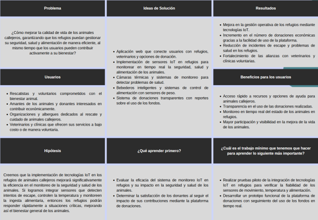

# 
Project Report

    <strong>Universidad Peruana de Ciencias Aplicadas</strong> 
     
    <strong>Ingeniería de Software - 2026-10</strong> 
    <strong>Desarrollo de Soluciones IOT - 17755</strong> 
    <strong>Profesor: Marco Antonio Leon Baca</strong> 
     <strong>Informe del Trabajo Final</strong>

    <strong>Startup: </strong> 
    <strong>Producto: </strong>

    <h3 align="center">Team Members:</h3>
    <table align="center">
        <tr>
            <th style="text-align:center;">Member</th>
            <th style="text-align:center;">Code</th>
        </tr>
        <tr>
            <td>Giancarlo Santiago Castañeda Guimas</td>
            <td>U202310601</td>
        </tr>
        <tr>
            <td>Luciana Carolina Choquehuanca Nuñez</td>
            <td>U202319431</td>
        </tr>
        <tr>
            <td>Carlos Matthew Gonzales Valverde</td>
            <td>U202314130</td>
        </tr>
        <tr>
            <td>María Patricia Hernández Uchuya</td>
            <td>U202311258</td>
        </tr>
        <tr>
            <td>Ronald Joel Peralta Chipa</td>
            <td>U202224619</td>
        </tr>
    </table>

    <strong>Abril, 2026</strong>

 

# Registro de versiones del Informe

<table align="center">
    <tr>
        <th>Versión</th>
        <th>Fecha</th>
        <th>Autor</th>
        <th>Descripción de modificaciones</th>
    </tr>
    <tr>
        <td>0</td>
        <td>11/04/2026</td>
        <td>María Hernández</td>
        <td>Creación del reporte</td>
    </tr>
</table>

 

# Project Report Collaboration Insights
Enlace de la organización para el reporte del proyecto: 

**TB1**

Para el desarrollo del informe correspondiente a la entrega TB1, se estableció la implementación de secciones de la siguiente manera para cada integrante del equipo:

|Integrante|Tareas Asignadas|
|-|-|
|Giancarlo Santiago Castañeda Guimas|Escribe aqui|
|Luciana Carolina Choquehuanca Nuñez|Escribe aqui|
|Carlos Matthew Gonzales Valverde|Escribe aqui|
|María Patricia Hernández Uchuya|Escribe aqui|
|Ronald Joel Peralta Chipa|Escribe aqui|

 

# Contenido
- [Student Outcome](#student-outcome)
- [Capítulo I: Introducción](#capítulo-i-introducción)
    - [1.1. Startup Profile](#11-startup-profile)
        - [1.1.1. Descripción de la Startup](#111-descripción-de-la-startup)
        - [1.1.2. Perfiles de integrantes del equipo](#112-perfiles-de-integrantes-del-equipo)
    - [1.2. Solution Profile](#12-solution-profile)
        - [1.2.1 Antecedentes y problemática](#121-antecedentes-y-problemática)
        - [1.2.2 Lean UX Process](#122-lean-ux-process)
            - [1.2.2.1. Lean UX Problem Statements](#1221-lean-ux-problem-statements)
            - [1.2.2.2. Lean UX Assumptions](#1222-lean-ux-assumptions)
            - [1.2.2.3. Lean UX Hypothesis Statements](#1223-lean-ux-hypothesis-statements)
            - [1.2.2.4. Lean UX Canvas](#1224-lean-ux-canvas)
    - [1.3. Segmentos objetivo](#13-segmentos-objetivo)
- [Capítulo II: Requirements Elicitation & Analysis](#capítulo-ii-requirements-elicitation--analysis)
    - [2.1. Competidores](#21-competidores)
        - [2.1.1. Análisis competitivo](#211-análisis-competitivo)
        - [2.1.2. Estrategias y tácticas frente a competidores](#212-estrategias-y-tácticas-frente-a-competidores)
    - [2.2. Entrevistas](#22-entrevistas)
        - [2.2.1. Diseño de entrevistas](#221-diseño-de-entrevistas)
        - [2.2.2. Registro de entrevistas](#222-registro-de-entrevistas)
        - [2.2.3. Análisis de entrevistas](#223-análisis-de-entrevistas)
    - [2.3. Needfinding](#23-needfinding)
        - [2.3.1. User Personas](#231-user-personas)
        - [2.3.2. User Task Matrix](#232-user-task-matrix)
        - [2.3.3. User Journey Mapping](#233-user-journey-mapping)
        - [2.3.4. Empathy Mapping](#234-empathy-mapping)
    - [2.4. Big Picture EventStorming](#24-big-picture-eventstorming)
    - [2.5. Ubiquitous Language](#25-ubiquitous-language)
- [Capítulo III: Requirements Specification](#capítulo-iii-requirements-specification)
    - [3.1. User Stories](#31-user-stories)
    - [3.2. Impact Mapping](#32-impact-mapping)
    - [3.3. Product Backlog](#33-product-backlog)
- [Capítulo IV: Solution Software Design](#capítulo-iv-solution-software-design)
    - [4.1. Strategic-Level Domain-Driven Design](#41-strategic-level-domain-driven-design)
        - [4.1.1. Design-Level EventStorming](#411-design-level-eventstorming)
            - [4.1.1.1 Candidate Context Discovery](#4111-candidate-context-discovery)
            - [4.1.1.2 Domain Message Flows Modeling](#4112-domain-message-flows-modeling)
            - [4.1.1.3 Bounded Context Canvases](#4113-bounded-context-canvases)
        - [4.1.2. Context Mapping](#412-context-mapping)
        - [4.1.3. Software Architecture](#413-software-architecture)
            - [4.1.3.1. Software Architecture System Landscape Diagram](#4131-software-architecture-system-landscape-diagram)
            - [4.1.3.2. Software Architecture Context Level Diagrams](#4132-software-architecture-context-level-diagrams)
            - [4.1.3.3. Software Architecture Container Level Diagrams](#4133-software-architecture-container-level-diagrams)
            - [4.1.3.4. Software Architecture Deployment Diagrams](#4134-software-architecture-deployment-diagrams)
    - [4.2. Tactical-Level Domain-Driven Design](#42-tactical-level-domain-driven-design)
        - [4.2.X. Bounded Context: <Bounded Context Name>](#42x-bounded-context-bounded-context-name)
            - [4.2.X.1. Domain Layer](#42x1-domain-layer)
            - [4.2.X.2. Interface Layer](#42x2-interface-layer)
            - [4.2.X.3. Application Layer](#42x3-application-layer)
            - [4.2.X.4. Infrastructure Layer](#42x4-infrastructure-layer)
            - [4.2.X.5. Bounded Context Software Architecture Component Level Diagrams](#42x5-bounded-context-software-architecture-component-level-diagrams)
            - [4.2.X.6. Bounded Context Software Architecture Code Level Diagrams](#42x6-bounded-context-software-architecture-code-level-diagrams)
                - [4.2.X.6.1. Bounded Context Domain Layer Class Diagrams](#42x61-bounded-context-domain-layer-class-diagrams)
                - [4.2.X.6.2. Bounded Context Database Design Diagram](#42x62-bounded-context-database-design-diagram)
- [Capítulo V: Solution UI/UX Design](#capítulo-v-solution-uiux-design)
    - [5.1. Style Guidelines](#51-style-guidelines)
        - [5.1.1. General Style Guidelines](#511-general-style-guidelines)
        - [5.1.2. Web, Mobile and IoT Style Guidelines](#512-web-mobile-and-iot-style-guidelines)
    - [5.2. Information Architecture](#52-information-architecture)
        - [5.2.1. Organization Systems](#521-organization-systems)
        - [5.2.2. Labeling Systems](#522-labeling-systems)
        - [5.2.3. SEO Tags and Meta Tags](#523-seo-tags-and-meta-tags)
        - [5.2.4. Searching Systems](#524-searching-systems)
        - [5.2.5. Navigation Systems](#525-navigation-systems)
    - [5.3. Landing Page UI Design](#53-landing-page-ui-design)
        - [5.3.1. Landing Page Wireframe](#531-landing-page-wireframe)
        - [5.3.2. Landing Page Mock-up](#532-landing-page-mock-up)
    - [5.4. Applications UX/UI Design](#54-applications-uxui-design)
        - [5.4.1. Applications Wireframes](#541-applications-wireframes)
        - [5.4.2. Applications Wireflow Diagrams](#542-applications-wireflow-diagrams)
        - [5.4.3. Applications Mock-ups](#543-applications-mock-ups)
        - [5.4.4. Applications User Flow Diagrams](#544-applications-user-flow-diagrams)
    - [5.5. Applications Prototyping](#55-applications-prototyping)
    - [5.6. IoT Device Design](#56-iot-device-design)
- [Capítulo VI: Product Implementation, Validation & Deployment](#capítulo-vi-product-implementation-validation--deployment)
    - [6.1. Software Configuration Management](#61-software-configuration-management)
        - [6.1.1. Software Development Environment Configuration](#611-software-development-environment-configuration)
        - [6.1.2. Source Code Management](#612-source-code-management)
        - [6.1.3. Source Code Style Guide & Conventions](#613-source-code-style-guide--conventions)
        - [6.1.4. Software Deployment Configuration](#614-software-deployment-configuration)
    - [6.2. Landing Page, Services & Applications Implementation](#62-landing-page-services--applications-implementation)
        - [6.2.X. Sprint n](#62x-sprint-n)
            - [6.2.X.1. Sprint Planning n](#62x1-sprint-planning-n)
            - [6.2.X.2. Aspect Leaders and Collaborators](#62x2-aspect-leaders-and-collaborators)
            - [6.2.X.3. Sprint Backlog n](#62x3-sprint-backlog-n)
            - [6.2.X.4. Development Evidence for Sprint Review](#62x4-development-evidence-for-sprint-review)
            - [6.2.X.5. Testing Suite Evidence for Sprint Review](#62x5-testing-suite-evidence-for-sprint-review)
            - [6.2.X.6. Execution Evidence for Sprint Review](#62x6-execution-evidence-for-sprint-review)
            - [6.2.X.7. Services Documentation Evidence for Sprint Review](#62x7-services-documentation-evidence-for-sprint-review)
            - [6.2.X.8. Software Deployment Evidence for Sprint Review](#62x8-software-deployment-evidence-for-sprint-review)
            - [6.2.X.9. Team Collaboration Insights during Sprint](#62x9-team-collaboration-insights-during-sprint)
    - [6.3. Validation Interviews](#63-validation-interviews)
        - [6.3.1. Diseño de Entrevistas](#631-diseño-de-entrevistas)
        - [6.3.2. Registro de Entrevistas](#632-registro-de-entrevistas)
        - [6.3.3. Evaluaciones según heurísticas](#633-evaluaciones-según-heurísticas)
    - [6.4. Video About-the-Product](#64-video-about-the-product)
- [Conclusiones](#conclusiones)
- [Bibliografía](#bibliografía)
- [Anexos](#anexos)

 

# Student Outcome
ABET – EAC - Student Outcome 7 Criterio: La capacidad de adquirir y aplicar nuevos conocimientos según sea necesario, utilizando estrategias de aprendizaje apropiadas.

<table style="border-collapse:collapse;border-spacing:0" class="tg">
<thead>
<tr>
<th style="border-color:black;border-style:solid;border-width:1px;font-family:Arial, sans-serif;font-size:14px;font-weight:normal;overflow:hidden;padding:10px 5px;text-align:left;vertical-align:top;word-break:normal">
Criterio específico
</th>
<th style="border-color:black;border-style:solid;border-width:1px;font-family:Arial, sans-serif;font-size:14px;font-weight:normal;overflow:hidden;padding:10px 5px;text-align:left;vertical-align:top;word-break:normal">
Acciones realizadas
</th>
<th style="border-color:black;border-style:solid;border-width:1px;font-family:Arial, sans-serif;font-size:14px;font-weight:normal;overflow:hidden;padding:10px 5px;text-align:left;vertical-align:top;word-break:normal">
Conclusiones
</th>
</tr>
</thead>

<tbody>
<tr>
<td style="border:1px solid black; padding:10px; vertical-align:top">
Actualiza conceptos y conocimientos necesarios para su desarrollo profesional y en especial para su proyecto en soluciones de ingeniería de software
</td>

<td style="border:1px solid black; padding:10px; vertical-align:top">

**Giancarlo Santiago Castañeda Guimas:**  
- TB1:  
- TP:  
- TB2:  
- TF:  

**Luciana Carolina Choquehuanca Nuñez:**  
- TB1:  
- TP:  
- TB2:  
- TF:  

**Carlos Matthew Gonzales Valverde:**  
- TB1:  
- TP:  
- TB2:  
- TF:  

**María Patricia Hernández Uchuya:**  
- TB1:  
- TP:  
- TB2:  
- TF:  

**Ronald Joel Peralta Chipa:**  
- TB1:  
- TP:  
- TB2:  
- TF:  

</td>

<td style="border:1px solid black; padding:10px; vertical-align:top">

- TB1:  
- TP:  
- TB2:  
- TF:  

</td>
</tr>

<tr>
<td style="border:1px solid black; padding:10px; vertical-align:top">
Reconoce la necesidad del aprendizaje permanente para el desempeño profesional y el desarrollo de proyectos en soluciones de tecnologías de ingeniería de software
</td>

<td style="border:1px solid black; padding:10px; vertical-align:top">

**Giancarlo Santiago Castañeda Guimas:**  
- TB1:  
- TP:  
- TB2:  
- TF:  

**Luciana Carolina Choquehuanca Nuñez:**  
- TB1:  
- TP:  
- TB2:  
- TF:  

**Carlos Matthew Gonzales Valverde:**  
- TB1:  
- TP:  
- TB2:  
- TF:  

**María Patricia Hernández Uchuya:**  
- TB1:  
- TP:  
- TB2:  
- TF:  

**Ronald Joel Peralta Chipa:**  
- TB1:  
- TP:  
- TB2:  
- TF:  

</td>

<td style="border:1px solid black; padding:10px; vertical-align:top">

- TB1:  
- TP:  
- TB2:  
- TF:  

</td>
</tr>

</tbody>
</table>

 

# Capítulo I: Introducción

## 1.1. Startup Profile
A continuación, se presenta nuestra startup y el equipo desarrollador de “BluePatitas”, una solución que utiliza tecnologías IoT para mejorar el monitoreo, cuidado y bienestar de animales callejeros mediante sensores inteligentes y una aplicación web.

### 1.1.1. Descripción de la Startup
Nuestra startup se enfoca en mejorar la vida de los animales mediante el desarrollo de una aplicación web y la implementación de tecnologías IoT en refugios, facilitando una gestión más eficiente y segura. Fundada por un grupo de estudiantes de ingeniería de software en la Universidad Peruana de Ciencias Aplicadas en Perú, nuestra misión es ofrecer soluciones tecnológicas avanzadas que aborden las necesidades más urgentes de los animales.
Nos aliamos con refugios para implementar sensores de movimiento que detecten intentos de escape, así como sensores de temperatura y humedad para controlar el ambiente y asegurar un entorno adecuado para los animales. Además, utilizamos identificadores para llevar un control del estado de vacunación y cámaras térmicas para monitorear la salud de los animales. Asimismo, se incluyeron bebederos inteligentes y sistemas de control de alimentación con sensores de peso que permiten un monitoreo detallado de la ingesta alimentaria, generando alertas cuando se detectan irregularidades. De igual importancia, a través de nuestra aplicación web, los usuarios podrán contribuir activamente al bienestar de los animales mediante donaciones económicas a los refugios, apoyando directamente su sostenibilidad y la mejora de sus condiciones de vida. Asimismo, la plataforma permitirá el monitoreo en tiempo real de los sensores implementados, brindando información clave sobre el estado, la salud y el entorno de los animales.

### 1.1.2. Perfiles de integrantes del equipo
| Foto | Información |
|------|-------------|
|  | **Nombres y apellidos:** Giancarlo Santiago Castañeda Guimas **Código:** U202310601 **Carrera:** Ing. de Software **Descripción:** ... |
|  | **Nombres y apellidos:** Luciana Carolina Choquehuanca Nuñez **Código:** U202319431 **Carrera:** Ing. de Software **Descripción:** ... |
|  | **Nombres y apellidos:** Carlos Matthew Gonzales Valverde **Código:** U202314130 **Carrera:** Ing. de Software **Descripción:** ... |
|  | **Nombres y apellidos:** María Patricia Hernández Uchuya **Código:** U202311258 **Carrera:** Ing. de Software **Descripción:** Estudio la carrera de Ingeniería de Software, tengo 20 años y actualmente me encuentro cursando el séptimo ciclo. Me considero una persona responsable, optimista y honesta, cualidades fundamentales para el trabajo en equipo y el desarrollo del proyecto. |
|  | **Nombres y apellidos:** Ronald Joel Peralta Chipa **Código:** U202224619 **Carrera:** Ing. de Software **Descripción:** Soy una persona comprometida con el orden, con un estilo de liderazgo democrático y una gran capacidad para escuchar y comprender. Disfruto crecer en equipo y aprender constantemente de los demás. Además, tengo interés en la cultura DevSecOps y la gestión de proyectos, lo que me permite tener un enfoque integral orientado a la seguridad, organización y mejora continua. En mi faceta como desarrollador, trabajo principalmente con tecnologías como Next.js y .NET, buscando siempre mejorar la calidad y el impacto de cada proyecto. |

## 1.2. Solution Profile
En la siguiente sección se presentan los aspectos principales de la propuesta de solución, considerando el análisis de las problemáticas identificadas, el uso de distintas técnicas y otros elementos clave que permiten comprender su enfoque y funcionamiento general.

### 1.2.1 Antecedentes y problemática
En el contexto actual, los refugios de animales callejeros enfrentan grandes dificultades para garantizar el bienestar, la seguridad y la salud de los animales bajo su cuidado. La gestión suele realizarse de manera manual, lo que limita el monitoreo constante y aumenta los riesgos ante situaciones críticas como enfermedades, problemas de alimentación o intentos de escape.

A pesar de que existen algunas soluciones tecnológicas, muchas no están diseñadas específicamente para las necesidades de los refugios ni integran herramientas de monitoreo en tiempo real. Esto genera una brecha en la gestión eficiente, especialmente en entornos con alta demanda y recursos limitados, dificultando la coordinación con clínicas veterinarias y la toma de decisiones oportunas.

En ese contexto, surge la necesidad de una solución tecnológica integral que combine el uso de sensores IoT con una plataforma web, permitiendo automatizar procesos, monitorear en tiempo real y mejorar la calidad de vida de los animales. BluePatitas nace como una propuesta innovadora que busca optimizar la gestión en refugios, facilitando el control de variables críticas como salud, alimentación y condiciones ambientales.

La metodología 5W y 2H es una herramienta práctica y eficaz para analizar esta problemática, permitiendo abordarla de manera estructurada a través de siete preguntas clave.

### **What (¿Qué?)**
La falta de herramientas tecnológicas limita el monitoreo adecuado de la salud, alimentación y seguridad de los animales en refugios, generando procesos ineficientes y mayores riesgos para su bienestar.

### **Who (¿Quién?)**
Afecta principalmente a rescatistas, voluntarios y organizaciones de bienestar animal que gestionan refugios, así como a los animales que dependen de estos cuidados.

### **Where (¿Dónde?)**
En refugios de animales, clínicas veterinarias y entornos donde se implementan tecnologías IoT para el monitoreo y gestión del bienestar animal.

### **When (¿Cuándo?)**
Durante la operación diaria de los refugios, especialmente en situaciones de alta demanda o emergencias como problemas de salud o intentos de escape.

### **Why (¿Por qué?)**
Debido a la falta de recursos, baja adopción de tecnología y escasa automatización en la gestión de refugios, lo que dificulta el control eficiente y oportuno de los animales.

### **How (¿Cómo?)**
Ocurre cuando el monitoreo se realiza manualmente o sin sistemas integrados, impidiendo detectar a tiempo irregularidades en la salud, alimentación o entorno, y retrasando la toma de decisiones.

### **How much (¿Cuánto?)**
En Perú, más de 286,000 perros y gatos han sido recogidos en refugios, de los cuales aproximadamente un 15.6% no sobrevive debido a la falta de atención médica adecuada, evidenciando la necesidad urgente de mejorar la gestión y los servicios en estos espacios.

**(AQUI AGREGAR FUENTE E IMAGEN)**
### 1.2.2 Lean UX Process
Lean UX es una metodología ágil que pone énfasis en la colaboración constante y el aprendizaje iterativo durante el desarrollo de un producto, priorizando la acción sobre la documentación exhaustiva. Este enfoque impulsa el trabajo conjunto entre los equipos de diseño y desarrollo, quienes crean prototipos y obtienen retroalimentación valiosa mediante ciclos de mejora continua.

Su objetivo esencial es validar hipótesis de forma ágil y con el menor uso de recursos, garantizando así que el resultado final sea adaptable y responda verdaderamente a las necesidades de los usuarios (Gothelf, 2013).
#### 1.2.2.1. Lean UX Problem Statements
Nuestro servicio ofrece una solución tecnológica que implementa dispositivos IoT en refugios de animales, conectando a los usuarios con herramientas para monitorear y mejorar el bienestar de los animales callejeros. A través de sensores de movimiento, cámaras térmicas, control ambiental y sistemas de alimentación automatizados, optimizamos la gestión de refugios y brindamos información en tiempo real sobre la salud y seguridad de los animales.
Hemos observado un factor crítico que afecta la satisfacción de los usuarios, que es la falta de sistemas automatizados y de monitoreo que permitan una gestión eficiente en los refugios, así como la dificultad para acceder rápidamente a información sobre el estado de los animales, en especial en situaciones urgentes.
¿Cómo mejorar la accesibilidad y eficacia del servicio mediante tecnologías IoT para asegurar que los refugios puedan monitorear, controlar y gestionar eficientemente a los animales, garantizando así una respuesta oportuna y adecuada a sus necesidades y mejorando el bienestar de los animales callejeros?

#### 1.2.2.2. Lean UX Assumptions
### **Assumptions Worksheet**

- **¿Quiénes son nuestros usuarios?**
  
  Nuestros usuarios son personas comprometidas con el bienestar animal, como voluntarios, rescatistas, amantes de los animales y cualquier persona interesada en ayudar a animales callejeros. También se incluyen organizaciones y albergues dedicados al rescate y cuidado de animales, así como veterinarios y clínicas que ofrecen sus servicios a bajo costo o de manera voluntaria.

- **¿Dónde encaja nuestro servicio en su trabajo o vida?**
  
  Nuestro servicio encaja directamente en la operación diaria de los refugios y en la mejora de la calidad de vida de los animales. Facilita la supervisión constante de la seguridad, salud y alimentación de los animales mediante tecnologías IoT. Para los usuarios y donantes, la aplicación web les permite participar activamente en el bienestar de los animales, aportando recursos que los refugios necesitan.

- **¿Qué problemas tiene nuestro producto?**
  
  El principal desafío de nuestro producto es la necesidad de infraestructura tecnológica adecuada en los refugios para soportar los sensores y sistemas IoT, lo cual puede ser una limitación en organizaciones con pocos recursos. Además, la implementación y mantenimiento de estas tecnologías puede generar costos adicionales.

- **¿Cómo y cuándo es usado nuestro producto?**
  
  Nuestro producto es utilizado principalmente por los refugios para gestionar de manera eficiente y en tiempo real la salud, seguridad y entorno de los animales mediante sensores IoT. Asimismo, los usuarios y donantes lo utilizan a través de la aplicación web cuando desean realizar donaciones o monitorear el impacto de su contribución.

- **¿Qué características son importantes?**
  
  Las características más importantes incluyen sensores IoT para detectar intentos de escape, monitoreo de temperatura, humedad y alimentación, así como cámaras térmicas para supervisar la salud de los animales. En la aplicación web, es clave la facilidad de uso, la transparencia en las donaciones y la generación de alertas en tiempo real.

- **¿Cómo debe verse nuestro producto y cómo comportarse?**
  
  El producto debe contar con una interfaz intuitiva, confiable y fácil de usar tanto para refugios como para donantes. Debe comportarse de manera eficiente, enviando notificaciones en tiempo real ante cualquier irregularidad y garantizando una experiencia clara y segura.

---

### **Business Outcomes**

- Mejorar la eficiencia operativa de los refugios mediante la implementación de tecnologías IoT que optimizan el monitoreo de salud, alimentación y entorno de los animales.  
- Aumentar las donaciones y financiamiento a través de una plataforma web accesible y transparente.  
- Fortalecer alianzas con refugios y clínicas veterinarias mediante soluciones tecnológicas especializadas.  
- Permitir la escalabilidad del sistema hacia otras regiones y potencial expansión internacional.  

---

### **User Outcomes**

- **Para rescatistas y voluntarios:**
  - Acceso en tiempo real al estado de los animales mediante sensores IoT.  
  - Mayor tranquilidad al poder monitorear su salud y seguridad de forma continua.  

- **Para donantes y amantes de los animales:**
  - Posibilidad de contribuir directamente al bienestar animal mediante donaciones.  
  - Transparencia sobre el uso de los fondos y el impacto generado.  

- **Para refugios y clínicas:**
  - Mejor gestión de recursos mediante automatización de procesos como alimentación y monitoreo ambiental.  
  - Mayor capacidad de respuesta gracias a alertas en tiempo real ante emergencias o irregularidades.  

---

### **Features**

- **Monitoreo en tiempo real con sensores IoT:** detección de movimiento, control de temperatura y humedad en los refugios.  
- **Cámaras térmicas e identificadores de vacunación:** seguimiento del estado de salud e historial médico de los animales.  
- **Bebederos inteligentes y control de alimentación:** monitoreo automatizado de ingesta con alertas en caso de irregularidades.  
- **Plataforma de donaciones:** sistema web que permite contribuciones económicas con transparencia en el uso de fondos.

#### 1.2.2.3. Lean UX Hypothesis Statements
### **Business Hypothesis**

- **Creemos que implementar tecnologías IoT en refugios de animales mejorará significativamente la gestión y seguridad de los animales callejeros.**
  
  - Sabremos que hemos tenido éxito cuando veamos una reducción del 25% en incidentes de escape y una mejora del 30% en los indicadores de salud de los animales en los primeros seis meses de implementación.

- **Creemos que ofrecer soluciones tecnológicas avanzadas a refugios aumentará nuestra base de clientes y expandirá nuestro impacto.**
  
  - Sabremos que hemos tenido éxito cuando veamos un incremento del 40% en el número de refugios que utilizan nuestras tecnologías en el primer año.

---

### **User Hypothesis**

- **Creemos que proporcionar datos en tiempo real sobre el ambiente y la salud de los animales a los administradores de refugios mejorará su capacidad de cuidado.**
  
  - Sabremos que hemos tenido éxito cuando veamos una mejora del 35% en la rapidez de respuesta a problemas de salud y ambientales en los refugios.

- **Creemos que implementar un sistema de monitoreo de alimentación con alertas automáticas optimizará la nutrición de los animales.**
  
  - Sabremos que hemos tenido éxito cuando veamos una reducción del 20% en problemas de salud relacionados con la nutrición en los animales de los refugios que usan nuestro sistema.

#### 1.2.2.4. Lean UX Canvas
Después de completar los pasos del Lean UX Process, avanzamos a la creación del Lean UX Canvas, el cual nos permite tener una visión integral del problema y nos prepara para iniciar la investigación preliminar antes de diseñar la solución propuesta.

## 1.3. Segmentos objetivo
De aceurdo a nuestro proposito, nuestros segmentos objetivos serían:

### **Segmento #1: Administradores de Refugios**

Este segmento de usuarios es clave, ya que son los responsables de la gestión integral del cuidado, control y adopción de animales callejeros. Necesitan herramientas que les permitan registrar y supervisar en tiempo real la cantidad de animales bajo su cuidado, identificar aquellos aptos para adopción y acceder a sistemas de apoyo que faciliten la sostenibilidad del refugio mediante donaciones y alertas automatizadas.

### **Aspectos demográficos**
- **Sexo:** Masculino y femenino  
- **Edades:** 20 - 50 años  
- **País de residencia:** Perú  

### **Aspectos psicográficos**
- **Motivaciones:** Alto compromiso con el bienestar animal y la mejora continua de los procesos de cuidado y adopción.  
- **Intereses:** Protección animal, gestión eficiente de recursos, digitalización de procesos y colaboración con otras organizaciones.  
- **Comportamiento:** Proactivos en la búsqueda de soluciones tecnológicas que les permitan supervisar el estado de los animales, optimizar la alimentación, controlar el entorno y mejorar la visibilidad de los casos de adopción y recaudación de fondos.  

---

### **Segmento #2: Veterinarios**

Este segmento incluye a profesionales y clínicas veterinarias que colaboran con los refugios para brindar atención médica a los animales. Buscan mejorar la coordinación con los refugios mediante sistemas que les permitan recibir notificaciones oportunas sobre el estado de los animales, facilitando una atención más rápida, precisa y eficiente.

### **Aspectos demográficos**
- **Sexo:** Masculino y femenino  
- **Edades:** 20 - 60 años  
- **País de residencia:** Perú  

### **Aspectos psicográficos**
- **Motivaciones:** Brindar atención médica oportuna y de calidad a animales en situación de calle, mejorando la respuesta ante emergencias.  
- **Intereses:** Innovación en la atención veterinaria, eficiencia en la gestión clínica y colaboración con organizaciones de rescate animal.  
- **Comportamiento:** Utilizan herramientas digitales para optimizar la atención de casos, priorizar emergencias, recibir alertas sobre condiciones críticas y coordinar acciones con los refugios de manera más efectiva.

 

# Capítulo II: Requirements Elicitation & Analysis

## 2.1. Competidores
### 2.1.1. Análisis competitivo
### 2.1.2. Estrategias y tácticas frente a competidores

## 2.2. Entrevistas
### 2.2.1. Diseño de entrevistas
### 2.2.2. Registro de entrevistas
### 2.2.3. Análisis de entrevistas

## 2.3. Needfinding
### 2.3.1. User Personas
### 2.3.2. User Task Matrix
### 2.3.3. User Journey Mapping
### 2.3.4. Empathy Mapping

## 2.4. Big Picture EventStorming
## 2.5. Ubiquitous Language

 

# Capítulo III: Requirements Specification

## 3.1. User Stories
## 3.2. Impact Mapping
## 3.3. Product Backlog

 

# Capítulo IV: Solution Software Design

## 4.1. Strategic-Level Domain-Driven Design
### 4.1.1. Design-Level EventStorming
#### 4.1.1.1 Candidate Context Discovery
#### 4.1.1.2 Domain Message Flows Modeling
#### 4.1.1.3 Bounded Context Canvases
### 4.1.2. Context Mapping
### 4.1.3. Software Architecture
#### 4.1.3.1. Software Architecture System Landscape Diagram
#### 4.1.3.2. Software Architecture Context Level Diagrams
#### 4.1.3.3. Software Architecture Container Level Diagrams
#### 4.1.3.4. Software Architecture Deployment Diagrams

## 4.2. Tactical-Level Domain-Driven Design
### 4.2.X. Bounded Context: <Bounded Context Name>
#### 4.2.X.1. Domain Layer
#### 4.2.X.2. Interface Layer
#### 4.2.X.3. Application Layer
#### 4.2.X.4. Infrastructure Layer
#### 4.2.X.5. Bounded Context Software Architecture Component Level Diagrams
#### 4.2.X.6. Bounded Context Software Architecture Code Level Diagrams
##### 4.2.X.6.1. Bounded Context Domain Layer Class Diagrams
##### 4.2.X.6.2. Bounded Context Database Design Diagram

 

# Capítulo V: Solution UI/UX Design

## 5.1. Style Guidelines
### 5.1.1. General Style Guidelines
### 5.1.2. Web, Mobile and IoT Style Guidelines

## 5.2. Information Architecture
### 5.2.1. Organization Systems
### 5.2.2. Labeling Systems
### 5.2.3. SEO Tags and Meta Tags
### 5.2.4. Searching Systems
### 5.2.5. Navigation Systems

## 5.3. Landing Page UI Design
### 5.3.1. Landing Page Wireframe
### 5.3.2. Landing Page Mock-up

## 5.4. Applications UX/UI Design
### 5.4.1. Applications Wireframes
### 5.4.2. Applications Wireflow Diagrams
### 5.4.3. Applications Mock-ups
### 5.4.4. Applications User Flow Diagrams

## 5.5. Applications Prototyping
## 5.6. IoT Device Design

 

# Capítulo VI: Product Implementation, Validation & Deployment

## 6.1. Software Configuration Management
### 6.1.1. Software Development Environment Configuration
### 6.1.2. Source Code Management
### 6.1.3. Source Code Style Guide & Conventions
### 6.1.4. Software Deployment Configuration

## 6.2. Landing Page, Services & Applications Implementation
### 6.2.X. Sprint n
#### 6.2.X.1. Sprint Planning n
#### 6.2.X.2. Aspect Leaders and Collaborators
#### 6.2.X.3. Sprint Backlog n
#### 6.2.X.4. Development Evidence for Sprint Review
#### 6.2.X.5. Testing Suite Evidence for Sprint Review
#### 6.2.X.6. Execution Evidence for Sprint Review
#### 6.2.X.7. Services Documentation Evidence for Sprint Review
#### 6.2.X.8. Software Deployment Evidence for Sprint Review
#### 6.2.X.9. Team Collaboration Insights during Sprint

## 6.3. Validation Interviews
### 6.3.1. Diseño de Entrevistas
### 6.3.2. Registro de Entrevistas
### 6.3.3. Evaluaciones según heurísticas

## 6.4. Video About-the-Product

 

# Conclusiones
## Conclusiones y recomendaciones
## Video About-the-Team

 

# Bibliografía

 

# Anexos
Link del Repositorio del Informe: 
Link del Repositorio del Backend: 
Link del Repositorio del Frontend Aplicación Web: 
Link del Repositorio del Frontend Aplicación Móvil: 
